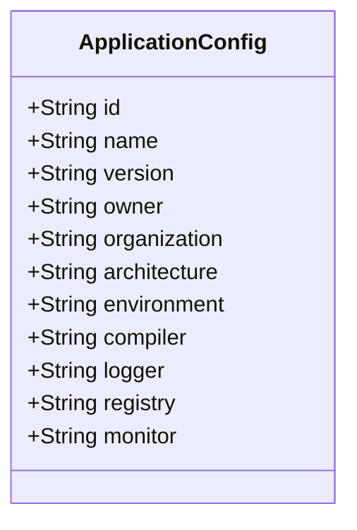
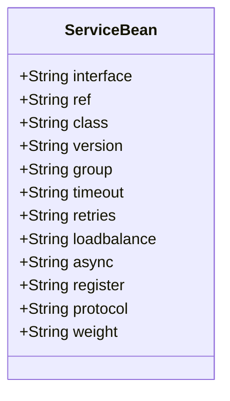
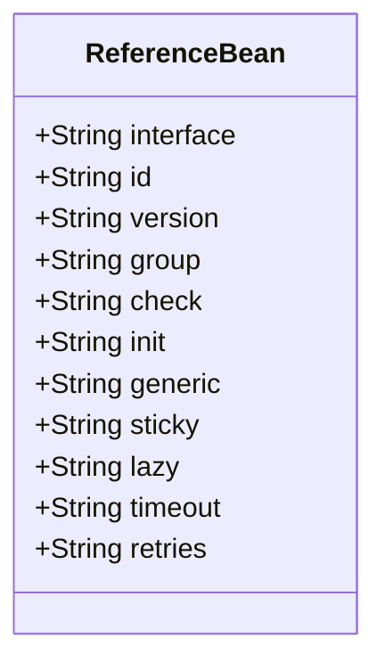
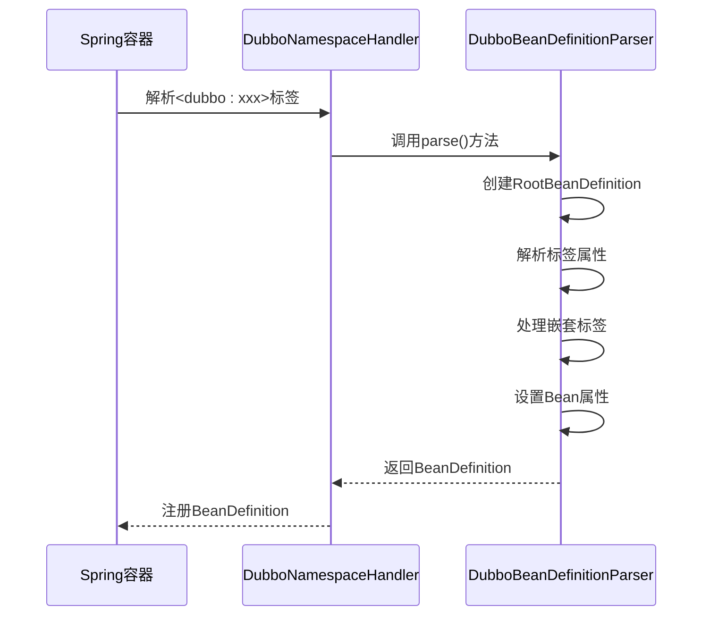
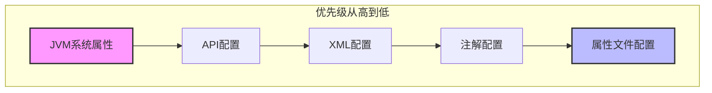
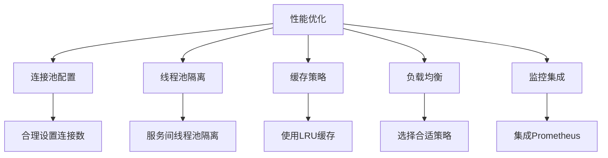

# XML配置

<cite>
**本文档引用的文件**   
- [dubbo.xsd](file://dubbo-config/dubbo-config-spring/src/main/resources/META-INF/dubbo.xsd)
- [compat/dubbo.xsd](file://dubbo-config/dubbo-config-spring/src/main/resources/META-INF/compat/dubbo.xsd)
- [spring.handlers](file://dubbo-config/dubbo-config-spring/src/main/resources/META-INF/spring.handlers)
- [spring.schemas](file://dubbo-config/dubbo-config-spring/src/main/resources/META-INF/spring.schemas)
- [DubboNamespaceHandler.java](file://dubbo-config/dubbo-config-spring/src/main/java/org/apache/dubbo/config/spring/schema/DubboNamespaceHandler.java)
- [DubboBeanDefinitionParser.java](file://dubbo-config/dubbo-config-spring/src/main/java/org/apache/dubbo/config/spring/schema/DubboBeanDefinitionParser.java)
- [ServiceBean.java](file://dubbo-config/dubbo-config-spring/src/main/java/org/apache/dubbo/config/spring/ServiceBean.java)
- [ReferenceBean.java](file://dubbo-config/dubbo-config-spring/src/main/java/org/apache/dubbo/config/spring/ReferenceBean.java)
- [ApplicationConfig.java](file://dubbo-common/src/main/java/org/apache/dubbo/config/ApplicationConfig.java)
</cite>

## 目录
1. [简介](#简介)
2. [dubbo.xsd模式文件](#dubboschema模式文件)
3. [Spring XML命名空间配置](#spring-xml命名空间配置)
4. [核心标签详解](#核心标签详解)
5. [XML配置解析过程](#xml配置解析过程)
6. [服务提供者配置示例](#服务提供者配置示例)
7. [服务消费者配置示例](#服务消费者配置示例)
8. [配置优先级关系](#配置优先级关系)
9. [迁移策略](#迁移策略)
10. [XML配置模板](#xml配置模板)
11. [高级特性和性能优化](#高级特性和性能优化)
12. [结论](#结论)

## 简介
本文档详细介绍了Dubbo框架中XML配置的使用方法，重点分析了dubbo.xsd模式文件和Spring XML命名空间的实现机制。文档详细说明了<dubbo:application>、<dubbo:service>、<dubbo:reference>等核心标签的属性和嵌套关系，解释了XML配置的解析过程。通过完整的XML配置示例，展示了如何定义服务提供者和服务消费者。文档还阐述了XML配置与其他配置方式的优先级关系，提供了在传统Spring应用中的迁移策略。为初学者提供了标准的XML配置模板，同时为经验丰富的开发者提供了XML配置的高级特性和性能优化建议。

## dubbo.xsd模式文件
dubbo.xsd文件定义了Dubbo XML配置的模式结构，位于`dubbo-config/dubbo-config-spring/src/main/resources/META-INF/dubbo.xsd`。该文件包含了Dubbo所有XML标签的定义，确保了配置文件的正确性和完整性。

dubbo.xsd文件定义了多个核心类型，包括：
- `abstractMethodType`: 定义方法级别的通用属性，如超时时间、重试次数等
- `abstractInterfaceType`: 定义接口级别的通用属性，继承自abstractMethodType
- `abstractReferenceType`: 定义引用类型的通用属性，继承自abstractInterfaceType
- `abstractServiceType`: 定义服务类型的通用属性，继承自abstractInterfaceType

这些类型构成了Dubbo XML配置的基础，通过继承关系实现了属性的复用和扩展。

**Section sources**
- [dubbo.xsd](file://dubbo-config/dubbo-config-spring/src/main/resources/META-INF/dubbo.xsd#L1-L800)

## Spring XML命名空间配置
Dubbo通过Spring的XML命名空间机制提供了便捷的配置方式。在`dubbo-config/dubbo-config-spring/src/main/resources/META-INF/spring.handlers`文件中定义了命名空间处理器：

```
http\://dubbo.apache.org/schema/dubbo=org.apache.dubbo.config.spring.schema.DubboNamespaceHandler
http\://code.alibabatech.com/schema/dubbo=org.apache.dubbo.config.spring.schema.DubboNamespaceHandler
```

对应的`dubbo-config/dubbo-config-spring/src/main/resources/META-INF/spring.schemas`文件定义了模式文件的位置：

```
http\://dubbo.apache.org/schema/dubbo/dubbo.xsd=META-INF/dubbo.xsd
http\://code.alibabatech.com/schema/dubbo/dubbo.xsd=META-INF/compat/dubbo.xsd
```

这种配置使得开发者可以在Spring配置文件中使用`<dubbo:xxx>`标签来配置Dubbo组件。

**Section sources**
- [spring.handlers](file://dubbo-config/dubbo-config-spring/src/main/resources/META-INF/spring.handlers#L1-L2)
- [spring.schemas](file://dubbo-config/dubbo-config-spring/src/main/resources/META-INF/spring.schemas#L1-L2)

## 核心标签详解
### <dubbo:application>
`<dubbo:application>`标签用于定义应用级别的配置，是Dubbo配置的起点。其主要属性包括：

- `id`: Bean的唯一标识符
- `name`: 应用名称（必需）
- `version`: 应用版本
- `owner`: 应用所有者
- `organization`: 组织名称
- `architecture`: 架构信息
- `environment`: 应用环境（如dev/test/run）
- `compiler`: Java代码编译器
- `logger`: 应用日志器
- `registry`: 应用注册中心
- `monitor`: 应用监控中心



**Diagram sources**
- [ApplicationConfig.java](file://dubbo-common/src/main/java/org/apache/dubbo/config/ApplicationConfig.java#L1-L50)

**Section sources**
- [dubbo.xsd](file://dubbo-config/dubbo-config-spring/src/main/resources/META-INF/dubbo.xsd#L385-L561)

### <dubbo:service>
`<dubbo:service>`标签用于定义服务提供者，其主要属性包括：

- `interface`: 服务接口类名（必需）
- `ref`: 服务实现实例的Bean ID
- `class`: 服务实现类名
- `version`: 服务版本
- `group`: 服务分组
- `timeout`: 方法调用超时时间
- `retries`: 方法重试次数
- `loadbalance`: 负载均衡策略
- `async`: 是否异步调用
- `register`: 服务是否注册到注册中心
- `protocol`: 服务协议
- `weight`: 服务权重



**Diagram sources**
- [ServiceBean.java](file://dubbo-config/dubbo-config-spring/src/main/java/org/apache/dubbo/config/spring/ServiceBean.java#L1-L50)

**Section sources**
- [dubbo.xsd](file://dubbo-config/dubbo-config-spring/src/main/resources/META-INF/dubbo.xsd#L270-L383)

### <dubbo:reference>
`<dubbo:reference>`标签用于定义服务消费者，其主要属性包括：

- `interface`: 服务接口类名（必需）
- `id`: Bean的唯一标识符
- `version`: 服务版本
- `group`: 服务分组
- `check`: 是否检查依赖的服务提供者
- `init`: 是否立即初始化引用
- `generic`: 是否使用泛化调用
- `sticky`: 是否启用粘性策略
- `lazy`: 是否延迟创建连接
- `timeout`: 方法调用超时时间
- `retries`: 方法重试次数



**Diagram sources**
- [ReferenceBean.java](file://dubbo-config/dubbo-config-spring/src/main/java/org/apache/dubbo/config/spring/ReferenceBean.java#L1-L50)

**Section sources**
- [dubbo.xsd](file://dubbo-config/dubbo-config-spring/src/main/resources/META-INF/dubbo.xsd#L186-L268)

## XML配置解析过程
Dubbo的XML配置解析过程由`DubboNamespaceHandler`和`DubboBeanDefinitionParser`两个核心类完成。

`DubboNamespaceHandler`在`init()`方法中注册了所有Dubbo标签的解析器：

```java
public void init() {
    registerBeanDefinitionParser("application", new DubboBeanDefinitionParser(ApplicationConfig.class));
    registerBeanDefinitionParser("module", new DubboBeanDefinitionParser(ModuleConfig.class));
    registerBeanDefinitionParser("registry", new DubboBeanDefinitionParser(RegistryConfig.class));
    registerBeanDefinitionParser("config-center", new DubboBeanDefinitionParser(ConfigCenterBean.class));
    registerBeanDefinitionParser("metadata-report", new DubboBeanDefinitionParser(MetadataReportConfig.class));
    registerBeanDefinitionParser("monitor", new DubboBeanDefinitionParser(MonitorConfig.class));
    registerBeanDefinitionParser("provider", new DubboBeanDefinitionParser(ProviderConfig.class));
    registerBeanDefinitionParser("consumer", new DubboBeanDefinitionParser(ConsumerConfig.class));
    registerBeanDefinitionParser("protocol", new DubboBeanDefinitionParser(ProtocolConfig.class));
    registerBeanDefinitionParser("service", new DubboBeanDefinitionParser(ServiceBean.class));
    registerBeanDefinitionParser("reference", new DubboBeanDefinitionParser(ReferenceBean.class));
    registerBeanDefinitionParser("annotation", new AnnotationBeanDefinitionParser());
}
```

`DubboBeanDefinitionParser`负责具体的标签解析工作，主要流程包括：

1. 创建`RootBeanDefinition`实例
2. 解析标签的属性并设置到BeanDefinition中
3. 处理嵌套标签（如method、argument、parameter等）
4. 注册BeanDefinition到Spring容器



**Diagram sources**
- [DubboNamespaceHandler.java](file://dubbo-config/dubbo-config-spring/src/main/java/org/apache/dubbo/config/spring/schema/DubboNamespaceHandler.java#L50-L67)
- [DubboBeanDefinitionParser.java](file://dubbo-config/dubbo-config-spring/src/main/java/org/apache/dubbo/config/spring/schema/DubboBeanDefinitionParser.java#L97-L284)

**Section sources**
- [DubboNamespaceHandler.java](file://dubbo-config/dubbo-config-spring/src/main/java/org/apache/dubbo/config/spring/schema/DubboNamespaceHandler.java#L49-L67)
- [DubboBeanDefinitionParser.java](file://dubbo-config/dubbo-config-spring/src/main/java/org/apache/dubbo/config/spring/schema/DubboBeanDefinitionParser.java#L78-L655)

## 服务提供者配置示例
以下是一个完整的服务提供者XML配置示例：

```xml
<?xml version="1.0" encoding="UTF-8"?>
<beans xmlns="http://www.springframework.org/schema/beans"
       xmlns:xsi="http://www.w3.org/2001/XMLSchema-instance"
       xmlns:dubbo="http://dubbo.apache.org/schema/dubbo"
       xsi:schemaLocation="http://www.springframework.org/schema/beans
       http://www.springframework.org/schema/beans/spring-beans.xsd
       http://dubbo.apache.org/schema/dubbo
       http://dubbo.apache.org/schema/dubbo/dubbo.xsd">

    <!-- 应用配置 -->
    <dubbo:application name="demo-provider" owner="developer"/>

    <!-- 注册中心配置 -->
    <dubbo:registry address="zookeeper://127.0.0.1:2181"/>

    <!-- 协议配置 -->
    <dubbo:protocol name="dubbo" port="20880"/>

    <!-- 服务实现 -->
    <bean id="demoService" class="org.apache.dubbo.demo.provider.DemoServiceImpl"/>

    <!-- 服务暴露 -->
    <dubbo:service interface="org.apache.dubbo.demo.DemoService" ref="demoService">
        <dubbo:method name="sayHello" timeout="3000" retries="2"/>
        <dubbo:method name="getData" timeout="5000" loadbalance="roundrobin"/>
    </dubbo:service>

</beans>
```

**Section sources**
- [dubbo.xsd](file://dubbo-config/dubbo-config-spring/src/main/resources/META-INF/dubbo.xsd#L1-L2352)

## 服务消费者配置示例
以下是一个完整的服务消费者XML配置示例：

```xml
<?xml version="1.0" encoding="UTF-8"?>
<beans xmlns="http://www.springframework.org/schema/beans"
       xmlns:xsi="http://www.w3.org/2001/XMLSchema-instance"
       xmlns:dubbo="http://dubbo.apache.org/schema/dubbo"
       xsi:schemaLocation="http://www.springframework.org/schema/beans
       http://www.springframework.org/schema/beans/spring-beans.xsd
       http://dubbo.apache.org/schema/dubbo
       http://dubbo.apache.org/schema/dubbo/dubbo.xsd">

    <!-- 应用配置 -->
    <dubbo:application name="demo-consumer" owner="developer"/>

    <!-- 注册中心配置 -->
    <dubbo:registry address="zookeeper://127.0.0.1:2181"/>

    <!-- 服务引用 -->
    <dubbo:reference id="demoService" interface="org.apache.dubbo.demo.DemoService">
        <dubbo:method name="sayHello" timeout="3000" retries="1"/>
        <dubbo:method name="getData" timeout="5000" loadbalance="random"/>
    </dubbo:reference>

</beans>
```

**Section sources**
- [dubbo.xsd](file://dubbo-config/dubbo-config-spring/src/main/resources/META-INF/dubbo.xsd#L1-L2352)

## 配置优先级关系
Dubbo支持多种配置方式，包括XML、注解、API和属性文件。当多种配置方式同时存在时，它们的优先级关系如下：

1. JVM系统属性（最高优先级）
2. API配置
3. XML配置
4. 注解配置
5. 属性文件配置（最低优先级）

这种优先级关系确保了在不同环境下可以灵活地覆盖配置。例如，在生产环境中可以通过JVM参数覆盖XML中的配置，而无需修改配置文件。



**Diagram sources**
- [dubbo.xsd](file://dubbo-config/dubbo-config-spring/src/main/resources/META-INF/dubbo.xsd#L1-L2352)

**Section sources**
- [dubbo.xsd](file://dubbo-config/dubbo-config-spring/src/main/resources/META-INF/dubbo.xsd#L1-L2352)

## 迁移策略
在传统Spring应用中迁移使用Dubbo XML配置时，可以遵循以下策略：

1. **逐步迁移**: 从简单的服务开始，逐步将服务迁移到Dubbo
2. **配置分离**: 将Dubbo配置与业务配置分离，便于管理和维护
3. **兼容性考虑**: 使用兼容模式的dubbo.xsd文件，确保与旧版本的兼容性
4. **测试验证**: 在迁移过程中进行充分的测试，确保服务的稳定性和性能


**Diagram sources**
- [spring.handlers](file://dubbo-config/dubbo-config-spring/src/main/resources/META-INF/spring.handlers#L1-L2)
- [spring.schemas](file://dubbo-config/dubbo-config-spring/src/main/resources/META-INF/spring.schemas#L1-L2)

**Section sources**
- [spring.handlers](file://dubbo-config/dubbo-config-spring/src/main/resources/META-INF/spring.handlers#L1-L2)
- [spring.schemas](file://dubbo-config/dubbo-config-spring/src/main/resources/META-INF/spring.schemas#L1-L2)

## XML配置模板
以下是一个标准的Dubbo XML配置模板，适用于大多数应用场景：

```xml
<?xml version="1.0" encoding="UTF-8"?>
<beans xmlns="http://www.springframework.org/schema/beans"
       xmlns:xsi="http://www.w3.org/2001/XMLSchema-instance"
       xmlns:dubbo="http://dubbo.apache.org/schema/dubbo"
       xsi:schemaLocation="http://www.springframework.org/schema/beans
       http://www.springframework.org/schema/beans/spring-beans.xsd
       http://dubbo.apache.org/schema/dubbo
       http://dubbo.apache.org/schema/dubbo/dubbo.xsd">

    <!-- 应用配置 -->
    <dubbo:application name="${dubbo.application.name}" owner="${dubbo.application.owner}"/>

    <!-- 注册中心配置 -->
    <dubbo:registry address="${dubbo.registry.address}" protocol="${dubbo.registry.protocol}"/>

    <!-- 协议配置 -->
    <dubbo:protocol name="${dubbo.protocol.name}" port="${dubbo.protocol.port}"/>

    <!-- 监控中心配置（可选） -->
    <dubbo:monitor protocol="${dubbo.monitor.protocol}" address="${dubbo.monitor.address}"/>

    <!-- 服务提供者配置（服务提供者需要） -->
    <!--
    <bean id="yourService" class="com.example.YourServiceImpl"/>
    <dubbo:service interface="com.example.YourService" ref="yourService"/>
    -->

    <!-- 服务消费者配置（服务消费者需要） -->
    <!--
    <dubbo:reference id="yourService" interface="com.example.YourService"/>
    -->

</beans>
```

**Section sources**
- [dubbo.xsd](file://dubbo-config/dubbo-config-spring/src/main/resources/META-INF/dubbo.xsd#L1-L2352)

## 高级特性和性能优化
### 高级特性
1. **方法级配置**: 可以为每个方法单独配置超时时间、重试次数等
2. **参数配置**: 使用`<dubbo:parameter>`标签进行自定义参数配置
3. **事件监听**: 通过Spring事件机制监听服务暴露等事件
4. **异步调用**: 支持异步调用和回调

### 性能优化建议
1. **连接池配置**: 合理配置连接池大小，避免资源浪费
2. **线程池隔离**: 为不同服务配置独立的线程池，避免相互影响
3. **缓存策略**: 合理使用服务缓存，减少重复调用
4. **负载均衡**: 根据业务特点选择合适的负载均衡策略
5. **监控集成**: 集成监控系统，及时发现和解决性能问题



**Diagram sources**
- [dubbo.xsd](file://dubbo-config/dubbo-config-spring/src/main/resources/META-INF/dubbo.xsd#L1-L2352)

**Section sources**
- [dubbo.xsd](file://dubbo-config/dubbo-config-spring/src/main/resources/META-INF/dubbo.xsd#L1-L2352)

## 结论
Dubbo的XML配置提供了一种强大而灵活的配置方式，通过dubbo.xsd模式文件和Spring XML命名空间机制，实现了配置的类型安全和易用性。本文档详细介绍了核心标签的使用方法、配置解析过程以及最佳实践。通过合理的配置和优化，可以充分发挥Dubbo的性能优势，构建稳定可靠的服务架构。对于新项目，建议结合注解和XML配置；对于传统Spring应用，可以按照迁移策略逐步引入Dubbo。