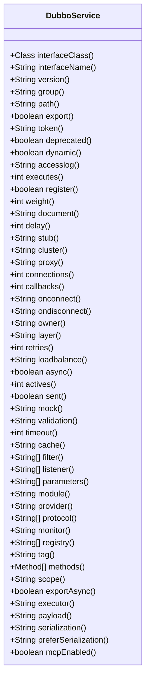
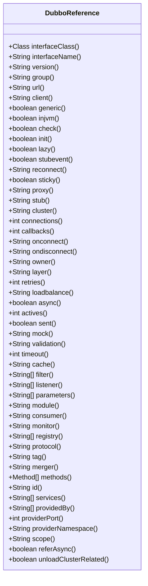
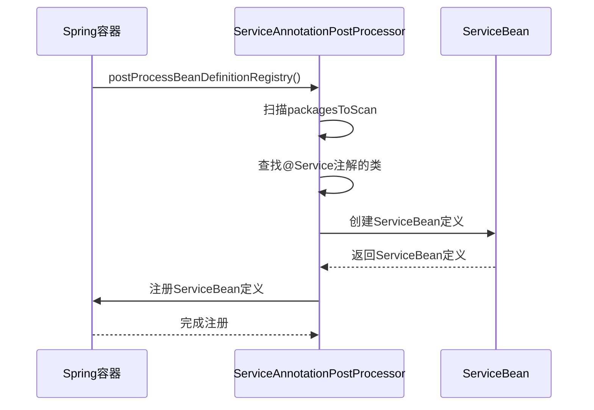
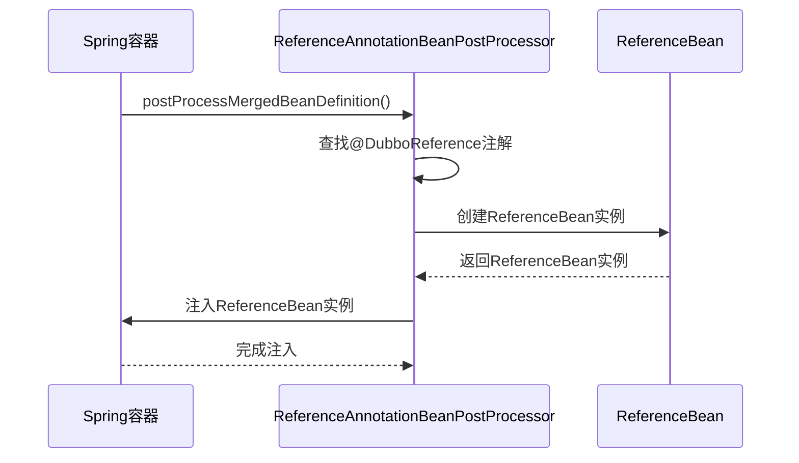

# 注解配置

<cite>
**本文档引用的文件**
- [DubboService.java](file://dubbo-common\src\main\java\org\apache\dubbo\config\annotation\DubboService.java)
- [DubboReference.java](file://dubbo-common\src\main\java\org\apache\dubbo\config\annotation\DubboReference.java)
- [ServiceAnnotationPostProcessor.java](file://dubbo-config\dubbo-config-spring\src\main\java\org\apache\dubbo\config\spring\beans\factory\annotation\ServiceAnnotationPostProcessor.java)
- [ReferenceAnnotationBeanPostProcessor.java](file://dubbo-config\dubbo-config-spring\src\main\java\org\apache\dubbo\config\spring\beans\factory\annotation\ReferenceAnnotationBeanPostProcessor.java)
- [ReferenceBean.java](file://dubbo-config\dubbo-config-spring\src\main\java\org\apache\dubbo\config\spring\ReferenceBean.java)
- [ConsumerApplication.java](file://dubbo-demo\dubbo-demo-spring-boot\dubbo-demo-spring-boot-consumer\src\main\java\org\apache\dubbo\springboot\demo\consumer\ConsumerApplication.java)
- [ProviderApplication.java](file://dubbo-demo\dubbo-demo-spring-boot\dubbo-demo-spring-boot-provider\src\main\java\org\apache\dubbo\springboot\demo\provider\ProviderApplication.java)
</cite>

## 目录
1. [引言](#引言)
2. [核心注解详解](#核心注解详解)
3. [注解属性参数详解](#注解属性参数详解)
4. [注解驱动配置原理](#注解驱动配置原理)
5. [服务提供者配置示例](#服务提供者配置示例)
6. [服务消费者配置示例](#服务消费者配置示例)
7. [配置优先级关系](#配置优先级关系)
8. [Spring Boot最佳实践](#spring-boot最佳实践)
9. [高级用法与扩展](#高级用法与扩展)

## 引言
Dubbo框架提供了基于注解的配置方式，通过`@DubboService`和`@DubboReference`等注解简化了服务提供者和消费者的配置。这种注解驱动的配置方式不仅提高了开发效率，还增强了代码的可读性和可维护性。本文档将详细介绍这些注解的使用方法、属性参数、作用范围和生效机制，并提供具体的代码示例来展示如何在Spring Boot应用中进行最佳实践。

**本文档引用的文件**
- [DubboService.java](file://dubbo-common\src\main\java\org\apache\dubbo\config\annotation\DubboService.java)
- [DubboReference.java](file://dubbo-common\src\main\java\org\apache\dubbo\config\annotation\DubboReference.java)

## 核心注解详解
Dubbo框架中的核心注解主要包括`@DubboService`和`@DubboReference`，它们分别用于声明服务提供者和引用服务消费者。

### @DubboService注解
`@DubboService`注解用于声明一个Dubbo服务，可以应用于类或方法上。推荐的使用方式是在Java配置类的@Bean方法上使用该注解，这样更加灵活且兼容Spring框架。



**图源**
- [DubboService.java](file://dubbo-common\src\main\java\org\apache\dubbo\config\annotation\DubboService.java)

### @DubboReference注解
`@DubboReference`注解用于引用一个Dubbo服务，可以应用于字段、方法或注解类型上。推荐的使用方式是在Java配置类的@Bean方法上使用该注解，而不是直接在需要注入的字段或setter方法上使用。



**图源**
- [DubboReference.java](file://dubbo-common\src\main\java\org\apache\dubbo\config\annotation\DubboReference.java)

## 注解属性参数详解
### @DubboService属性参数
`@DubboService`注解提供了丰富的属性参数，用于配置服务的各种行为。

| 属性名 | 默认值 | 说明 |
| --- | --- | --- |
| interfaceClass | void.class | 接口类，默认值为void.class |
| interfaceName | "" | 接口类名，默认值为空字符串 |
| version | "" | 服务版本，默认值为空字符串 |
| group | "" | 服务组，默认值为空字符串 |
| path | "" | 服务路径，默认值为空字符串 |
| export | true | 是否导出服务，默认值为true |
| token | "" | 服务令牌，默认值为空字符串 |
| deprecated | false | 服务是否已废弃，默认值为false |
| dynamic | true | 服务是否动态，默认值为true |
| accesslog | "" | 访问日志，默认值为空字符串 |
| executes | -1 | 最大并发执行数，默认值为-1（无限制） |
| register | true | 是否注册到注册中心，默认值为true |
| weight | -1 | 服务权重值，默认值为-1 |
| document | "" | 服务文档，默认值为空字符串 |
| delay | -1 | 服务注册延迟时间，默认值为-1 |
| stub | "" | 服务存根名称，默认使用接口名+Local |
| cluster | "" | 集群策略，合法值包括：failover, failfast, failsafe, failback, forking |
| proxy | "" | 代理生成方式，合法值包括：jdk, javassist |
| connections | -1 | 服务提供者可接受的最大连接数，默认值为-1（共享连接） |
| callbacks | -1 | 每个连接的回调实例限制 |
| onconnect | "" | 连接时的回调方法名，默认值为空字符串 |
| ondisconnect | "" | 断开连接时的回调方法名，默认值为空字符串 |
| owner | "" | 服务所有者，默认值为空字符串 |
| layer | "" | 服务层，默认值为空字符串 |
| retries | -1 | 服务调用重试次数 |
| loadbalance | "" | 负载均衡策略，合法值包括：random, roundrobin, leastactive |
| async | false | 是否启用异步调用，默认值为false |
| actives | -1 | 允许的最大活跃请求数，默认值为-1 |
| sent | false | 异步请求是否已发送，默认值为false |
| mock | "" | 服务模拟名称，默认使用接口名+Mock |
| validation | "" | 是否启用JSR303验证，合法值为：true, false |
| timeout | -1 | 服务调用超时值，默认值为-1 |
| cache | "" | 指定服务调用的缓存实现，合法值包括：lru, threadlocal, jcache |
| filter | {} | 服务调用的过滤器 |
| listener | {} | 服务导出和取消导出的监听器 |
| parameters | {} | 自定义参数键值对 |
| module | "" | 模块关联名称 |
| provider | "" | 提供者关联名称 |
| protocol | {} | 协议关联名称 |
| monitor | "" | 监控关联名称 |
| registry | {} | 注册中心关联名称 |
| tag | "" | 服务标签名称 |
| methods | {} | 方法支持 |
| scope | "" | 引用/导出服务的作用域，如果为local，则仅在当前JVM内搜索 |
| exportAsync | false | 服务是否异步导出 |
| executor | "" | 服务执行器（线程池）的bean名称，用于服务间的线程池隔离 |
| payload | "" | 有效载荷最大长度 |
| serialization | "" | 序列化类型 |
| preferSerialization | "" | 优先使用的序列化类型 |
| mcpEnabled | false | 是否将此服务中的方法作为MCP工具暴露，默认值为false |

### @DubboReference属性参数
`@DubboReference`注解同样提供了丰富的属性参数，用于配置服务引用的各种行为。

| 属性名 | 默认值 | 说明 |
| --- | --- | --- |
| interfaceClass | void.class | 接口类，默认值为void.class |
| interfaceName | "" | 接口类名，默认值为空字符串 |
| version | "" | 服务版本，默认值为空字符串 |
| group | "" | 服务组，默认值为空字符串 |
| url | "" | 直连调用的目标URL，如果指定了此值，则注册中心无效 |
| client | "netty" | 客户端传输类型，默认值为"netty" |
| generic | false | 是否启用泛化调用，默认值为false |
| injvm | true | 是否优先调用本地服务（如果存在），默认值为true |
| check | true | 启动时检查服务提供者是否可用，默认值为true |
| init | true | 所有属性设置后是否立即初始化引用bean，默认值为true |
| lazy | false | 创建客户端时是否建立连接，默认值为false |
| stubevent | false | 是否导出存根服务以进行事件分发，默认值为false |
| reconnect | "" | 如果连接丢失是否重连，默认启用重连，重试连接间隔为2000毫秒 |
| sticky | false | 是否粘附到集群中的同一节点，默认值为false |
| proxy | "" | 代理生成方式，合法值包括：jdk, javassist |
| stub | "" | 服务存根名称，默认使用接口名+Stub |
| cluster | "" | 集群策略，合法值包括：failover, failfast, failsafe, failback, forking |
| connections | 0 | 服务提供者可接受的最大连接数，默认值为0（共享连接） |
| callbacks | -1 | 每个连接的回调实例限制 |
| onconnect | "" | 连接时的回调方法名，默认值为空字符串 |
| ondisconnect | "" | 断开连接时的回调方法名，默认值为空字符串 |
| owner | "" | 服务所有者，默认值为空字符串 |
| layer | "" | 服务层，默认值为空字符串 |
| retries | -1 | 服务调用重试次数 |
| loadbalance | "" | 负载均衡策略，合法值包括：random, roundrobin, leastactive |
| async | false | 是否启用异步调用，默认值为false |
| actives | 0 | 允许的最大活跃请求数，默认值为0 |
| sent | false | 异步请求是否已发送，默认值为false |
| mock | "" | 服务模拟名称，默认使用接口名+Mock |
| validation | "" | 是否启用JSR303验证，合法值为：true, false |
| timeout | 0 | 服务调用超时值，默认值为0 |
| cache | "" | 指定服务调用的缓存实现，合法值包括：lru, threadlocal, jcache |
| filter | {} | 服务调用的过滤器 |
| listener | {} | 服务导出和取消导出的监听器 |
| parameters | {} | 自定义参数键值对 |
| module | "" | 模块关联名称 |
| consumer | "" | 消费者关联名称 |
| monitor | "" | 监控关联名称 |
| registry | {} | 注册中心关联名称 |
| protocol | "" | Dubbo服务的通信协议 |
| tag | "" | 服务标签名称 |
| merger | "" | 服务合并器 |
| methods | {} | 方法支持 |
| id | "" | Bean的ID |
| services | {} | 订阅的Dubbo接口服务名称 |
| providedBy | {} | 声明此接口属于哪个应用或服务 |
| providerPort | -1 | 提供者的服务端口 |
| providerNamespace | "" | 分配提供者所属的命名空间 |
| scope | "" | 引用/导出服务的作用域，如果为local，则仅在当前JVM内搜索 |
| referAsync | false | 引用是否异步 |
| unloadClusterRelated | false | 在mesh模式下卸载集群相关 |

## 注解驱动配置原理
Dubbo的注解驱动配置是通过Spring的BeanPostProcessor机制实现的。具体来说，`ServiceAnnotationPostProcessor`和`ReferenceAnnotationBeanPostProcessor`是两个关键的处理器，它们分别负责处理`@DubboService`和`@DubboReference`注解。

### ServiceAnnotationPostProcessor
`ServiceAnnotationPostProcessor`实现了`BeanDefinitionRegistryPostProcessor`接口，其主要职责是在Spring容器启动时扫描并注册带有`@DubboService`注解的类。它会创建相应的`ServiceBean`定义，并将其注册到Spring容器中。



**图源**
- [ServiceAnnotationPostProcessor.java](file://dubbo-config\dubbo-config-spring\src\main\java\org\apache\dubbo\config\spring\beans\factory\annotation\ServiceAnnotationPostProcessor.java)

### ReferenceAnnotationBeanPostProcessor
`ReferenceAnnotationBeanPostProcessor`实现了`InstantiationAwareBeanPostProcessor`接口，其主要职责是在Spring容器启动时处理带有`@DubboReference`注解的字段和方法。它会创建相应的`ReferenceBean`实例，并将其注入到目标bean中。



**图源**
- [ReferenceAnnotationBeanPostProcessor.java](file://dubbo-config\dubbo-config-spring\src\main\java\org\apache\dubbo\config\spring\beans\factory\annotation\ReferenceAnnotationBeanPostProcessor.java)

## 服务提供者配置示例
以下是一个使用`@DubboService`注解配置服务提供者的示例：

```java
@Configuration
class ProviderConfiguration {
    
    @Bean
    @DubboService(group="demo")
    public DemoService demoServiceImpl() {
        return new DemoServiceImpl();
    }
}
```

在这个示例中，`@DubboService`注解被应用在Java配置类的@Bean方法上，声明了一个名为`demoServiceImpl`的服务提供者，该服务属于`demo`组。

另一种使用方式是直接在服务实现类上使用`@DubboService`注解：

```java
@DubboService(group="demo")
public class DemoServiceImpl implements DemoService {
    // ...
}
```

这种方式会导致实现类依赖于Dubbo模块。

## 服务消费者配置示例
以下是一个使用`@DubboReference`注解配置服务消费者的示例：

```java
@Configuration
public class ReferenceConfiguration {
    @Bean
    @DubboReference(group = "demo")
    public ReferenceBean<HelloService> helloService() {
        return new ReferenceBean();
    }

    @Bean
    @DubboReference(group = "demo", interfaceClass = HelloService.class)
    public ReferenceBean<GenericService> genericHelloService() {
        return new ReferenceBean();
    }
}
```

在这个示例中，`@DubboReference`注解被应用在Java配置类的@Bean方法上，声明了两个服务引用：`helloService`和`genericHelloService`。

然后可以通过@Autowired注入这些引用：

```java
public class FooController {
    @Autowired
    private HelloService helloService;

    @Autowired
    private GenericService genericHelloService;
}
```

## 配置优先级关系
在Dubbo中，配置的优先级关系如下：

1. **代码配置**：通过API直接设置的配置具有最高优先级。
2. **注解配置**：通过`@DubboService`和`@DubboReference`注解设置的配置次之。
3. **XML配置**：通过XML文件设置的配置再次之。
4. **属性文件配置**：通过属性文件（如dubbo.properties）设置的配置最低。

当多个配置源同时存在时，优先级高的配置会覆盖优先级低的配置。

## Spring Boot最佳实践
在Spring Boot应用中使用Dubbo注解的最佳实践包括：

1. **使用@EnableDubbo注解**：在主配置类上使用`@EnableDubbo`注解来启用Dubbo功能。
2. **使用Java配置类**：推荐在Java配置类的@Bean方法上使用`@DubboService`和`@DubboReference`注解，而不是直接在实现类或字段上使用。
3. **合理设置扫描包**：通过`@EnableDubbo`注解的`scanBasePackages`属性指定需要扫描的包，以提高启动性能。
4. **使用属性文件管理配置**：将常用的配置项放在属性文件中，便于管理和维护。

以下是一个完整的Spring Boot应用示例：

```java
@SpringBootApplication
@EnableDubbo(scanBasePackages = "org.apache.dubbo.springboot.demo.provider")
public class ProviderApplication {
    public static void main(String[] args) throws Exception {
        SpringApplication.run(ProviderApplication.class, args);
        new CountDownLatch(1).await();
    }
}
```

```java
@SpringBootApplication
@Service
@EnableDubbo
public class ConsumerApplication {
    private static final Logger logger = LoggerFactory.getLogger(ConsumerApplication.class);

    @DubboReference
    private DemoService demoService;

    public static void main(String[] args) {
        ConfigurableApplicationContext context = SpringApplication.run(ConsumerApplication.class, args);
        ConsumerApplication application = context.getBean(ConsumerApplication.class);
        String result = application.doSayHello("world");
        logger.info("result: {}", result);
    }

    public String doSayHello(String name) {
        return demoService.sayHello(name);
    }
}
```

## 高级用法与扩展
### 自定义注解扩展
可以通过创建自定义注解来扩展Dubbo的功能。例如，可以创建一个自定义注解来简化某些常用配置：

```java
@Target({ElementType.TYPE, ElementType.METHOD})
@Retention(RetentionPolicy.RUNTIME)
@DubboService(timeout = 5000, retries = 3)
public @interface FastService {
    String group() default "";
    String version() default "";
}
```

然后可以在服务实现类上使用这个自定义注解：

```java
@FastService(group="demo", version="1.0.0")
public class DemoServiceImpl implements DemoService {
    // ...
}
```

### 高级属性配置
对于一些高级属性，如`methods`、`parameters`等，可以通过更复杂的配置来满足特定需求。例如，可以为不同的方法设置不同的超时时间和重试次数：

```java
@DubboService(methods = {
    @Method(name = "sayHello", timeout = 100, retries = 0),
    @Method(name = "sayGoodbye", timeout = 200, retries = 1)
})
public class DemoServiceImpl implements DemoService {
    // ...
}
```

通过这些高级用法和扩展，可以更好地利用Dubbo的注解配置功能，满足各种复杂的应用场景。

**本文档引用的文件**
- [DubboService.java](file://dubbo-common\src\main\java\org\apache\dubbo\config\annotation\DubboService.java)
- [DubboReference.java](file://dubbo-common\src\main\java\org\apache\dubbo\config\annotation\DubboReference.java)
- [ServiceAnnotationPostProcessor.java](file://dubbo-config\dubbo-config-spring\src\main\java\org\apache\dubbo\config\spring\beans\factory\annotation\ServiceAnnotationPostProcessor.java)
- [ReferenceAnnotationBeanPostProcessor.java](file://dubbo-config\dubbo-config-spring\src\main\java\org\apache\dubbo\config\spring\beans\factory\annotation\ReferenceAnnotationBeanPostProcessor.java)
- [ReferenceBean.java](file://dubbo-config\dubbo-config-spring\src\main\java\org\apache\dubbo\config\spring\ReferenceBean.java)
- [ConsumerApplication.java](file://dubbo-demo\dubbo-demo-spring-boot\dubbo-demo-spring-boot-consumer\src\main\java\org\apache\dubbo\springboot\demo\consumer\ConsumerApplication.java)
- [ProviderApplication.java](file://dubbo-demo\dubbo-demo-spring-boot\dubbo-demo-spring-boot-provider\src\main\java\org\apache\dubbo\springboot\demo\provider\ProviderApplication.java)