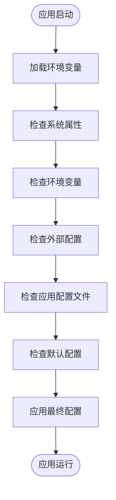
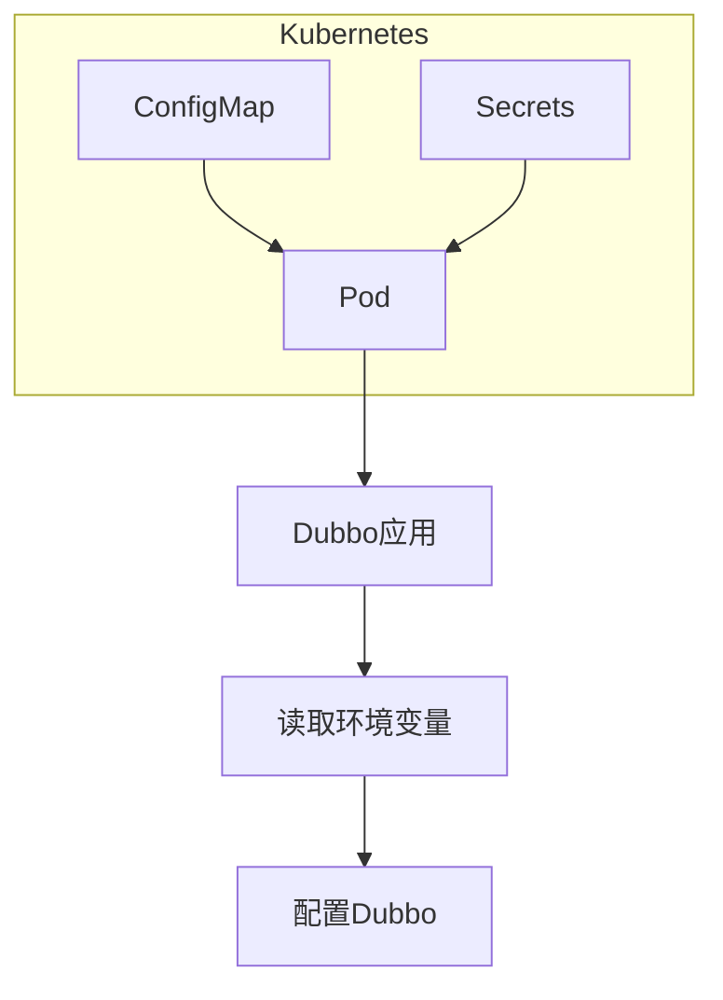
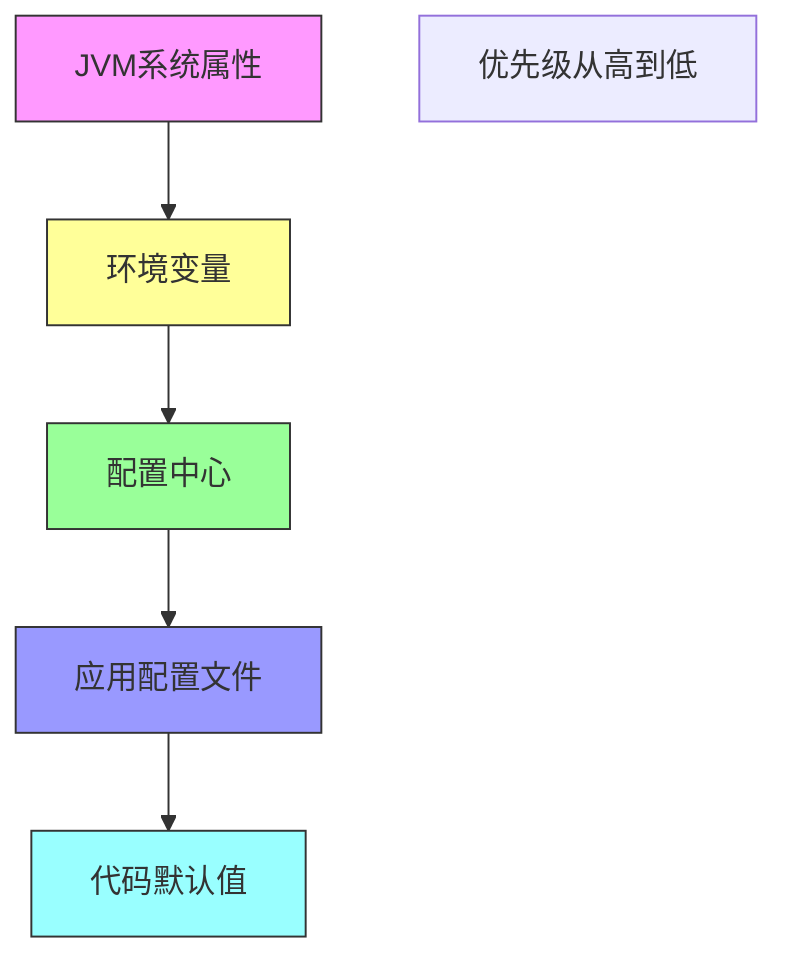

# 环境变量

<cite>
**本文档中引用的文件**   
- [Environment.java](file://dubbo-common\src\main\java\org\apache\dubbo\common\config\Environment.java)
- [SystemConfiguration.java](file://dubbo-common\src\main\java\org\apache\dubbo\common\config\SystemConfiguration.java)
- [EnvironmentConfiguration.java](file://dubbo-common\src\main\java\org\apache\dubbo\common\config\EnvironmentConfiguration.java)
- [ApplicationConfig.java](file://dubbo-common\src\main\java\org\apache\dubbo\config\ApplicationConfig.java)
- [ReferenceConfig.java](file://dubbo-config\dubbo-config-api\src\main\java\org\apache\dubbo\config\ReferenceConfig.java)
- [CommonConstants.java](file://dubbo-common\src\main\java\org\apache\dubbo\common\constants\CommonConstants.java)
- [Constants.java](file://dubbo-common\src\main\java\org\apache\dubbo\config\Constants.java)
</cite>

## 目录
1. [简介](#简介)
2. [环境变量命名规范](#环境变量命名规范)
3. [作用范围与加载时机](#作用范围与加载时机)
4. [容器化部署中的重要性](#容器化部署中的重要性)
5. [关键配置示例](#关键配置示例)
6. [配置优先级关系](#配置优先级关系)
7. [云原生环境最佳实践](#云原生环境最佳实践)
8. [初学者设置方法](#初学者设置方法)
9. [高级使用场景](#高级使用场景)

## 简介

Dubbo框架支持通过操作系统环境变量进行配置，这在容器化和云原生部署场景中尤为重要。环境变量提供了一种灵活、安全的配置方式，允许在不修改代码或配置文件的情况下动态调整应用行为。Dubbo通过`Environment`类统一管理各种配置源，包括系统属性、环境变量、配置中心等，为开发者提供了强大的配置管理能力。

## 环境变量命名规范

Dubbo环境变量遵循特定的命名规范，以确保配置的一致性和可读性。主要命名规则如下：

- **前缀规范**：所有Dubbo环境变量以`DUBBO_`为前缀，如`DUBBO_APPLICATION_NAME`
- **层级结构**：使用下划线分隔不同层级，如`DUBBO_PROTOCOL_PORT`表示协议端口配置
- **大小写不敏感**：Dubbo支持大小写不敏感的环境变量读取，`DUBBO_APPLICATION_NAME`和`dubbo_application_name`效果相同
- **点号转换**：Java属性中的点号(.)在环境变量中转换为下划线(_)，如`dubbo.application.name`对应`DUBBO_APPLICATION_NAME`

这些命名规范确保了环境变量在不同操作系统和容器环境中的兼容性。

**Section sources**
- [CommonConstants.java](file://dubbo-common\src\main\java\org\apache\dubbo\common\constants\CommonConstants.java#L28-L31)
- [Constants.java](file://dubbo-common\src\main\java\org\apache\dubbo\config\Constants.java#L89-L92)

## 作用范围与加载时机

Dubbo环境变量的作用范围和加载时机是理解其工作原理的关键。环境变量在应用启动的早期阶段就被加载，影响整个应用的配置。

环境变量的加载遵循特定的优先级顺序：
1. 系统属性（System Properties）
2. 环境变量（Environment Variables）
3. 外部配置（如配置中心）
4. 应用配置文件
5. 默认配置

这种分层加载机制确保了环境变量可以覆盖其他配置源，同时保留了配置的灵活性。



**Diagram sources **
- [Environment.java](file://dubbo-common\src\main\java\org\apache\dubbo\common\config\Environment.java#L231-L233)
- [SystemConfiguration.java](file://dubbo-common\src\main\java\org\apache\dubbo\common\config\SystemConfiguration.java#L28)

## 容器化部署中的重要性

在容器化部署环境中，环境变量扮演着至关重要的角色。它们为微服务架构提供了动态配置的能力，使得应用可以在不同环境中无缝迁移。

环境变量在容器化部署中的优势包括：
- **配置解耦**：将配置与代码分离，实现一次构建，多处部署
- **动态更新**：无需重启容器即可更新配置
- **安全性**：敏感信息（如密码、密钥）可以通过环境变量安全传递
- **环境适配**：轻松适应开发、测试、生产等不同环境

在Kubernetes等容器编排平台中，环境变量通常通过ConfigMap和Secrets进行管理，实现了配置的集中化和安全化。



**Diagram sources **
- [ReferenceConfig.java](file://dubbo-config\dubbo-config-api\src\main\java\org\apache\dubbo\config\ReferenceConfig.java#L547-L559)
- [ApplicationConfig.java](file://dubbo-common\src\main\java\org\apache\dubbo\config\ApplicationConfig.java#L884-L911)

## 关键配置示例

以下是一些常用的Dubbo环境变量配置示例：

### 应用配置
```bash
# 设置应用名称
DUBBO_APPLICATION_NAME=my-dubbo-app

# 设置应用所有者
DUBBO_APPLICATION_OWNER=developer-team

# 设置应用版本
DUBBO_APPLICATION_VERSION=1.0.0
```

### 协议配置
```bash
# 设置协议端口
DUBBO_PROTOCOL_PORT=20880

# 设置协议名称
DUBBO_PROTOCOL_NAME=dubbo
```

### 注册中心配置
```bash
# 设置注册中心地址
DUBBO_REGISTRY_ADDRESS=127.0.0.1:2181

# 设置注册中心类型
DUBBO_REGISTRY_PROTOCOL=zookeeper
```

### 服务配置
```bash
# 设置服务超时时间
DUBBO_SERVICE_INVOKE_TIMEOUT=5000

# 设置服务重试次数
DUBBO_SERVICE_RETRIES=3
```

这些示例展示了如何通过环境变量配置Dubbo的核心组件。

**Section sources**
- [CommonConstants.java](file://dubbo-common\src\main\java\org\apache\dubbo\common\constants\CommonConstants.java#L38-L40)
- [Constants.java](file://dubbo-common\src\main\java\org\apache\dubbo\config\Constants.java#L46-L51)

## 配置优先级关系

Dubbo配置系统遵循明确的优先级规则，环境变量在其中占据重要位置。理解这些优先级关系对于正确配置应用至关重要。

配置优先级从高到低如下：
1. **JVM系统属性**：通过`-D`参数设置
2. **环境变量**：操作系统环境变量
3. **配置中心**：如Nacos、Zookeeper等
4. **应用配置文件**：如`dubbo.properties`
5. **代码默认值**：在代码中定义的默认值

这种优先级设计允许开发者在不同层级覆盖配置，实现灵活的配置管理。



**Diagram sources **
- [Environment.java](file://dubbo-common\src\main\java\org\apache\dubbo\common\config\Environment.java#L231-L233)
- [SystemConfiguration.java](file://dubbo-common\src\main\java\org\apache\dubbo\common\config\SystemConfiguration.java#L28)

## 云原生环境最佳实践

在Kubernetes、Docker等云原生环境中，使用环境变量配置Dubbo有特定的最佳实践：

### Kubernetes中的配置
```yaml
apiVersion: apps/v1
kind: Deployment
metadata:
  name: dubbo-app
spec:
  template:
    spec:
      containers:
      - name: dubbo
        image: my-dubbo-app:latest
        env:
        - name: DUBBO_APPLICATION_NAME
          valueFrom:
            configMapKeyRef:
              name: dubbo-config
              key: application-name
        - name: DUBBO_REGISTRY_ADDRESS
          valueFrom:
            secretKeyRef:
              name: dubbo-secrets
              key: registry-address
```

### Docker中的配置
```bash
# 使用docker run命令
docker run -e DUBBO_APPLICATION_NAME=myapp \
           -e DUBBO_REGISTRY_ADDRESS=registry:2181 \
           my-dubbo-image

# 使用docker-compose
version: '3'
services:
  dubbo-app:
    image: my-dubbo-app
    environment:
      - DUBBO_APPLICATION_NAME=myapp
      - DUBBO_REGISTRY_ADDRESS=registry:2181
```

### 配置管理建议
- 使用ConfigMap管理非敏感配置
- 使用Secrets管理敏感信息
- 通过环境变量实现多环境配置
- 避免在镜像中硬编码配置

**Section sources**
- [ReferenceConfig.java](file://dubbo-config\dubbo-config-api\src\main\java\org\apache\dubbo\config\ReferenceConfig.java#L566-L567)
- [EnvironmentConfiguration.java](file://dubbo-common\src\main\java\org\apache\dubbo\common\config\EnvironmentConfiguration.java#L37-L51)

## 初学者设置方法

对于初学者，可以通过简单的方法快速设置Dubbo环境变量：

### Windows系统
```cmd
# 设置环境变量
set DUBBO_APPLICATION_NAME=myapp
set DUBBO_REGISTRY_ADDRESS=127.0.0.1:2181

# 启动应用
java -jar my-dubbo-app.jar
```

### Linux/Mac系统
```bash
# 临时设置环境变量
export DUBBO_APPLICATION_NAME=myapp
export DUBBO_REGISTRY_ADDRESS=127.0.0.1:2181

# 启动应用
java -jar my-dubbo-app.jar
```

### 验证配置
```java
// 在代码中验证环境变量是否生效
String appName = System.getenv("DUBBO_APPLICATION_NAME");
if (appName != null) {
    System.out.println("应用名称: " + appName);
}
```

这些简单的方法可以帮助初学者快速上手Dubbo环境变量配置。

**Section sources**
- [SystemConfiguration.java](file://dubbo-common\src\main\java\org\apache\dubbo\common\config\SystemConfiguration.java#L28)
- [EnvironmentConfiguration.java](file://dubbo-common\src\main\java\org\apache\dubbo\common\config\EnvironmentConfiguration.java#L37)

## 高级使用场景

对于经验丰富的开发者，可以结合环境变量与其他配置方式实现更复杂的场景：

### 环境变量与配置文件组合
```properties
# dubbo.properties
dubbo.application.name=${DUBBO_APPLICATION_NAME:default-app}
dubbo.registry.address=${DUBBO_REGISTRY_ADDRESS:127.0.0.1:2181}
dubbo.protocol.port=${DUBBO_PROTOCOL_PORT:20880}
```

### 动态配置更新
```java
// 监听环境变量变化
public class EnvVarListener {
    public void checkEnvChanges() {
        String newPort = System.getenv("DUBBO_PROTOCOL_PORT");
        if (newPort != null && !newPort.equals(currentPort)) {
            // 动态更新协议端口
            updateProtocolPort(Integer.parseInt(newPort));
        }
    }
}
```

### 安全考虑
- 敏感信息不应直接写在环境变量中
- 使用加密的Secrets管理密码和密钥
- 定期轮换敏感配置
- 限制环境变量的访问权限

这些高级场景展示了环境变量在复杂应用中的灵活应用。

**Section sources**
- [ApplicationConfig.java](file://dubbo-common\src\main\java\org\apache\dubbo\config\ApplicationConfig.java#L884-L911)
- [Environment.java](file://dubbo-common\src\main\java\org\apache\dubbo\common\config\Environment.java#L296-L298)