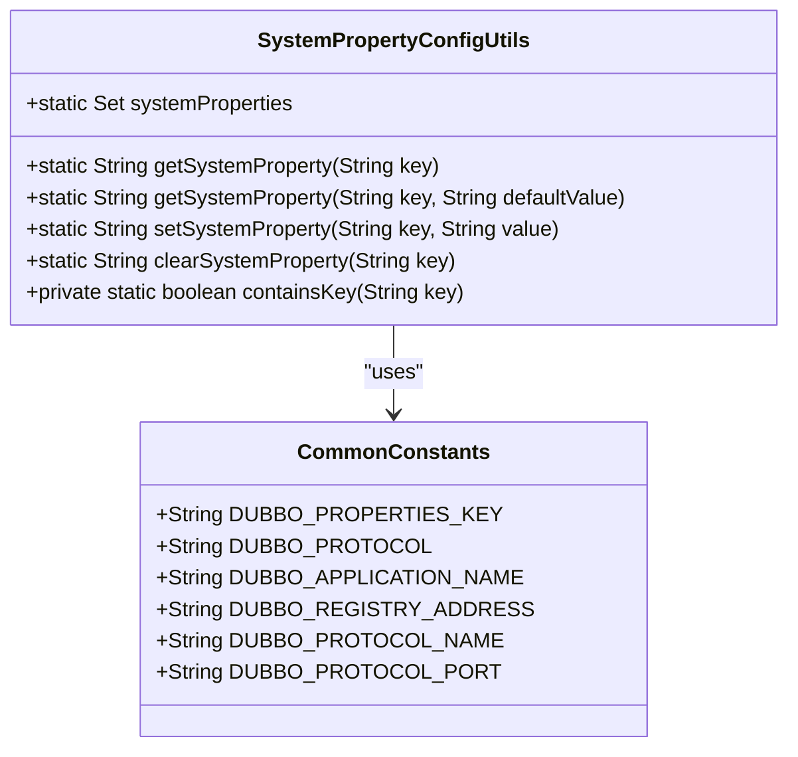
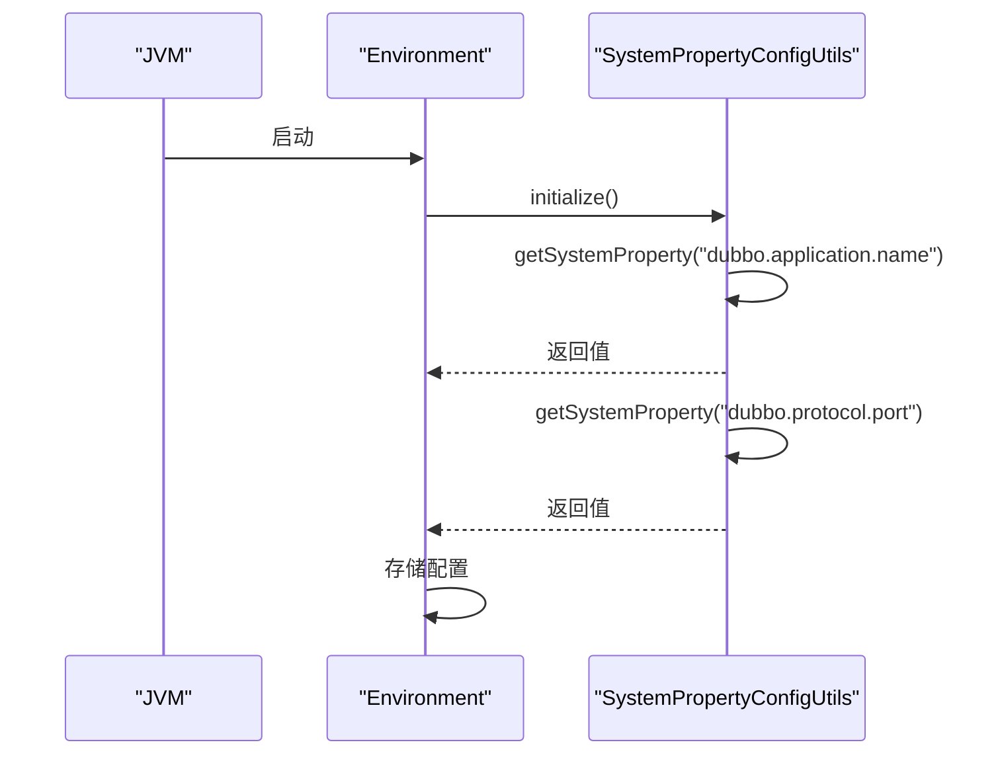

# 系统属性

<cite>
**本文档引用的文件**   
- [SystemPropertyConfigUtils.java](file://dubbo-common\src\main\java\org\apache\dubbo\common\utils\SystemPropertyConfigUtils.java)
- [Environment.java](file://dubbo-common\src\main\java\org\apache\dubbo\common\config\Environment.java)
- [CommonConstants.java](file://dubbo-common\src\main\java\org\apache\dubbo\common\constants\CommonConstants.java)
- [PropertiesConfiguration.java](file://dubbo-common\src\main\java\org\apache\dubbo\common\config\PropertiesConfiguration.java)
- [ConfigUtils.java](file://dubbo-common\src\main\java\org\apache\dubbo\common\utils\ConfigUtils.java)
- [SysProps.java](file://dubbo-config\dubbo-config-api\src\test\java\org\apache\dubbo\config\SysProps.java)
</cite>

## 目录
1. [引言](#引言)
2. [系统属性配置机制](#系统属性配置机制)
3. [系统属性优先级与作用范围](#系统属性优先级与作用范围)
4. [JVM启动时的加载机制](#jvm启动时的加载机制)
5. [常用配置项示例](#常用配置项示例)
6. [系统属性与其他配置源的关系](#系统属性与其他配置源的关系)
7. [初学者示例](#初学者示例)
8. [高级使用场景与最佳实践](#高级使用场景与最佳实践)
9. [结论](#结论)

## 引言

Apache Dubbo 是一个高性能的 Java RPC 框架，提供了多种配置方式来满足不同场景的需求。其中，通过 `System.setProperty()` 方式配置 Dubbo 是一种灵活且强大的方法，允许在 JVM 启动时或运行时动态地设置配置项。本文档详细介绍了如何使用系统属性进行 Dubbo 配置，包括系统属性的优先级、作用范围和生命周期，以及其在 JVM 启动时的加载机制。此外，还提供了具体的代码示例，展示如何设置 `dubbo.application.name`、`dubbo.protocol.port` 等常用配置项，并阐述了系统属性与其他配置来源的优先级关系。

## 系统属性配置机制

Dubbo 使用 `SystemPropertyConfigUtils` 类来处理系统属性的读取和设置。该类提供了一系列静态方法，用于获取和设置系统属性。这些方法确保了只有在 `CommonConstants` 类中定义的系统属性才能被访问，从而保证了配置的安全性和一致性。



**图源**
- [SystemPropertyConfigUtils.java](file://dubbo-common\src\main\java\org\apache\dubbo\common\utils\SystemPropertyConfigUtils.java#L25-L123)
- [CommonConstants.java](file://dubbo-common\src\main\java\org\apache\dubbo\common\constants\CommonConstants.java)

### 系统属性的读取

`SystemPropertyConfigUtils.getSystemProperty(String key)` 方法用于从 JVM 系统属性中读取指定键的值。如果键不存在，则抛出 `IllegalStateException` 异常。此方法确保了只有在 `CommonConstants` 类中定义的系统属性才能被访问。

```java
public static String getSystemProperty(String key) {
    if (containsKey(key)) {
        return System.getProperty(key);
    } else {
        throw new IllegalStateException(String.format(
            "System property [%s] does not define in org.apache.dubbo.common.constants.CommonConstants", key));
    }
}
```

### 系统属性的设置

`SystemPropertyConfigUtils.setSystemProperty(String key, String value)` 方法用于设置 JVM 系统属性。同样，只有在 `CommonConstants` 类中定义的系统属性才能被设置。

```java
public static String setSystemProperty(String key, String value) {
    if (containsKey(key)) {
        return System.setProperty(key, value);
    } else {
        throw new IllegalStateException(String.format(
            "System property [%s] does not define in org.apache.dubbo.common.constants.CommonConstants", key));
    }
}
```

## 系统属性优先级与作用范围

在 Dubbo 中，配置项的优先级顺序决定了最终使用的配置值。系统属性的优先级较高，通常位于配置优先级的顶层。以下是 Dubbo 配置项的优先级顺序：

1. **系统属性 (System Properties)** - 通过 `System.setProperty()` 设置
2. **环境变量 (Environment Variables)** - 通过操作系统环境变量设置
3. **外部配置中心 (External Configuration Center)** - 如 Nacos、Zookeeper 等
4. **应用配置文件 (Application Configuration Files)** - 如 `dubbo.properties`
5. **代码中硬编码的默认值**

### 作用范围

系统属性的作用范围是整个 JVM 实例。一旦设置了某个系统属性，它将对所有使用该 JVM 的应用程序生效。这意味着系统属性非常适合用于全局配置，如应用名称、协议端口等。

## JVM启动时的加载机制

当 JVM 启动时，可以通过命令行参数 `-D` 来设置系统属性。例如：

```bash
java -Ddubbo.application.name=myApp -Ddubbo.protocol.port=20880 -jar myApp.jar
```

在应用程序启动过程中，Dubbo 会自动读取这些系统属性，并将其应用于相应的配置项。具体来说，`Environment` 类在初始化时会调用 `SystemPropertyConfigUtils` 来读取系统属性，并将其存储在 `SystemConfiguration` 对象中。



**图源**
- [Environment.java](file://dubbo-common\src\main\java\org\apache\dubbo\common\config\Environment.java#L81-L93)
- [SystemPropertyConfigUtils.java](file://dubbo-common\src\main\java\org\apache\dubbo\common\utils\SystemPropertyConfigUtils.java#L58-L65)

## 常用配置项示例

以下是一些常用的 Dubbo 配置项及其对应的系统属性设置方法：

### dubbo.application.name

设置应用名称，用于标识 Dubbo 应用实例。

```java
System.setProperty("dubbo.application.name", "myApp");
```

### dubbo.protocol.port

设置 Dubbo 服务监听的端口号。

```java
System.setProperty("dubbo.protocol.port", "20880");
```

### dubbo.registry.address

设置注册中心地址，用于服务发现和注册。

```java
System.setProperty("dubbo.registry.address", "N/A");
```

### dubbo.protocol.name

设置 Dubbo 服务使用的协议名称。

```java
System.setProperty("dubbo.protocol.name", "dubbo");
```

### dubbo.service.register

控制服务是否注册到注册中心。

```java
System.setProperty("dubbo.service.register", "false");
```

## 系统属性与其他配置源的关系

在 Dubbo 中，系统属性的优先级高于其他配置源。这意味着即使在 `dubbo.properties` 文件或其他配置文件中设置了相同的配置项，系统属性的值也会覆盖它们。这种设计使得系统属性成为一种强有力的工具，可以在不修改配置文件的情况下快速调整应用行为。

### 优先级关系

1. **系统属性** - 最高优先级
2. **环境变量** - 次高优先级
3. **外部配置中心** - 中等优先级
4. **应用配置文件** - 较低优先级
5. **代码中硬编码的默认值** - 最低优先级

### 使用场景

- **开发和测试环境**：在开发和测试环境中，可以使用系统属性快速切换不同的配置，而无需修改配置文件。
- **生产环境**：在生产环境中，可以使用系统属性来动态调整某些配置项，如端口号、注册中心地址等，以应对突发情况。
- **多环境部署**：在多环境部署中，可以使用系统属性来区分不同环境的配置，避免配置文件的重复和混乱。

## 初学者示例

对于初学者来说，最简单的系统属性设置方法是在启动 JVM 时通过命令行参数 `-D` 来设置。以下是一个简单的示例：

```bash
java -Ddubbo.application.name=myApp -Ddubbo.protocol.port=20880 -jar myApp.jar
```

在这个示例中，我们设置了两个系统属性：`dubbo.application.name` 和 `dubbo.protocol.port`。这些属性将在应用程序启动时被读取并应用于 Dubbo 配置。

### 代码示例

```java
public class SimpleExample {
    public static void main(String[] args) {
        // 设置系统属性
        System.setProperty("dubbo.application.name", "myApp");
        System.setProperty("dubbo.protocol.port", "20880");

        // 启动 Dubbo 应用
        // ...
    }
}
```

## 高级使用场景与最佳实践

### 组合使用系统属性和环境变量

在复杂的生产环境中，可以结合使用系统属性和环境变量来实现更灵活的配置管理。例如，可以将敏感信息（如密码）存储在环境变量中，而将非敏感信息（如应用名称）存储在系统属性中。

```bash
export DUBBO_REGISTRY_PASSWORD=myPassword
java -Ddubbo.application.name=myApp -Ddubbo.registry.address=zookeeper://127.0.0.1:2181 -jar myApp.jar
```

### 动态配置更新

在某些情况下，可能需要在运行时动态更新配置。虽然系统属性本身是不可变的，但可以通过重新启动 JVM 或使用外部配置中心来实现动态配置更新。

### 最佳实践

1. **安全性**：避免在系统属性中存储敏感信息，如密码、密钥等。应使用环境变量或加密存储。
2. **可维护性**：尽量减少在代码中硬编码配置项，使用配置文件或外部配置中心来管理配置。
3. **文档化**：为所有使用的系统属性编写详细的文档，说明其用途、默认值和可能的取值范围。
4. **测试**：在不同的环境和配置下进行全面的测试，确保系统属性的设置不会导致意外的行为。

## 结论

通过 `System.setProperty()` 方式配置 Dubbo 是一种强大且灵活的方法，适用于各种场景。了解系统属性的优先级、作用范围和生命周期，以及其在 JVM 启动时的加载机制，可以帮助开发者更好地管理和优化 Dubbo 应用。本文档提供了详细的说明和示例，旨在帮助初学者快速上手，并为经验丰富的开发者提供高级使用场景和最佳实践。