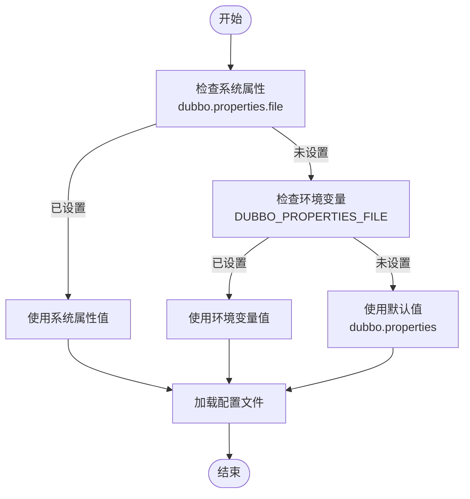
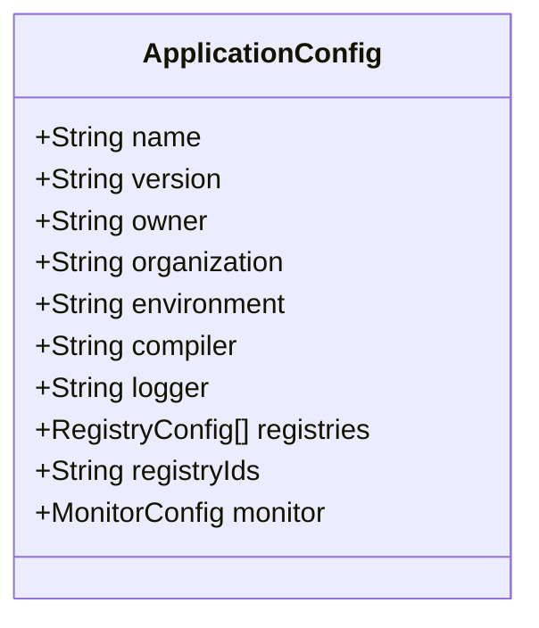
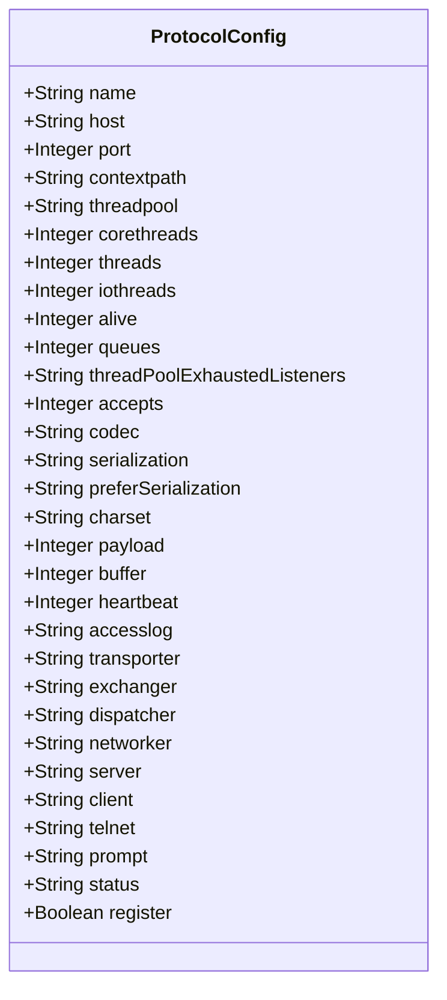
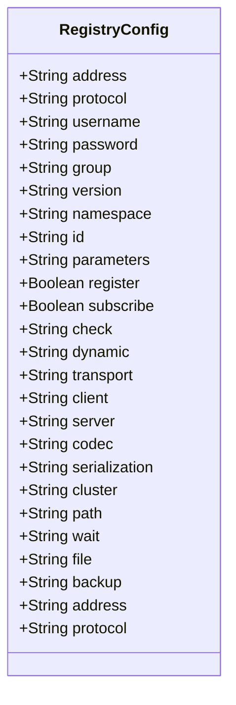
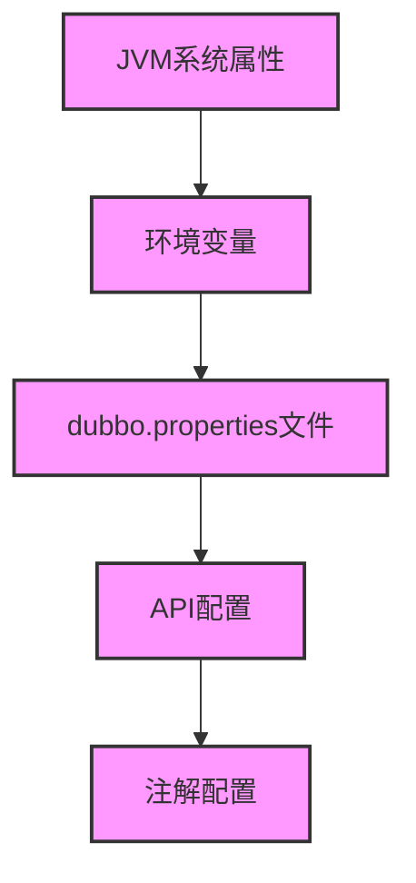
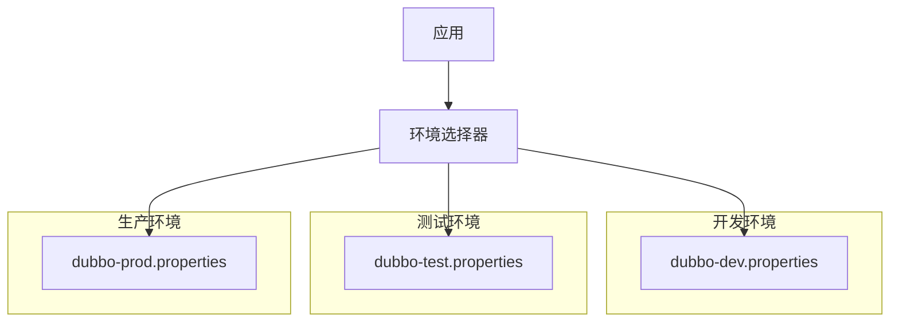

# 配置文件

<cite>
**本文档中引用的文件**  
- [ConfigUtils.java](file://dubbo-common\src\main\java\org\apache\dubbo\common\utils\ConfigUtils.java)
- [CommonConstants.java](file://dubbo-common\src\main\java\org\apache\dubbo\common\constants\CommonConstants.java)
- [PropertiesConfiguration.java](file://dubbo-common\src\main\java\org\apache\dubbo\common\config\PropertiesConfiguration.java)
- [ConfigCenterBean.java](file://dubbo-config\dubbo-config-spring\src\main\java\org\apache\dubbo\config\spring\ConfigCenterBean.java)
- [ConfigCenterBuilder.java](file://dubbo-config\dubbo-config-api\src\main\java\org\apache\dubbo\config\bootstrap\builders\ConfigCenterBuilder.java)
- [ApplicationConfig.java](file://dubbo-common\src\main\java\org\apache\dubbo\config\ApplicationConfig.java)
- [ProtocolConfig.java](file://dubbo-common\src\main\java\org\apache\dubbo\config\ProtocolConfig.java)
- [RegistryConfig.java](file://dubbo-common\src\main\java\org\apache\dubbo\config\RegistryConfig.java)
- [dubbo.properties](file://dubbo-common\src\test\resources\dubbo.properties)
</cite>

## 目录
1. [配置文件概述](#配置文件概述)
2. [配置文件查找路径与加载顺序](#配置文件查找路径与加载顺序)
3. [dubbo.properties语法格式](#dubbo.properties语法格式)
4. [核心组件配置详解](#核心组件配置详解)
5. [配置优先级关系](#配置优先级关系)
6. [不同部署环境的配置管理策略](#不同部署环境的配置管理策略)
7. [标准配置模板与高级用法](#标准配置模板与高级用法)

## 配置文件概述

Dubbo框架通过`dubbo.properties`文件提供了一种简单而强大的配置机制，允许开发者通过属性文件的方式配置Dubbo的各种参数。该配置文件是Dubbo配置体系的重要组成部分，为应用提供了灵活的配置选项。`dubbo.properties`文件主要用于配置Dubbo框架的全局参数，包括应用、协议、注册中心等核心组件的设置。

**Section sources**
- [ConfigUtils.java](file://dubbo-common\src\main\java\org\apache\dubbo\common\utils\ConfigUtils.java#L166-L174)

## 配置文件查找路径与加载顺序

Dubbo配置文件的查找和加载遵循特定的优先级顺序，确保配置的灵活性和可覆盖性。系统首先检查系统属性`dubbo.properties.file`，如果未设置，则检查环境变量`DUBBO_PROPERTIES_FILE`，最后默认使用类路径下的`dubbo.properties`文件。这种分层的查找机制允许在不同环境中灵活地覆盖配置。

配置文件的加载过程由`ConfigUtils.getProperties()`方法实现，该方法首先确定配置文件路径，然后调用`loadProperties()`方法从指定路径加载属性。当在类路径中发现多个同名配置文件时，Dubbo会合并这些文件的内容，但如果`allowMultiFile`参数为false，则会记录警告信息。



**Diagram sources**
- [ConfigUtils.java](file://dubbo-common\src\main\java\org\apache\dubbo\common\utils\ConfigUtils.java#L166-L174)

**Section sources**
- [ConfigUtils.java](file://dubbo-common\src\main\java\org\apache\dubbo\common\utils\ConfigUtils.java#L166-L233)
- [CommonConstants.java](file://dubbo-common\src\main\java\org\apache\dubbo\common\constants\CommonConstants.java#L63-L716)

## dubbo.properties语法格式

`dubbo.properties`文件采用标准的Java属性文件格式，每行包含一个键值对，使用等号分隔。配置项的键遵循特定的命名约定，通常以`dubbo.`为前缀，后跟组件类型和具体属性名。例如，`dubbo.application.name`表示应用名称，`dubbo.protocol.port`表示协议端口。

配置文件支持基本的数据类型，包括字符串、整数和布尔值。对于复杂配置，可以通过点分隔的路径来组织配置项，形成层次化的配置结构。配置文件中的注释以`#`开头，用于解释配置项的用途和取值范围。

**Section sources**
- [dubbo.properties](file://dubbo-common\src\test\resources\dubbo.properties#L18-L21)

## 核心组件配置详解

### 应用配置

应用配置通过`ApplicationConfig`类实现，用于定义Dubbo应用的基本信息。在`dubbo.properties`中，应用配置项以`dubbo.application`为前缀，包括应用名称、版本、负责人等信息。应用名称是必填项，用于在注册中心标识应用实例。



**Diagram sources**
- [ApplicationConfig.java](file://dubbo-common\src\main\java\org\apache\dubbo\config\ApplicationConfig.java#L82-L200)

**Section sources**
- [ApplicationConfig.java](file://dubbo-common\src\main\java\org\apache\dubbo\config\ApplicationConfig.java#L82-L200)

### 协议配置

协议配置通过`ProtocolConfig`类实现，用于定义服务暴露的协议参数。在`dubbo.properties`中，协议配置项以`dubbo.protocol`为前缀，包括协议名称、端口号、线程池配置等。协议名称决定了服务通信的传输方式，如dubbo、http等。



**Diagram sources**
- [ProtocolConfig.java](file://dubbo-common\src\main\java\org\apache\dubbo\config\ProtocolConfig.java#L40-L200)

**Section sources**
- [ProtocolConfig.java](file://dubbo-common\src\main\java\org\apache\dubbo\config\ProtocolConfig.java#L40-L200)

### 注册中心配置

注册中心配置通过`RegistryConfig`类实现，用于定义服务注册与发现的参数。在`dubbo.properties`中，注册中心配置项以`dubbo.registry`为前缀，包括注册中心地址、协议、超时时间等。注册中心是Dubbo服务治理的核心组件，负责服务实例的注册与发现。



**Diagram sources**
- [RegistryConfig.java](file://dubbo-common\src\main\java\org\apache\dubbo\config\RegistryConfig.java#L216-L264)

**Section sources**
- [RegistryConfig.java](file://dubbo-common\src\main\java\org\apache\dubbo\config\RegistryConfig.java#L216-L264)

## 配置优先级关系

Dubbo配置体系遵循明确的优先级规则，确保配置的可预测性和可管理性。配置优先级从高到低依次为：JVM系统属性、环境变量、`dubbo.properties`文件、API配置、注解配置。这种分层的优先级机制允许在不同层面覆盖配置，满足不同场景的需求。

当多个配置源存在冲突时，高优先级的配置会覆盖低优先级的配置。例如，通过JVM参数设置的配置会覆盖`dubbo.properties`文件中的相同配置。这种设计使得在部署时可以通过命令行参数快速调整配置，而无需修改配置文件。



**Diagram sources**
- [ConfigUtils.java](file://dubbo-common\src\main\java\org\apache\dubbo\common\utils\ConfigUtils.java#L166-L174)
- [PropertiesConfiguration.java](file://dubbo-common\src\main\java\org\apache\dubbo\common\config\PropertiesConfiguration.java#L38-L40)

**Section sources**
- [ConfigUtils.java](file://dubbo-common\src\main\java\org\apache\dubbo\common\utils\ConfigUtils.java#L166-L174)
- [PropertiesConfiguration.java](file://dubbo-common\src\main\java\org\apache\dubbo\common\config\PropertiesConfiguration.java#L38-L40)

## 不同部署环境的配置管理策略

在不同的部署环境中，Dubbo配置管理需要采用不同的策略。在开发环境中，可以使用简单的`dubbo.properties`文件进行配置，便于快速迭代和调试。在测试环境中，建议使用配置中心统一管理配置，确保测试环境的一致性。在生产环境中，应结合配置中心和环境变量，实现配置的动态更新和安全管理。

对于多环境部署，可以使用Spring Profile或类似的机制，为不同环境提供独立的配置文件。例如，可以创建`dubbo-dev.properties`、`dubbo-test.properties`和`dubbo-prod.properties`文件，分别对应开发、测试和生产环境。通过环境变量或系统属性指定当前环境，动态加载相应的配置文件。



**Diagram sources**
- [ConfigCenterBean.java](file://dubbo-config\dubbo-config-spring\src\main\java\org\apache\dubbo\config\spring\ConfigCenterBean.java#L65-L75)
- [ConfigCenterBuilder.java](file://dubbo-config\dubbo-config-api\src\main\java\org\apache\dubbo\config\bootstrap\builders\ConfigCenterBuilder.java#L40-L43)

**Section sources**
- [ConfigCenterBean.java](file://dubbo-config\dubbo-config-spring\src\main\java\org\apache\dubbo\config\spring\ConfigCenterBean.java#L65-L75)
- [ConfigCenterBuilder.java](file://dubbo-config\dubbo-config-api\src\main\java\org\apache\dubbo\config\bootstrap\builders\ConfigCenterBuilder.java#L40-L43)

## 标准配置模板与高级用法

### 标准dubbo.properties模板

为初学者提供一个标准的`dubbo.properties`模板，包含常用配置项的默认值和注释说明：

```properties
# 应用配置
dubbo.application.name=demo-application
dubbo.application.owner=developer
dubbo.application.organization=company

# 协议配置
dubbo.protocol.name=dubbo
dubbo.protocol.port=20880
dubbo.protocol.threads=200

# 注册中心配置
dubbo.registry.address=zookeeper://127.0.0.1:2181
dubbo.registry.timeout=30000

# 监控中心配置
dubbo.monitor.protocol=registry
```

### 高级用法

对于经验丰富的开发者，可以采用以下高级配置管理技术：

1. **配置文件分环境管理**：使用`application-${profile}.properties`模式，为不同环境提供独立的配置文件。
2. **敏感信息加密**：将密码等敏感信息加密存储，在运行时解密使用。
3. **动态配置更新**：结合配置中心，实现配置的动态更新，无需重启应用。
4. **配置验证**：在应用启动时验证配置的正确性，防止因配置错误导致服务异常。

这些高级用法可以显著提升配置管理的安全性和灵活性，适应复杂的生产环境需求。

**Section sources**
- [dubbo.properties](file://dubbo-common\src\test\resources\dubbo.properties#L18-L21)
- [ConfigCenterBuilder.java](file://dubbo-config\dubbo-config-api\src\main\java\org\apache\dubbo\config\bootstrap\builders\ConfigCenterBuilder.java#L40-L43)