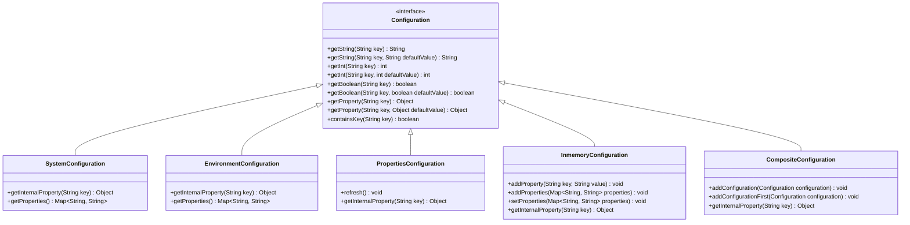
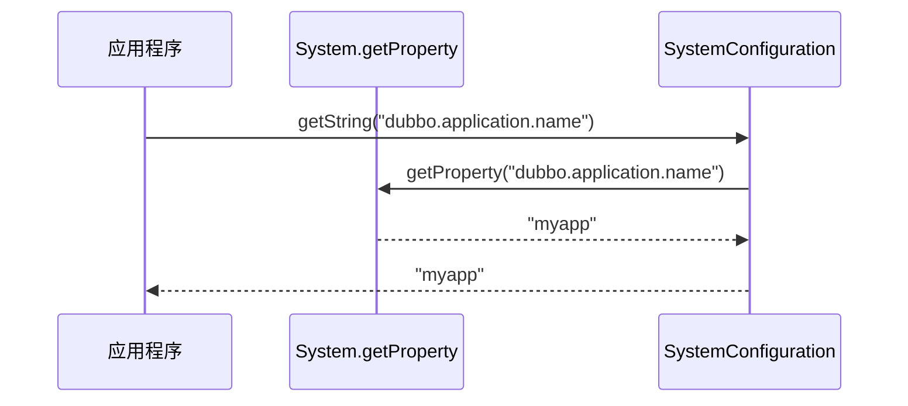
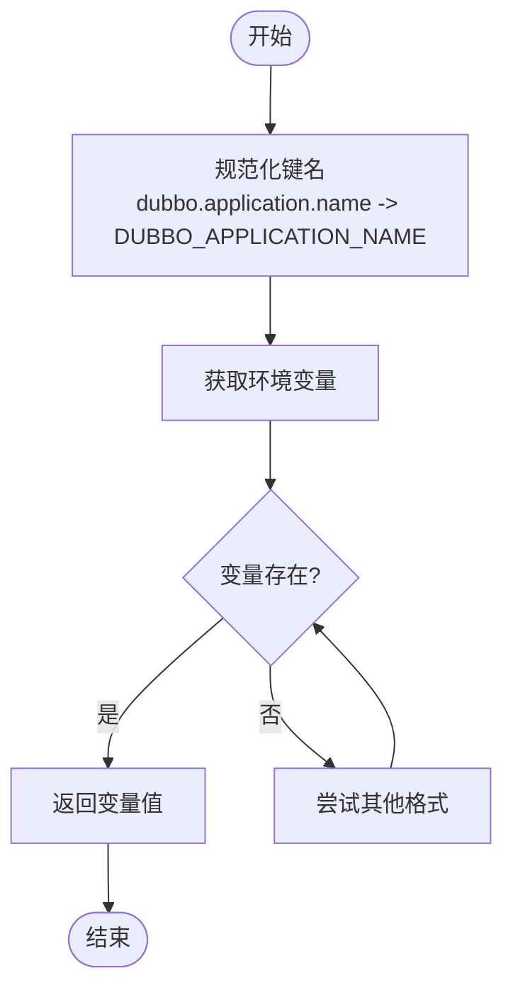
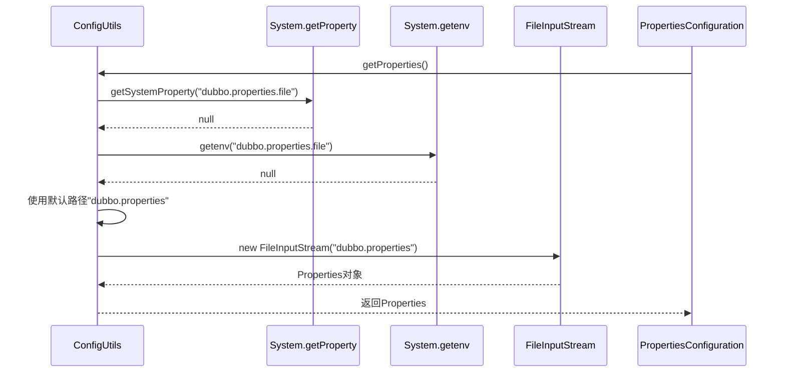
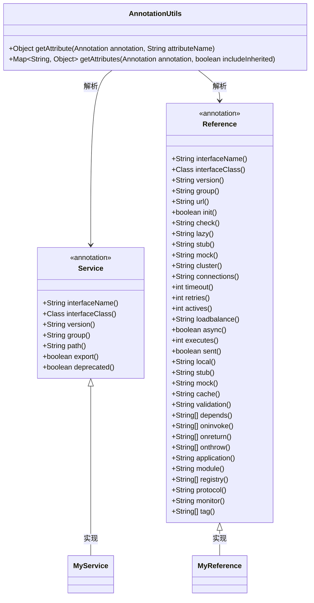
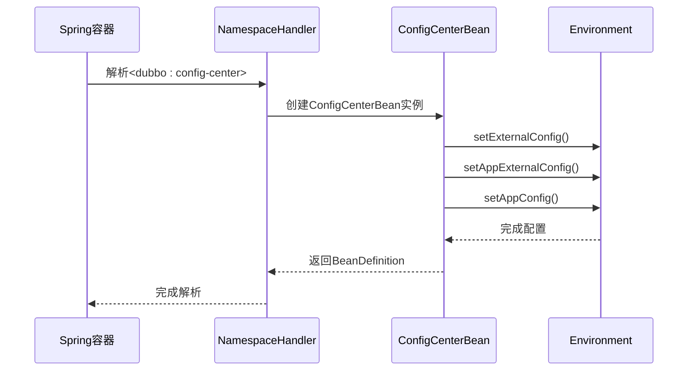
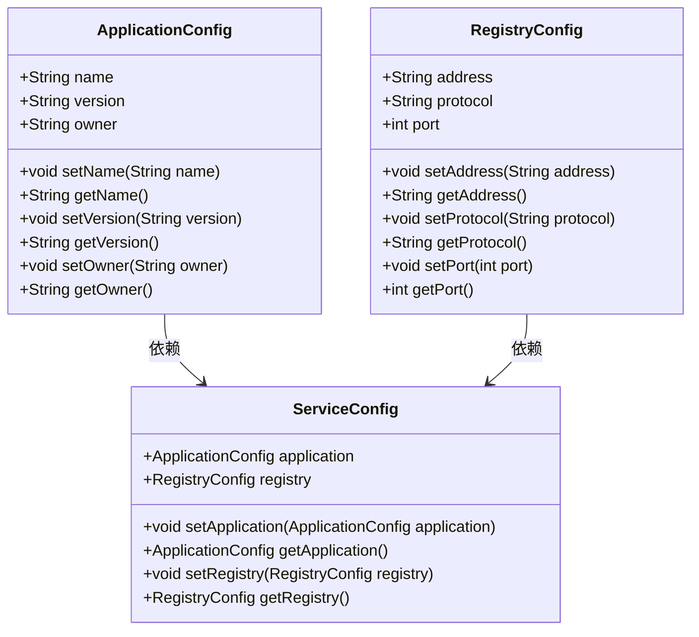
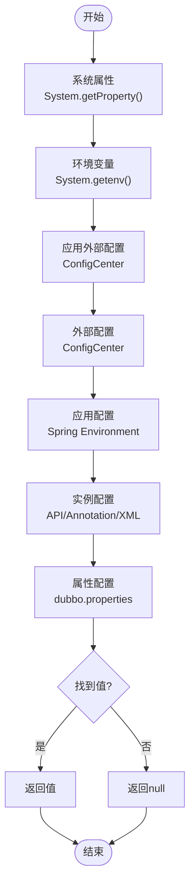
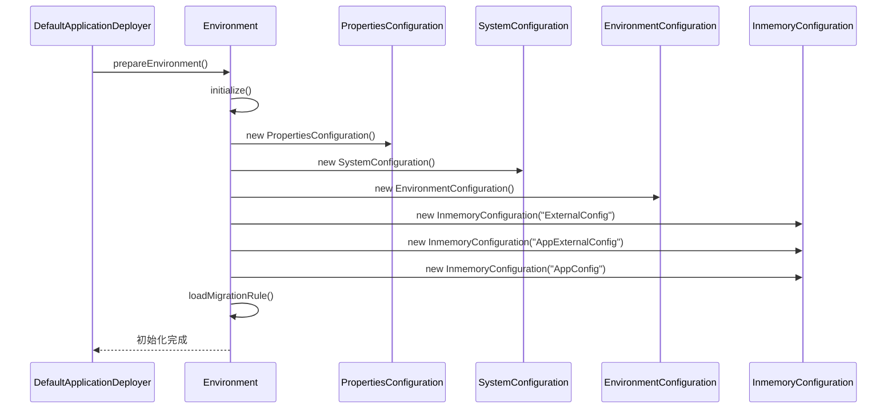

# 配置来源

<cite>
**本文档中引用的文件**  
- [SystemConfiguration.java](file://dubbo-common\src\main\java\org\apache\dubbo\common\config\SystemConfiguration.java)
- [Environment.java](file://dubbo-common\src\main\java\org\apache\dubbo\common\config\Environment.java)
- [ConfigUtils.java](file://dubbo-common\src\main\java\org\apache\dubbo\common\utils\ConfigUtils.java)
- [PropertiesConfiguration.java](file://dubbo-common\src\main\java\org\apache\dubbo\common\config\PropertiesConfiguration.java)
- [EnvironmentConfiguration.java](file://dubbo-common\src\main\java\org\apache\dubbo\common\config\EnvironmentConfiguration.java)
- [InmemoryConfiguration.java](file://dubbo-common\src\main\java\org\apache\dubbo\common\config\InmemoryConfiguration.java)
- [Configuration.java](file://dubbo-common\src\main\java\org\apache\dubbo\common\config\Configuration.java)
- [CompositeConfiguration.java](file://dubbo-common\src\main\java\org\apache\dubbo\common\config\CompositeConfiguration.java)
- [ConfigCenterBean.java](file://dubbo-config\dubbo-config-spring\src\main\java\org\apache\dubbo\config\spring\ConfigCenterBean.java)
- [dubbo.xsd](file://dubbo-config\dubbo-config-spring\src\main\resources\META-INF\dubbo.xsd)
</cite>

## 目录
1. [引言](#引言)
2. [配置来源概述](#配置来源概述)
3. [系统属性配置](#系统属性配置)
4. [环境变量配置](#环境变量配置)
5. [JVM参数配置](#jvm参数配置)
6. [配置文件配置](#配置文件配置)
7. [注解配置](#注解配置)
8. [XML配置](#xml配置)
9. [API配置](#api配置)
10. [配置加载顺序与优先级](#配置加载顺序与优先级)
11. [配置初始化过程](#配置初始化过程)
12. [最佳实践与复杂配置组合](#最佳实践与复杂配置组合)

## 引言

Dubbo框架提供了多种配置来源，允许开发者通过不同的方式来配置服务。这些配置来源包括系统属性、环境变量、JVM参数、配置文件（如dubbo.properties）、注解配置、XML配置和API配置等。本文档将详细介绍这些配置来源的使用场景、适用范围、加载时机和初始化过程，为初学者提供简单的配置示例，同时为经验丰富的开发者提供复杂的配置组合场景和最佳实践。

## 配置来源概述

Dubbo的配置系统设计为一个复合配置系统，它将多种配置来源按优先级顺序组合在一起。这种设计允许开发者在不同层次上进行配置，从全局的系统属性到特定的API调用。配置系统的核心是`Configuration`接口，它定义了获取配置值的基本方法。不同的配置来源实现了这个接口，如`SystemConfiguration`、`EnvironmentConfiguration`、`PropertiesConfiguration`等。



**图示来源**
- [Configuration.java](file://dubbo-common\src\main\java\org\apache\dubbo\common\config\Configuration.java)
- [SystemConfiguration.java](file://dubbo-common\src\main\java\org\apache\dubbo\common\config\SystemConfiguration.java)
- [EnvironmentConfiguration.java](file://dubbo-common\src\main\java\org\apache\dubbo\common\config\EnvironmentConfiguration.java)
- [PropertiesConfiguration.java](file://dubbo-common\src\main\java\org\apache\dubbo\common\config\PropertiesConfiguration.java)
- [InmemoryConfiguration.java](file://dubbo-common\src\main\java\org\apache\dubbo\common\config\InmemoryConfiguration.java)
- [CompositeConfiguration.java](file://dubbo-common\src\main\java\org\apache\dubbo\common\config\CompositeConfiguration.java)

## 系统属性配置

系统属性配置是通过Java的`System.getProperty()`方法获取的。在Dubbo中，`SystemConfiguration`类实现了`Configuration`接口，用于从系统属性中读取配置。系统属性通常通过JVM启动参数（-D）设置，例如`-Ddubbo.application.name=myapp`。



**图示来源**
- [SystemConfiguration.java](file://dubbo-common\src\main\java\org\apache\dubbo\common\config\SystemConfiguration.java)

**本节来源**
- [SystemConfiguration.java](file://dubbo-common\src\main\java\org\apache\dubbo\common\config\SystemConfiguration.java)
- [SystemConfigurationTest.java](file://dubbo-common\src\test\java\org\apache\dubbo\common\config\SystemConfigurationTest.java)

## 环境变量配置

环境变量配置是通过操作系统的环境变量获取的。在Dubbo中，`EnvironmentConfiguration`类实现了`Configuration`接口，用于从环境变量中读取配置。环境变量的键名会经过转换，支持多种格式，如`DUBBO_APPLICATION_NAME`、`dubbo.application.name`等。



**图示来源**
- [EnvironmentConfiguration.java](file://dubbo-common\src\main\java\org\apache\dubbo\common\config\EnvironmentConfiguration.java)

**本节来源**
- [EnvironmentConfiguration.java](file://dubbo-common\src\main\java\org\apache\dubbo\common\config\EnvironmentConfiguration.java)

## JVM参数配置

JVM参数配置是通过JVM启动时的系统属性设置的，实际上与系统属性配置是同一机制。通过`-D`参数可以设置任意的系统属性，这些属性在应用程序中可以通过`System.getProperty()`或Dubbo的配置系统访问。

例如，启动JVM时可以使用以下参数：
```
java -Ddubbo.application.name=myapp -Ddubbo.protocol.port=20880 -jar myapp.jar
```

这些参数会被`SystemConfiguration`捕获并作为配置来源。

**本节来源**
- [SystemConfiguration.java](file://dubbo-common\src\main\java\org\apache\dubbo\common\config\SystemConfiguration.java)

## 配置文件配置

配置文件配置是通过读取`dubbo.properties`文件实现的。在Dubbo中，`PropertiesConfiguration`类负责加载这个文件。配置文件的路径可以通过系统属性`dubbo.properties.file`或环境变量`DUBBO_PROPERTIES_FILE`指定，如果没有指定，则默认使用类路径下的`dubbo.properties`文件。



**图示来源**
- [ConfigUtils.java](file://dubbo-common\src\main\java\org\apache\dubbo\common\utils\ConfigUtils.java)
- [PropertiesConfiguration.java](file://dubbo-common\src\main\java\org\apache\dubbo\common\config\PropertiesConfiguration.java)

**本节来源**
- [ConfigUtils.java](file://dubbo-common\src\main\java\org\apache\dubbo\common\utils\ConfigUtils.java)
- [PropertiesConfiguration.java](file://dubbo-common\src\main\java\org\apache\dubbo\common\config\PropertiesConfiguration.java)

## 注解配置

注解配置是通过Java注解实现的，主要用于Spring集成环境中。Dubbo提供了`@Service`和`@Reference`等注解，可以直接在服务实现类和引用字段上使用。这些注解的属性会被`AnnotationUtils`解析并转换为配置。



**图示来源**
- [AnnotationUtils.java](file://dubbo-common\src\main\java\org\apache\dubbo\common\utils\AnnotationUtils.java)
- [Service.java](file://dubbo-compatible\src\main\java\com\alibaba\dubbo\config\annotation\Service.java)
- [Reference.java](file://dubbo-compatible\src\main\java\com\alibaba\dubbo\config\annotation\Reference.java)

**本节来源**
- [AnnotationUtils.java](file://dubbo-common\src\main\java\org\apache\dubbo\common\utils\AnnotationUtils.java)
- [AnnotationUtilsTest.java](file://dubbo-common\src\test\java\org\apache\dubbo\common\utils\AnnotationUtilsTest.java)

## XML配置

XML配置是通过Spring的XML配置文件实现的。Dubbo提供了自定义的XML命名空间，允许在Spring配置文件中使用`<dubbo:application>`、`<dubbo:registry>`、`<dubbo:service>`等标签。这些标签的属性会被`ConfigCenterBean`等类解析并转换为配置对象。



**图示来源**
- [ConfigCenterBean.java](file://dubbo-config\dubbo-config-spring\src\main\java\org\apache\dubbo\config\spring\ConfigCenterBean.java)
- [dubbo.xsd](file://dubbo-config\dubbo-config-spring\src\main\resources\META-INF\dubbo.xsd)

**本节来源**
- [ConfigCenterBean.java](file://dubbo-config\dubbo-config-spring\src\main\java\org\apache\dubbo\config\spring\ConfigCenterBean.java)
- [dubbo.xsd](file://dubbo-config\dubbo-config-spring\src\main\resources\META-INF\dubbo.xsd)

## API配置

API配置是通过直接调用Dubbo的API来设置配置。这种方式提供了最大的灵活性，允许在运行时动态修改配置。通过创建`ApplicationConfig`、`RegistryConfig`等配置对象，并设置其属性，然后将这些对象传递给服务提供者或消费者。



**图示来源**
- [ApplicationConfig.java](file://dubbo-compatible\src\main\java\com\alibaba\dubbo\config\ApplicationConfig.java)
- [RegistryConfig.java](file://dubbo-compatible\src\main\java\com\alibaba\dubbo\config\RegistryConfig.java)
- [ServiceConfig.java](file://dubbo-compatible\src\main\java\com\alibaba\dubbo\config\ServiceConfig.java)

**本节来源**
- [ApplicationConfig.java](file://dubbo-compatible\src\main\java\com\alibaba\dubbo\config\ApplicationConfig.java)
- [RegistryConfig.java](file://dubbo-compatible\src\main\java\com\alibaba\dubbo\config\RegistryConfig.java)
- [ServiceConfig.java](file://dubbo-compatible\src\main\java\com\alibaba\dubbo\config\ServiceConfig.java)

## 配置加载顺序与优先级

Dubbo的配置系统采用复合配置模式，将多种配置来源按优先级顺序组合在一起。当查询一个配置项时，系统会按顺序在各个配置来源中查找，直到找到第一个匹配的值。配置的优先级顺序如下：

1. 系统属性（System Properties）
2. 环境变量（Environment Variables）
3. 应用外部配置（App External Configuration）
4. 外部配置（External Configuration）
5. 应用配置（App Configuration）
6. 实例配置（Instance Configuration）
7. 属性配置（Properties Configuration）



**图示来源**
- [Environment.java](file://dubbo-common\src\main\java\org\apache\dubbo\common\config\Environment.java)

**本节来源**
- [Environment.java](file://dubbo-common\src\main\java\org\apache\dubbo\common\config\Environment.java)

## 配置初始化过程

Dubbo的配置初始化过程在`Environment`类的`initialize()`方法中完成。这个过程包括创建各种配置对象，并将它们按优先级顺序添加到复合配置中。初始化过程确保了所有配置来源都已准备就绪，可以在应用程序启动时使用。



**图示来源**
- [Environment.java](file://dubbo-common\src\main\java\org\apache\dubbo\common\config\Environment.java)

**本节来源**
- [Environment.java](file://dubbo-common\src\main\java\org\apache\dubbo\common\config\Environment.java)

## 最佳实践与复杂配置组合

在实际应用中，通常会结合多种配置来源来实现灵活的配置管理。以下是一些最佳实践和复杂配置组合的示例：

1. **分层配置策略**：使用`dubbo.properties`文件作为基础配置，环境变量作为环境特定配置，系统属性作为临时覆盖配置。

2. **配置中心集成**：将动态配置存储在Nacos、Zookeeper等配置中心中，通过`ConfigCenterBean`加载，实现配置的动态更新。

3. **Spring Boot集成**：在Spring Boot应用中，使用`application.properties`或`application.yml`作为主要配置来源，通过`@Value`注解注入配置值。

4. **多环境配置**：使用不同的配置文件（如`dubbo-dev.properties`、`dubbo-prod.properties`）配合环境变量`DUBBO_ENV`来选择加载相应的配置。

5. **配置验证**：在配置加载后，使用`Configuration`接口的`containsKey()`方法验证必需的配置项是否存在。

这些最佳实践可以帮助开发者构建更加灵活、可维护的Dubbo应用配置系统。

**本节来源**
- [Environment.java](file://dubbo-common\src\main\java\org\apache\dubbo\common\config\Environment.java)
- [ConfigCenterBean.java](file://dubbo-config\dubbo-config-spring\src\main\java\org\apache\dubbo\config\spring\ConfigCenterBean.java)
- [ConfigUtils.java](file://dubbo-common\src\main\java\org\apache\dubbo\common\utils\ConfigUtils.java)