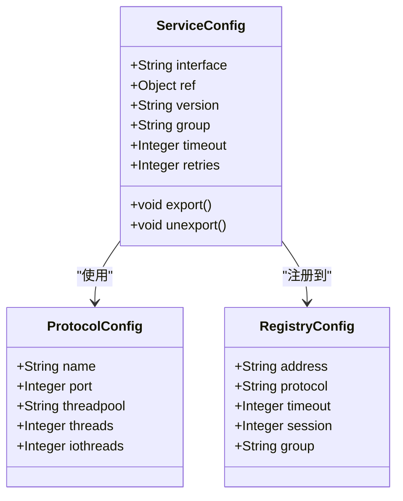
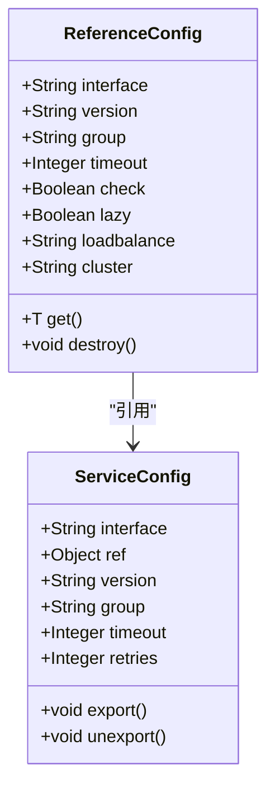
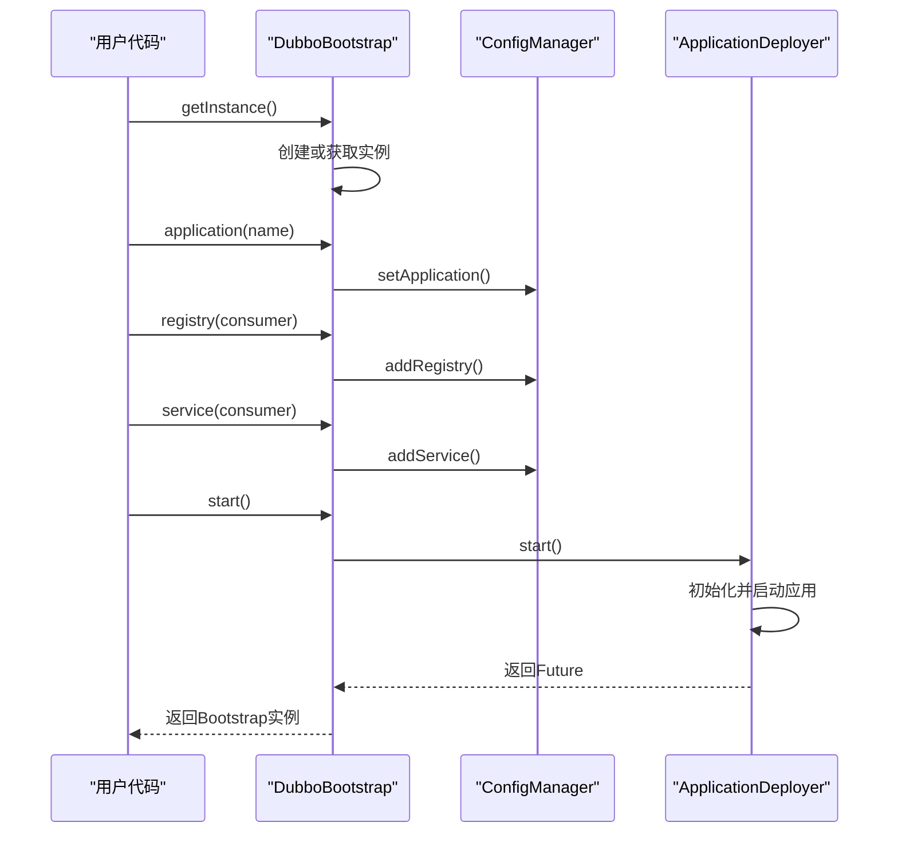
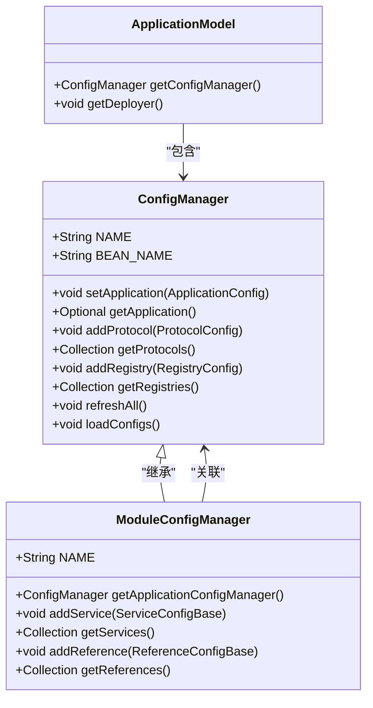
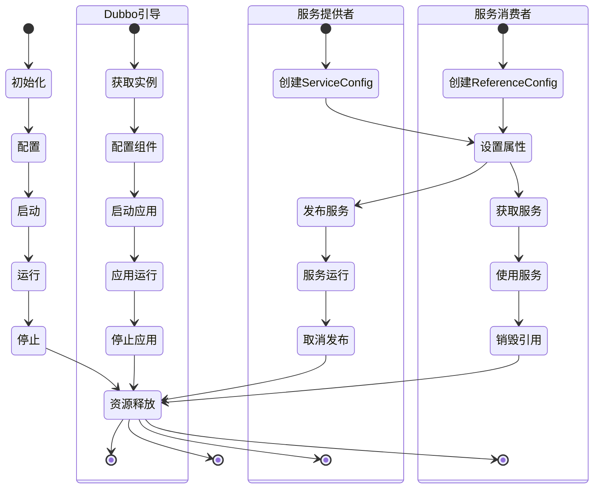

# API编程配置

<cite>
**Referenced Files in This Document**   
- [ServiceConfig.java](file://dubbo-config\dubbo-config-api\src\main\java\org\apache\dubbo\config\ServiceConfig.java)
- [ReferenceConfig.java](file://dubbo-config\dubbo-config-api\src\main\java\org\apache\dubbo\config\ReferenceConfig.java)
- [DubboBootstrap.java](file://dubbo-config\dubbo-config-api\src\main\java\org\apache\dubbo\config\bootstrap\DubboBootstrap.java)
- [ConfigManager.java](file://dubbo-common\src\main\java\org\apache\dubbo\config\context\ConfigManager.java)
- [ModuleConfigManager.java](file://dubbo-common\src\main\java\org\apache\dubbo\config\context\ModuleConfigManager.java)
</cite>

## 目录
1. [简介](#简介)
2. [核心配置类](#核心配置类)
3. [服务提供者配置](#服务提供者配置)
4. [服务消费者配置](#服务消费者配置)
5. [Dubbo引导类](#dubbo引导类)
6. [配置管理器](#配置管理器)
7. [API配置示例](#api配置示例)
8. [生命周期管理](#生命周期管理)
9. [配置优先级](#配置优先级)
10. [总结](#总结)

## 简介
本文档详细介绍了Dubbo框架中通过Java API进行编程配置的方法。重点阐述了`ServiceConfig`和`ReferenceConfig`类的使用方式，包括属性设置、协议配置、注册中心配置等。同时，文档还介绍了`DubboBootstrap`引导类的使用方法，展示了如何通过编程方式启动和管理Dubbo应用。此外，文档解释了`ConfigManager`配置管理器的内部机制和作用域模型，提供了完整的API配置示例，展示了动态创建服务提供者和消费者的方法。最后，文档说明了API配置的生命周期管理和资源释放机制，为初学者提供了简单的API配置示例，同时也为经验丰富的开发者提供了复杂的动态配置和运行时修改功能。

## 核心配置类
Dubbo框架提供了两个核心的API配置类：`ServiceConfig`用于配置服务提供者，`ReferenceConfig`用于配置服务消费者。这两个类都继承自`AbstractServiceConfig`和`AbstractReferenceConfig`，提供了丰富的配置选项和灵活的编程接口。

**Section sources**
- [ServiceConfig.java](file://dubbo-config\dubbo-config-api\src\main\java\org\apache\dubbo\config\ServiceConfig.java)
- [ReferenceConfig.java](file://dubbo-config\dubbo-config-api\src\main\java\org\apache\dubbo\config\ReferenceConfig.java)

## 服务提供者配置
`ServiceConfig`类用于配置和发布Dubbo服务。通过该类，开发者可以以编程方式定义服务的接口、实现、协议、注册中心等信息。

### 基本属性设置
`ServiceConfig`提供了多种属性来配置服务，包括：
- `interface`: 服务接口名称
- `ref`: 服务实现对象
- `version`: 服务版本
- `group`: 服务分组
- `timeout`: 调用超时时间
- `retries`: 失败重试次数

### 协议配置
可以通过`ProtocolConfig`类来配置服务使用的协议。Dubbo支持多种协议，如dubbo、http、hessian等。每个协议可以独立配置端口、线程池等参数。

### 注册中心配置
通过`RegistryConfig`类可以配置服务注册中心，如Zookeeper、Nacos等。可以设置注册中心的地址、协议、超时时间等参数。



**Diagram sources**
- [ServiceConfig.java](file://dubbo-config\dubbo-config-api\src\main\java\org\apache\dubbo\config\ServiceConfig.java)
- [ProtocolConfig.java](file://dubbo-config\dubbo-config-api\src\main\java\org\apache\dubbo\config\ProtocolConfig.java)
- [RegistryConfig.java](file://dubbo-config\dubbo-config-api\src\main\java\org\apache\dubbo\config\RegistryConfig.java)

**Section sources**
- [ServiceConfig.java](file://dubbo-config\dubbo-config-api\src\main\java\org\apache\dubbo\config\ServiceConfig.java)

## 服务消费者配置
`ReferenceConfig`类用于配置和引用Dubbo服务。通过该类，开发者可以以编程方式定义服务消费者的配置，包括接口、版本、分组、超时时间等。

### 基本属性设置
`ReferenceConfig`提供了多种属性来配置服务引用，包括：
- `interface`: 服务接口名称
- `version`: 服务版本
- `group`: 服务分组
- `timeout`: 调用超时时间
- `check`: 启动时检查提供者是否存在
- `lazy`: 是否延迟连接

### 负载均衡配置
可以通过`loadbalance`属性来配置负载均衡策略，支持随机、轮询、最少活跃调用等策略。

### 集群容错配置
可以通过`cluster`属性来配置集群容错策略，支持failover、failfast、failsafe等模式。



**Diagram sources**
- [ReferenceConfig.java](file://dubbo-config\dubbo-config-api\src\main\java\org\apache\dubbo\config\ReferenceConfig.java)
- [ServiceConfig.java](file://dubbo-config\dubbo-config-api\src\main\java\org\apache\dubbo\config\ServiceConfig.java)

**Section sources**
- [ReferenceConfig.java](file://dubbo-config\dubbo-config-api\src\main\java\org\apache\dubbo\config\ReferenceConfig.java)

## Dubbo引导类
`DubboBootstrap`是Dubbo框架的引导类，用于以编程方式启动和管理Dubbo应用。它提供了一种流畅的API风格，使得配置和启动Dubbo应用变得更加简单和直观。

### 基本使用
通过`DubboBootstrap`的静态方法`getInstance()`获取单例实例，然后通过链式调用配置各种组件。

### 配置方法
`DubboBootstrap`提供了多种配置方法，包括：
- `application()`: 配置应用信息
- `registry()`: 配置注册中心
- `protocol()`: 配置协议
- `service()`: 配置服务提供者
- `reference()`: 配置服务消费者
- `start()`: 启动Dubbo应用
- `stop()`: 停止Dubbo应用



**Diagram sources**
- [DubboBootstrap.java](file://dubbo-config\dubbo-config-api\src\main\java\org\apache\dubbo\config\bootstrap\DubboBootstrap.java)
- [ConfigManager.java](file://dubbo-common\src\main\java\org\apache\dubbo\config\context\ConfigManager.java)
- [ApplicationDeployer.java](file://dubbo-rpc\src\main\java\org\apache\dubbo\rpc\model\ApplicationDeployer.java)

**Section sources**
- [DubboBootstrap.java](file://dubbo-config\dubbo-config-api\src\main\java\org\apache\dubbo\config\bootstrap\DubboBootstrap.java)

## 配置管理器
`ConfigManager`是Dubbo框架中的配置管理器，负责管理应用级别的所有配置对象。它采用无锁设计，通过`ConcurrentHashMap`实现快速的读操作，同时在写操作时使用配置类型级别的锁确保安全性。

### 管理的配置类型
`ConfigManager`管理以下类型的配置：
- `ApplicationConfig`: 应用配置（唯一）
- `MonitorConfig`: 监控中心配置（唯一）
- `MetricsConfig`: 指标配置（唯一）
- `ProtocolConfig`: 协议配置（多实例）
- `RegistryConfig`: 注册中心配置（多实例）
- `ConfigCenterConfig`: 配置中心配置（多实例）
- `MetadataReportConfig`: 元数据中心配置（多实例）

### 作用域模型
`ConfigManager`与`ApplicationModel`集成，作为应用模型的扩展。它支持配置的继承和覆盖，可以在不同作用域（应用级、模块级）之间共享配置。



**Diagram sources**
- [ConfigManager.java](file://dubbo-common\src\main\java\org\apache\dubbo\config\context\ConfigManager.java)
- [ApplicationModel.java](file://dubbo-rpc\src\main\java\org\apache\dubbo\rpc\model\ApplicationModel.java)
- [ModuleConfigManager.java](file://dubbo-common\src\main\java\org\apache\dubbo\config\context\ModuleConfigManager.java)

**Section sources**
- [ConfigManager.java](file://dubbo-common\src\main\java\org\apache\dubbo\config\context\ConfigManager.java)
- [ModuleConfigManager.java](file://dubbo-common\src\main\java\org\apache\dubbo\config\context\ModuleConfigManager.java)

## API配置示例
本节提供了一些实用的API配置示例，展示了如何使用`ServiceConfig`、`ReferenceConfig`和`DubboBootstrap`进行编程配置。

### 简单的服务提供者示例
```java
// 创建服务提供者配置
ServiceConfig<DemoService> service = new ServiceConfig<>();
service.setInterface(DemoService.class);
service.setRef(new DemoServiceImpl());

// 创建应用配置
ApplicationConfig application = new ApplicationConfig();
application.setName("demo-provider");

// 创建注册中心配置
RegistryConfig registry = new RegistryConfig();
registry.setAddress("zookeeper://127.0.0.1:2181");

// 设置配置
service.setApplication(application);
service.setRegistry(registry);

// 发布服务
service.export();
```

### 简单的服务消费者示例
```java
// 创建服务消费者配置
ReferenceConfig<DemoService> reference = new ReferenceConfig<>();
reference.setInterface(DemoService.class);

// 创建应用配置
ApplicationConfig application = new ApplicationConfig();
application.setName("demo-consumer");

// 创建注册中心配置
RegistryConfig registry = new RegistryConfig();
registry.setAddress("zookeeper://127.0.0.1:2181");

// 设置配置
reference.setApplication(application);
reference.setRegistry(registry);

// 获取服务
DemoService service = reference.get();
```

### 使用DubboBootstrap的示例
```java
// 获取DubboBootstrap实例
DubboBootstrap bootstrap = DubboBootstrap.getInstance();

// 配置应用
bootstrap.application("demo-app");

// 配置注册中心
bootstrap.registry(registry -> registry.setAddress("zookeeper://127.0.0.1:2181"));

// 配置协议
bootstrap.protocol(protocol -> protocol.setName("dubbo").setPort(20880));

// 配置服务提供者
bootstrap.service(service -> {
    service.setInterface(DemoService.class);
    service.setRef(new DemoServiceImpl());
});

// 配置服务消费者
bootstrap.reference(reference -> {
    reference.setInterface(DemoService.class);
});

// 启动Dubbo
bootstrap.start();

// 等待终止
bootstrap.await();
```

**Section sources**
- [ServiceConfig.java](file://dubbo-config\dubbo-config-api\src\main\java\org\apache\dubbo\config\ServiceConfig.java)
- [ReferenceConfig.java](file://dubbo-config\dubbo-config-api\src\main\java\org\apache\dubbo\config\ReferenceConfig.java)
- [DubboBootstrap.java](file://dubbo-config\dubbo-config-api\src\main\java\org\apache\dubbo\config\bootstrap\DubboBootstrap.java)

## 生命周期管理
Dubbo的API配置具有明确的生命周期，包括初始化、启动、运行和销毁等阶段。正确管理配置的生命周期对于应用的稳定运行至关重要。

### 服务提供者的生命周期
服务提供者的生命周期包括：
1. 创建`ServiceConfig`实例
2. 设置各种配置属性
3. 调用`export()`方法发布服务
4. 应用运行期间服务可用
5. 调用`unexport()`方法取消发布服务
6. 释放相关资源

### 服务消费者的生命周期
服务消费者的生命周期包括：
1. 创建`ReferenceConfig`实例
2. 设置各种配置属性
3. 调用`get()`方法获取服务代理
4. 使用服务代理进行远程调用
5. 调用`destroy()`方法销毁引用
6. 释放相关资源

### 引导类的生命周期
`DubboBootstrap`的生命周期包括：
1. 调用`getInstance()`获取实例
2. 配置各种组件
3. 调用`start()`方法启动应用
4. 应用运行期间处理请求
5. 调用`stop()`方法停止应用
6. 释放所有资源



**Diagram sources**
- [ServiceConfig.java](file://dubbo-config\dubbo-config-api\src\main\java\org\apache\dubbo\config\ServiceConfig.java)
- [ReferenceConfig.java](file://dubbo-config\dubbo-config-api\src\main\java\org\apache\dubbo\config\ReferenceConfig.java)
- [DubboBootstrap.java](file://dubbo-config\dubbo-config-api\src\main\java\org\apache\dubbo\config\bootstrap\DubboBootstrap.java)

**Section sources**
- [ServiceConfig.java](file://dubbo-config\dubbo-config-api\src\main\java\org\apache\dubbo\config\ServiceConfig.java)
- [ReferenceConfig.java](file://dubbo-config\dubbo-config-api\src\main\java\org\apache\dubbo\config\ReferenceConfig.java)
- [DubboBootstrap.java](file://dubbo-config\dubbo-config-api\src\main\java\org\apache\dubbo\config\bootstrap\DubboBootstrap.java)

## 配置优先级
在Dubbo中，配置可以通过多种方式设置，包括API配置、XML配置、注解配置和属性文件配置。当同一配置项在多个地方设置时，会根据优先级规则确定最终的配置值。

### 优先级规则
配置的优先级从高到低依次为：
1. API配置：通过Java代码直接设置的配置，优先级最高
2. 系统属性：通过JVM系统属性设置的配置
3. 环境变量：通过操作系统环境变量设置的配置
4. XML配置：通过XML文件配置的配置
5. 注解配置：通过注解设置的配置
6. 属性文件：通过属性文件（如dubbo.properties）设置的配置

### 互操作性
不同配置方式之间可以互操作，例如：
- 可以在XML配置中引用API配置的实例
- 可以在注解配置中使用属性文件的值
- 可以在API配置中读取系统属性的值

这种互操作性使得开发者可以根据具体需求选择最合适的配置方式，或者结合多种配置方式来实现复杂的配置需求。

**Section sources**
- [ServiceConfig.java](file://dubbo-config\dubbo-config-api\src\main\java\org\apache\dubbo\config\ServiceConfig.java)
- [ReferenceConfig.java](file://dubbo-config\dubbo-config-api\src\main\java\org\apache\dubbo\config\ReferenceConfig.java)
- [ConfigManager.java](file://dubbo-common\src\main\java\org\apache\dubbo\config\context\ConfigManager.java)

## 总结
本文档详细介绍了Dubbo框架中通过Java API进行编程配置的方法。我们重点介绍了`ServiceConfig`和`ReferenceConfig`类的使用方式，包括属性设置、协议配置、注册中心配置等。同时，文档还介绍了`DubboBootstrap`引导类的使用方法，展示了如何通过编程方式启动和管理Dubbo应用。此外，文档解释了`ConfigManager`配置管理器的内部机制和作用域模型，提供了完整的API配置示例，展示了动态创建服务提供者和消费者的方法。最后，文档说明了API配置的生命周期管理和资源释放机制。

通过本文档，开发者可以全面了解Dubbo的API编程配置方式，无论是初学者还是经验丰富的开发者，都能找到适合自己的配置方法。API配置提供了最大的灵活性和控制力，特别适合需要动态配置或复杂配置逻辑的场景。同时，API配置与其他配置方式（如XML、注解、属性文件）良好地互操作，开发者可以根据具体需求选择最合适的配置方式。