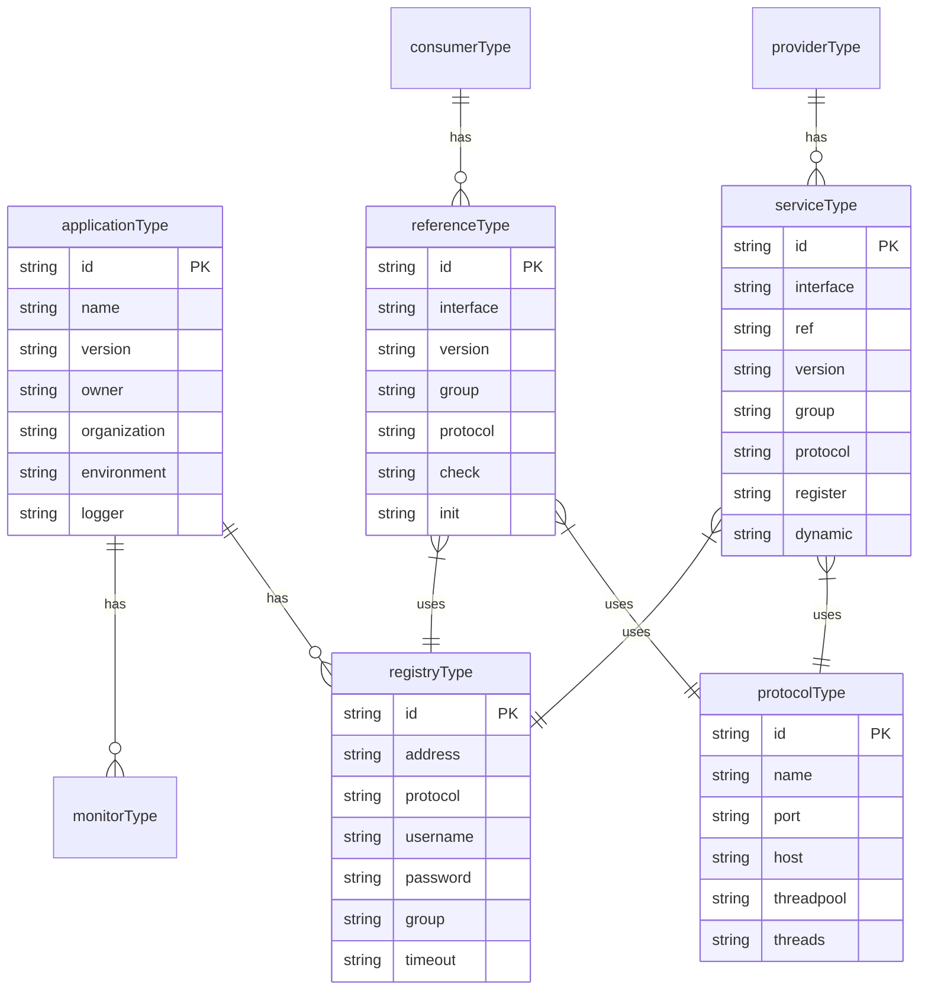
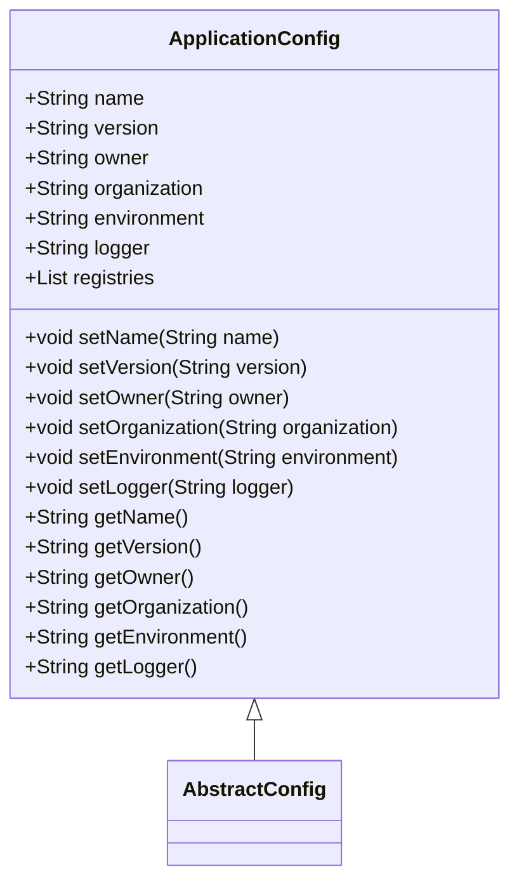
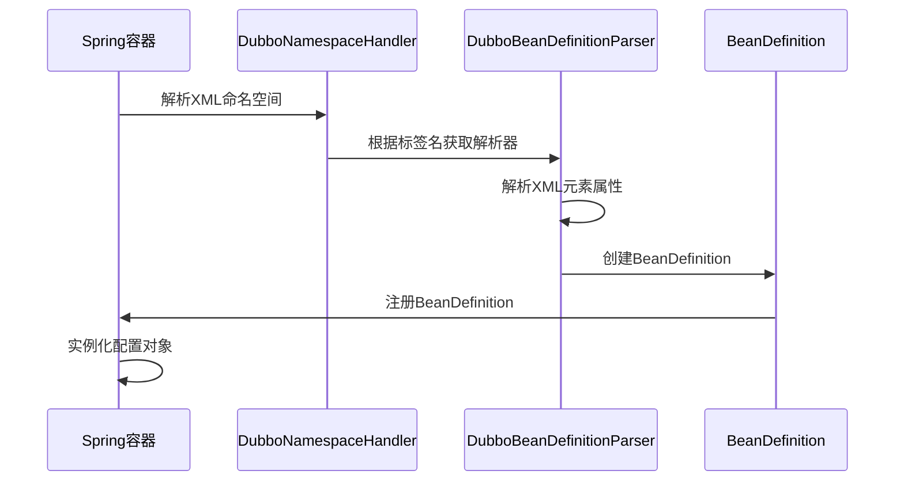
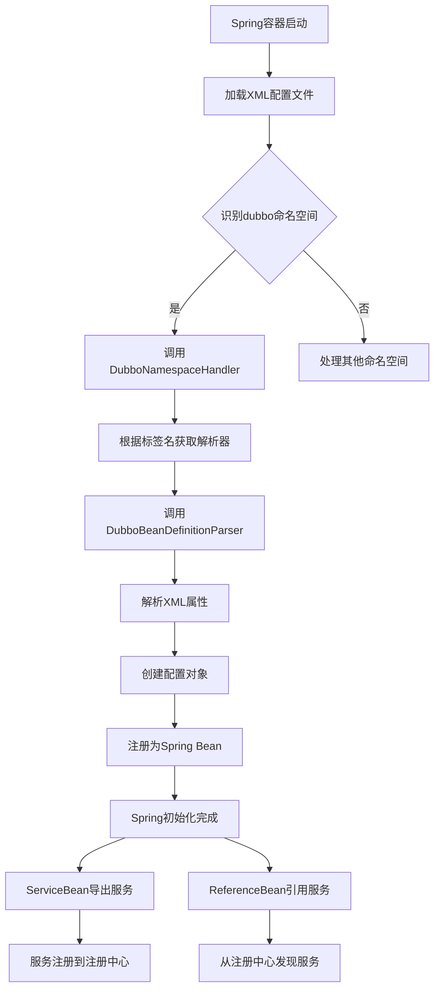

# XML配置

<cite>
**本文档引用的文件**   
- [DubboNamespaceHandler.java](file://dubbo-config/dubbo-config-spring/src/main/java/org/apache/dubbo/config/spring/schema/DubboNamespaceHandler.java)
- [dubbo.xsd](file://dubbo-config/dubbo-config-spring/src/main/resources/META-INF/dubbo.xsd)
- [compat/dubbo.xsd](file://dubbo-config/dubbo-config-spring/src/main/resources/META-INF/compat/dubbo.xsd)
- [ApplicationConfig.java](file://dubbo-common/src/main/java/org/apache/dubbo/config/ApplicationConfig.java)
- [DubboBeanDefinitionParser.java](file://dubbo-config/dubbo-config-spring/src/main/java/org/apache/dubbo/config/spring/schema/DubboBeanDefinitionParser.java)
- [dubbo-provider-v1.xml](file://dubbo-config/dubbo-config-spring/src/test/java/org/apache/dubbo/config/spring/context/customize/dubbo-provider-v1.xml)
- [dubbo-consumer.xml](file://dubbo-config/dubbo-config-spring/src/test/java/org/apache/dubbo/config/spring/boot/importxml/consumer/dubbo-consumer.xml)
</cite>

## 目录
1. [简介](#简介)
2. [dubbo.xsd模式定义](#dubboschema定义)
3. [核心配置标签详解](#核心配置标签详解)
4. [Spring XML配置处理机制](#spring-xml配置处理机制)
5. [XML配置示例](#xml配置示例)
6. [XML配置加载流程](#xml配置加载流程)
7. [配置方式互操作性](#配置方式互操作性)

## 简介
Dubbo提供了基于XML的配置方式，允许开发者通过Spring XML配置文件来定义服务提供者和消费者。这种配置方式通过自定义的XML命名空间和模式定义（XSD）来实现，将XML配置元素映射到相应的Java配置类。XML配置是Dubbo早期主要的配置方式之一，特别适用于基于Spring的传统应用。

**Section sources**
- [DubboNamespaceHandler.java](file://dubbo-config/dubbo-config-spring/src/main/java/org/apache/dubbo/config/spring/schema/DubboNamespaceHandler.java)
- [dubbo.xsd](file://dubbo-config/dubbo-config-spring/src/main/resources/META-INF/dubbo.xsd)

## dubbo.xsd定义
Dubbo的XML配置由`dubbo.xsd`文件定义，该文件位于`dubbo-config-spring`模块的`META-INF`目录下。该XSD文件定义了所有支持的Dubbo配置元素和属性，包括核心的`<dubbo:service>`、`<dubbo:reference>`、`<dubbo:application>`和`<dubbo:registry>`等标签。

XSD文件定义了两种主要的命名空间：
- `http://dubbo.apache.org/schema/dubbo`：用于新版本的Dubbo配置
- `http://code.alibabatech.com/schema/dubbo`：用于兼容旧版本的配置

XSD文件通过复杂的类型定义来约束XML配置的结构和属性。例如，`abstractMethodType`定义了方法级别的通用属性，如`timeout`、`retries`、`loadbalance`等；`abstractInterfaceType`扩展了方法类型，增加了接口级别的属性，如`cluster`、`filter`、`listener`等。



**Diagram sources **
- [dubbo.xsd](file://dubbo-config/dubbo-config-spring/src/main/resources/META-INF/dubbo.xsd)
- [compat/dubbo.xsd](file://dubbo-config/dubbo-config-spring/src/main/resources/META-INF/compat/dubbo.xsd)

## 核心配置标签详解

### <dubbo:application>
`<dubbo:application>`标签用于配置Dubbo应用的基本信息，是所有Dubbo配置的基础。该标签对应`ApplicationConfig`类，定义了应用的名称、版本、所有者等元数据。

主要属性包括：
- `id`：配置的唯一标识符
- `name`：应用名称（必需）
- `version`：应用版本
- `owner`：应用负责人
- `organization`：应用所属组织
- `environment`：运行环境（如dev、test、production）
- `logger`：日志实现类型
- `qos-enable`：是否启用QoS（Quality of Service）服务



**Diagram sources **
- [ApplicationConfig.java](file://dubbo-common/src/main/java/org/apache/dubbo/config/ApplicationConfig.java)
- [dubbo.xsd](file://dubbo-config/dubbo-config-spring/src/main/resources/META-INF/dubbo.xsd)

**Section sources**
- [ApplicationConfig.java](file://dubbo-common/src/main/java/org/apache/dubbo/config/ApplicationConfig.java)
- [dubbo.xsd](file://dubbo-config/dubbo-config-spring/src/main/resources/META-INF/dubbo.xsd)

### <dubbo:registry>
`<dubbo:registry>`标签用于配置注册中心，定义服务发现和注册的地址和协议。该标签对应`RegistryConfig`类，支持多种注册中心实现，如Zookeeper、Nacos、Multicast等。

主要属性包括：
- `id`：配置的唯一标识符
- `address`：注册中心地址
- `protocol`：注册中心协议（如zookeeper、nacos）
- `username`和`password`：认证信息
- `group`：注册中心分组
- `timeout`：请求超时时间
- `check`：启动时是否检查注册中心状态

### <dubbo:service>
`<dubbo:service>`标签用于配置服务提供者，定义对外暴露的服务接口和实现。该标签对应`ServiceBean`类，是服务导出的核心配置。

主要属性包括：
- `interface`：服务接口全限定名（必需）
- `ref`：服务实现的Spring Bean引用（必需）
- `version`：服务版本
- `group`：服务分组
- `protocol`：使用的协议
- `timeout`：方法调用超时时间
- `retries`：重试次数
- `loadbalance`：负载均衡策略
- `dynamic`：注册的服务是否动态

### <dubbo:reference>
`<dubbo:reference>`标签用于配置服务消费者，定义对远程服务的引用。该标签对应`ReferenceBean`类，是服务引用的核心配置。

主要属性包括：
- `interface`：服务接口全限定名（必需）
- `version`：服务版本
- `group`：服务分组
- `check`：启动时是否检查服务提供者
- `init`：是否在Spring初始化时提前引用
- `lazy`：是否延迟创建连接
- `timeout`：调用超时时间
- `retries`：重试次数

## Spring XML配置处理机制
Dubbo的XML配置通过Spring的自定义命名空间处理器实现。核心组件是`DubboNamespaceHandler`和`DubboBeanDefinitionParser`，它们将XML配置元素解析为Spring的Bean定义。

### NamespaceHandler实现
`DubboNamespaceHandler`继承自Spring的`NamespaceHandlerSupport`，在`init()`方法中注册了所有Dubbo配置标签的解析器：

```java
public class DubboNamespaceHandler extends NamespaceHandlerSupport implements ConfigurableSourceBeanMetadataElement {
    @Override
    public void init() {
        registerBeanDefinitionParser("application", new DubboBeanDefinitionParser(ApplicationConfig.class));
        registerBeanDefinitionParser("module", new DubboBeanDefinitionParser(ModuleConfig.class));
        registerBeanDefinitionParser("registry", new DubboBeanDefinitionParser(RegistryConfig.class));
        registerBeanDefinitionParser("config-center", new DubboBeanDefinitionParser(ConfigCenterBean.class));
        registerBeanDefinitionParser("metadata-report", new DubboBeanDefinitionParser(MetadataReportConfig.class));
        registerBeanDefinitionParser("monitor", new DubboBeanDefinitionParser(MonitorConfig.class));
        registerBeanDefinitionParser("metrics", new DubboBeanDefinitionParser(MetricsConfig.class));
        registerBeanDefinitionParser("tracing", new DubboBeanDefinitionParser(TracingConfig.class));
        registerBeanDefinitionParser("ssl", new DubboBeanDefinitionParser(SslConfig.class));
        registerBeanDefinitionParser("provider", new DubboBeanDefinitionParser(ProviderConfig.class));
        registerBeanDefinitionParser("consumer", new DubboBeanDefinitionParser(ConsumerConfig.class));
        registerBeanDefinitionParser("protocol", new DubboBeanDefinitionParser(ProtocolConfig.class));
        registerBeanDefinitionParser("service", new DubboBeanDefinitionParser(ServiceBean.class));
        registerBeanDefinitionParser("reference", new DubboBeanDefinitionParser(ReferenceBean.class));
        registerBeanDefinitionParser("annotation", new AnnotationBeanDefinitionParser());
    }
}
```

### BeanDefinitionParser实现
`DubboBeanDefinitionParser`负责将XML元素解析为Spring的`BeanDefinition`。它通过反射创建配置类的实例，并将XML属性映射到Java对象的属性。



**Diagram sources **
- [DubboNamespaceHandler.java](file://dubbo-config/dubbo-config-spring/src/main/java/org/apache/dubbo/config/spring/schema/DubboNamespaceHandler.java)
- [DubboBeanDefinitionParser.java](file://dubbo-config/dubbo-config-spring/src/main/java/org/apache/dubbo/config/spring/schema/DubboBeanDefinitionParser.java)

**Section sources**
- [DubboNamespaceHandler.java](file://dubbo-config/dubbo-config-spring/src/main/java/org/apache/dubbo/config/spring/schema/DubboNamespaceHandler.java)
- [DubboBeanDefinitionParser.java](file://dubbo-config/dubbo-config-spring/src/main/java/org/apache/dubbo/config/spring/schema/DubboBeanDefinitionParser.java)

## XML配置示例

### 简单配置示例
以下是一个简单的服务提供者配置示例：

```xml
<beans xmlns="http://www.springframework.org/schema/beans"
       xmlns:xsi="http://www.w3.org/2001/XMLSchema-instance"
       xmlns:dubbo="http://dubbo.apache.org/schema/dubbo"
       xsi:schemaLocation="http://www.springframework.org/schema/beans 
                           http://www.springframework.org/schema/beans/spring-beans.xsd
                           http://dubbo.apache.org/schema/dubbo 
                           http://dubbo.apache.org/schema/dubbo/dubbo.xsd">

    <!-- 应用配置 -->
    <dubbo:application name="demo-provider"/>

    <!-- 注册中心配置 -->
    <dubbo:registry address="zookeeper://127.0.0.1:2181"/>

    <!-- 协议配置 -->
    <dubbo:protocol name="dubbo" port="20880"/>

    <!-- 服务实现Bean -->
    <bean id="helloService" class="org.apache.dubbo.config.spring.impl.HelloServiceImpl"/>

    <!-- 服务暴露配置 -->
    <dubbo:service interface="org.apache.dubbo.config.spring.api.HelloService" 
                   ref="helloService" 
                   version="1.0.0"/>
</beans>
```

### 复杂嵌套配置示例
以下是一个包含多个注册中心、协议和复杂属性的高级配置示例：

```xml
<beans xmlns="http://www.springframework.org/schema/beans"
       xmlns:xsi="http://www.w3.org/2001/XMLSchema-instance"
       xmlns:dubbo="http://dubbo.apache.org/schema/dubbo"
       xsi:schemaLocation="http://www.springframework.org/schema/beans 
                           http://www.springframework.org/schema/beans/spring-beans.xsd
                           http://dubbo.apache.org/schema/dubbo 
                           http://dubbo.apache.org/schema/dubbo/dubbo.xsd">

    <!-- 应用配置 -->
    <dubbo:application name="demo-provider">
        <dubbo:parameter key="qos.enable" value="false"/>
    </dubbo:application>

    <!-- 多个注册中心 -->
    <dubbo:registry id="registry1" address="zookeeper://127.0.0.1:2181" group="group1"/>
    <dubbo:registry id="registry2" address="zookeeper://127.0.0.1:2182" group="group2"/>

    <!-- 多个协议 -->
    <dubbo:protocol id="dubbo" name="dubbo" port="20880"/>
    <dubbo:protocol id="rmi" name="rmi" port="1099"/>

    <!-- 提供者配置 -->
    <dubbo:provider timeout="3000" retries="2" threadpool="fixed" threads="100"/>

    <!-- 服务实现Bean -->
    <bean id="helloService" class="org.apache.dubbo.config.spring.impl.HelloServiceImpl"/>

    <!-- 服务暴露配置 -->
    <dubbo:service interface="org.apache.dubbo.config.spring.api.HelloService" 
                   ref="helloService" 
                   version="1.0.0"
                   group="demo"
                   protocol="dubbo,rmi"
                   registry="registry1,registry2">
        <!-- 方法级别配置 -->
        <dubbo:method name="sayHello" timeout="5000" retries="3">
            <dubbo:argument index="0" type="java.lang.String" callback="true"/>
            <dubbo:parameter key="retry.times" value="3"/>
        </dubbo:method>
    </dubbo:service>
</beans>
```

**Section sources**
- [dubbo-provider-v1.xml](file://dubbo-config/dubbo-config-spring/src/test/java/org/apache/dubbo/config/spring/context/customize/dubbo-provider-v1.xml)
- [dubbo-consumer.xml](file://dubbo-config/dubbo-config-spring/src/test/java/org/apache/dubbo/config/spring/boot/importxml/consumer/dubbo-consumer.xml)

## XML配置加载流程
Dubbo的XML配置加载流程遵循Spring的Bean定义解析机制，具体步骤如下：

1. **Spring容器启动**：Spring容器开始加载XML配置文件
2. **命名空间解析**：Spring识别`dubbo`命名空间，调用`DubboNamespaceHandler`
3. **Bean定义解析**：`DubboNamespaceHandler`根据标签名调用相应的`DubboBeanDefinitionParser`
4. **配置对象创建**：解析器将XML属性映射到Java配置对象的属性
5. **Bean注册**：创建的配置对象作为Spring Bean注册到容器中
6. **服务导出/引用**：`ServiceBean`和`ReferenceBean`在Spring初始化完成后执行服务导出和引用逻辑



**Diagram sources **
- [DubboNamespaceHandler.java](file://dubbo-config/dubbo-config-spring/src/main/java/org/apache/dubbo/config/spring/schema/DubboNamespaceHandler.java)
- [DubboBeanDefinitionParser.java](file://dubbo-config/dubbo-config-spring/src/main/java/org/apache/dubbo/config/spring/schema/DubboBeanDefinitionParser.java)

## 配置方式互操作性
Dubbo支持多种配置方式，包括XML、注解、Java API和属性文件。这些配置方式可以混合使用，但存在优先级关系。

### 配置优先级
当同一配置项在多种方式中定义时，优先级从高到低为：
1. Java API配置
2. 注解配置
3. XML配置
4. 属性文件配置

### 配置合并
Dubbo会自动合并不同来源的配置。例如，可以在XML中定义`<dubbo:application>`的基本信息，同时在代码中通过API设置特定属性。系统会将这些配置合并，以最高优先级的配置为准。

### 互操作性示例
```java
// XML配置
<dubbo:application name="demo-provider"/>
<dubbo:registry address="zookeeper://127.0.0.1:2181"/>

// Java代码配置
ApplicationConfig appConfig = new ApplicationConfig();
appConfig.setName("demo-provider-override"); // 此配置优先级更高
appConfig.setOwner("developer");

RegistryConfig regConfig = new RegistryConfig();
regConfig.setAddress("zookeeper://127.0.0.1:2181");
regConfig.setTimeout("5000"); // 此配置与XML合并

// 最终生效的配置：name="demo-provider-override", owner="developer", address="zookeeper://127.0.0.1:2181", timeout="5000"
```

**Section sources**
- [DubboNamespaceHandler.java](file://dubbo-config/dubbo-config-spring/src/main/java/org/apache/dubbo/config/spring/schema/DubboNamespaceHandler.java)
- [ApplicationConfig.java](file://dubbo-common/src/main/java/org/apache/dubbo/config/ApplicationConfig.java)