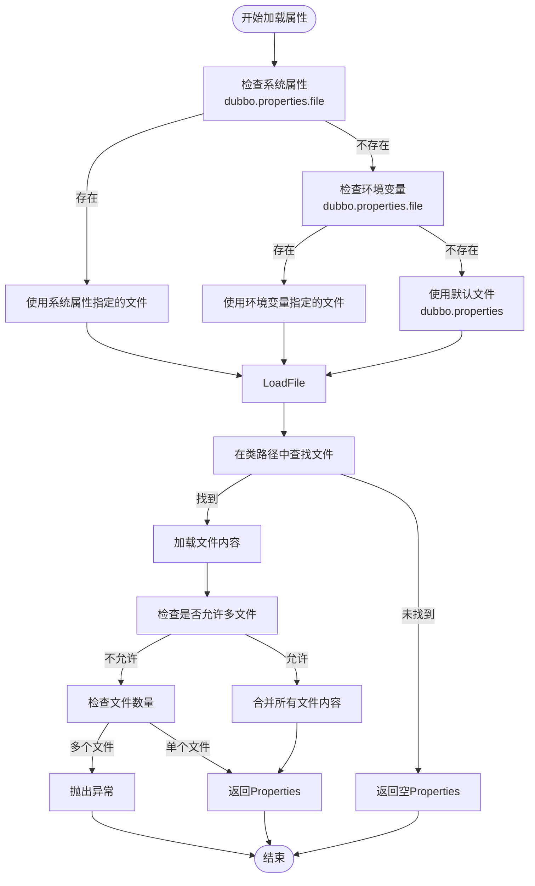
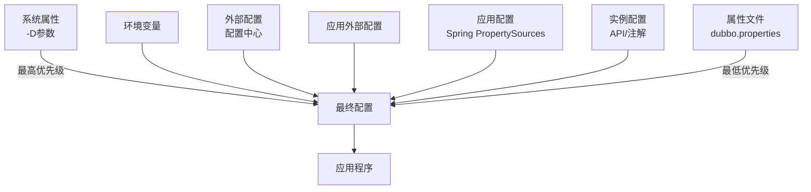
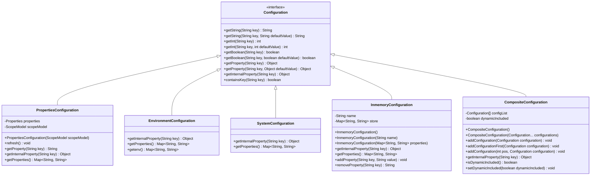
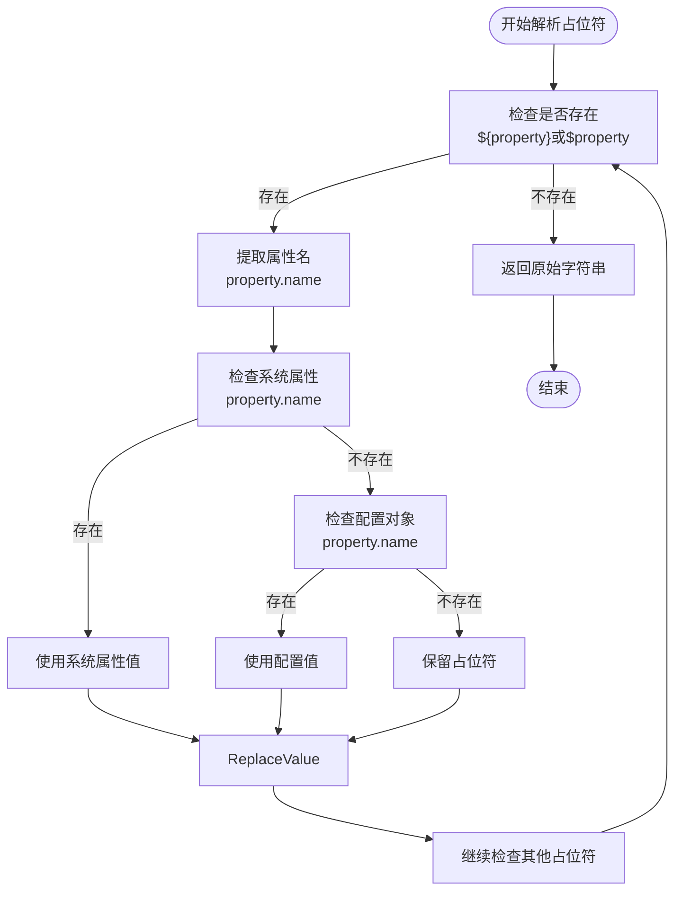
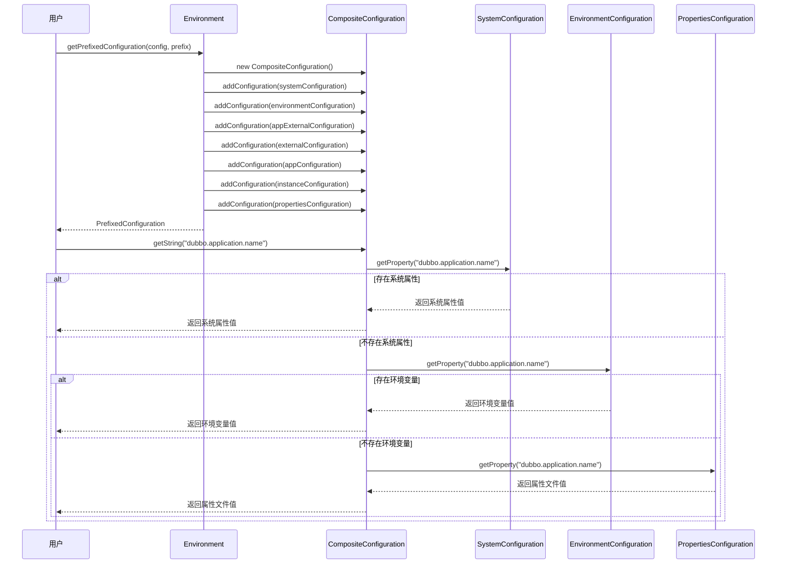
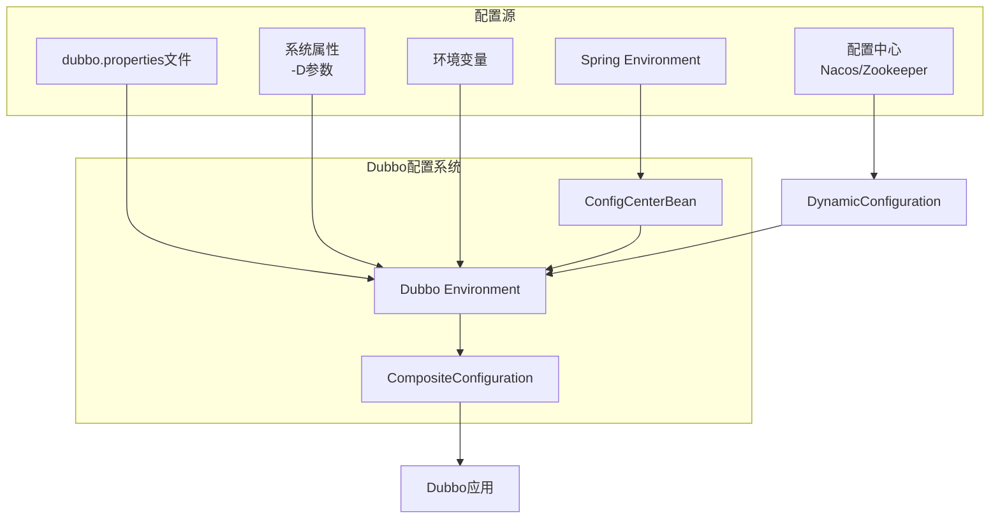

# 属性文件配置

<cite>
**本文档中引用的文件**
- [dubbo.properties](file://dubbo-common/src/test/resources/dubbo.properties)
- [ConfigUtils.java](file://dubbo-common/src/main/java/org/apache/dubbo/common/utils/ConfigUtils.java)
- [PropertiesConfiguration.java](file://dubbo-common/src/main/java/org/apache/dubbo/common/config/PropertiesConfiguration.java)
- [Environment.java](file://dubbo-common/src/main/java/org/apache/dubbo/common/config/Environment.java)
- [EnvironmentConfiguration.java](file://dubbo-common/src/main/java/org/apache/dubbo/common/config/EnvironmentConfiguration.java)
- [SystemConfiguration.java](file://dubbo-common/src/main/java/org/apache/dubbo/common/config/SystemConfiguration.java)
- [InmemoryConfiguration.java](file://dubbo-common/src/main/java/org/apache/dubbo/common/config/InmemoryConfiguration.java)
- [Configuration.java](file://dubbo-common/src/main/java/org/apache/dubbo/common/config/Configuration.java)
- [ConfigCenterBean.java](file://dubbo-config/dubbo-config-spring/src/main/java/org/apache/dubbo/config/spring/ConfigCenterBean.java)
- [DynamicConfiguration.java](file://dubbo-common/src/main/java/org/apache/dubbo/common/config/configcenter/DynamicConfiguration.java)
</cite>

## 目录
1. [引言](#引言)
2. [属性文件格式与位置](#属性文件格式与位置)
3. [属性加载机制](#属性加载机制)
4. [配置优先级关系](#配置优先级关系)
5. [Configuration接口实现机制](#configuration接口实现机制)
6. [属性文件配置示例](#属性文件配置示例)
7. [属性占位符解析机制](#属性占位符解析机制)
8. [配置覆盖规则](#配置覆盖规则)
9. [多环境配置与动态属性加载](#多环境配置与动态属性加载)
10. [与其他配置方式的互操作性](#与其他配置方式的互操作性)
11. [总结](#总结)

## 引言
Dubbo框架提供了灵活的属性文件配置机制，允许开发者通过dubbo.properties文件进行系统配置。本文档详细介绍了Dubbo的属性文件配置方式，包括dubbo.properties文件的格式、位置和加载机制，系统属性、环境变量与属性文件的优先级关系，Configuration接口的实现机制，以及属性占位符的解析机制和配置覆盖规则。通过本文档，初学者可以获得简单的属性文件配置示例，而经验丰富的开发者可以了解复杂的多环境配置和动态属性加载技术。

## 属性文件格式与位置
Dubbo的属性文件采用标准的Java Properties文件格式，文件扩展名为.properties。属性文件中的每一行都包含一个键值对，使用等号（=）或冒号（:）分隔键和值。注释行以井号（#）或感叹号（!）开头。

dubbo.properties文件通常位于项目的类路径（classpath）根目录下，最常见的位置是`src/main/resources/dubbo.properties`。Dubbo会自动在类路径中搜索该文件并加载其内容。

```properties
# 示例dubbo.properties文件
dubbo.application.name=my-application
dubbo.protocol.name=dubbo
dubbo.protocol.port=20880
dubbo.registry.address=zookeeper://127.0.0.1:2181
```

除了默认的dubbo.properties文件，Dubbo还支持通过系统属性或环境变量指定自定义的属性文件路径。这为不同环境下的配置管理提供了灵活性。

**Section sources**
- [dubbo.properties](file://dubbo-common/src/test/resources/dubbo.properties)
- [ConfigUtils.java](file://dubbo-common/src/main/java/org/apache/dubbo/common/utils/ConfigUtils.java#L166-L174)

## 属性加载机制
Dubbo的属性加载机制遵循特定的顺序和规则。系统首先检查系统属性`dubbo.properties.file`，如果存在则使用该属性指定的文件路径。如果系统属性未设置，则检查同名的环境变量。如果环境变量也未设置，则使用默认的`dubbo.properties`文件。

属性加载过程由`ConfigUtils.getProperties()`方法实现，该方法首先确定属性文件的路径，然后调用`loadProperties()`方法从类路径加载文件内容。加载过程中，Dubbo会尝试从多个类加载器中查找属性文件，确保在复杂的类加载环境下也能正确加载配置。

当在类路径中发现多个同名的dubbo.properties文件时，默认情况下会抛出异常，以防止配置冲突。但可以通过设置`allowMultiFile`参数为true来允许合并多个文件的内容。



**Diagram sources**
- [ConfigUtils.java](file://dubbo-common/src/main/java/org/apache/dubbo/common/utils/ConfigUtils.java#L166-L262)

**Section sources**
- [ConfigUtils.java](file://dubbo-common/src/main/java/org/apache/dubbo/common/utils/ConfigUtils.java#L166-L262)

## 配置优先级关系
Dubbo的配置系统采用了分层的优先级模型，确保不同来源的配置能够有序地合并和覆盖。配置的优先级从高到低依次为：系统属性、环境变量、外部配置（如配置中心）、应用外部配置、应用配置、实例配置和属性文件。

系统属性和环境变量具有最高的优先级，可以覆盖其他所有配置源。环境变量的优先级略低于系统属性，但高于其他配置。属性文件（dubbo.properties）的优先级最低，主要用于提供默认配置值。

这种分层的优先级设计使得开发者可以在不同层级上管理配置，例如在开发环境中使用属性文件提供默认值，在生产环境中通过系统属性或环境变量进行覆盖，从而实现灵活的配置管理。



**Diagram sources**
- [Environment.java](file://dubbo-common/src/main/java/org/apache/dubbo/common/config/Environment.java#L188-L198)

**Section sources**
- [Environment.java](file://dubbo-common/src/main/java/org/apache/dubbo/common/config/Environment.java#L188-L198)

## Configuration接口实现机制
Dubbo的配置系统基于`Configuration`接口构建，该接口定义了获取配置值的基本方法。系统提供了多种`Configuration`接口的实现，每种实现对应不同的配置源。

`PropertiesConfiguration`实现了从系统属性和dubbo.properties文件读取配置的功能。`EnvironmentConfiguration`负责从系统环境变量读取配置，支持点号（.）和下划线（_）的键名转换。`SystemConfiguration`直接从Java系统属性读取配置。`InmemoryConfiguration`则提供了一个内存中的配置存储，用于临时或动态配置。

这些不同的配置实现通过`CompositeConfiguration`组合在一起，形成一个统一的配置视图。`CompositeConfiguration`按照预定义的顺序遍历所有配置源，返回第一个非空的配置值，从而实现了配置的优先级管理。



**Diagram sources**
- [Configuration.java](file://dubbo-common/src/main/java/org/apache/dubbo/common/config/Configuration.java#L30-L196)
- [PropertiesConfiguration.java](file://dubbo-common/src/main/java/org/apache/dubbo/common/config/PropertiesConfiguration.java#L28-L68)
- [EnvironmentConfiguration.java](file://dubbo-common/src/main/java/org/apache/dubbo/common/config/EnvironmentConfiguration.java#L30-L83)
- [SystemConfiguration.java](file://dubbo-common/src/main/java/org/apache/dubbo/common/config/SystemConfiguration.java#L24-L34)
- [InmemoryConfiguration.java](file://dubbo-common/src/main/java/org/apache/dubbo/common/config/InmemoryConfiguration.java#L25-L45)
- [CompositeConfiguration.java](file://dubbo-common/src/main/java/org/apache/dubbo/common/config/CompositeConfiguration.java#L32-L96)

**Section sources**
- [Configuration.java](file://dubbo-common/src/main/java/org/apache/dubbo/common/config/Configuration.java#L30-L196)
- [PropertiesConfiguration.java](file://dubbo-common/src/main/java/org/apache/dubbo/common/config/PropertiesConfiguration.java#L28-L68)
- [EnvironmentConfiguration.java](file://dubbo-common/src/main/java/org/apache/dubbo/common/config/EnvironmentConfiguration.java#L30-L83)
- [SystemConfiguration.java](file://dubbo-common/src/main/java/org/apache/dubbo/common/config/SystemConfiguration.java#L24-L34)
- [InmemoryConfiguration.java](file://dubbo-common/src/main/java/org/apache/dubbo/common/config/InmemoryConfiguration.java#L25-L45)
- [CompositeConfiguration.java](file://dubbo-common/src/main/java/org/apache/dubbo/common/config/CompositeConfiguration.java#L32-L96)

## 属性文件配置示例
以下是一些常见的dubbo.properties文件配置示例，展示了各种配置项的正确写法。

### 基础配置示例
```properties
# 应用配置
dubbo.application.name=demo-provider
dubbo.application.owner=developers

# 协议配置
dubbo.protocol.name=dubbo
dubbo.protocol.port=20880

# 注册中心配置
dubbo.registry.address=zookeeper://127.0.0.1:2181

# 服务配置
dubbo.service.timeout=5000
dubbo.service.retries=0
dubbo.service.loadbalance=random
```

### 高级配置示例
```properties
# 多协议配置
dubbo.protocol.dubbo.name=dubbo
dubbo.protocol.dubbo.port=20880
dubbo.protocol.rmi.name=rmi
dubbo.protocol.rmi.port=1099

# 多注册中心配置
dubbo.registry.nacos1.address=nacos://127.0.0.1:8848
dubbo.registry.nacos2.address=nacos://127.0.0.2:8848

# 服务分组和版本
dubbo.service.group=demo
dubbo.service.version=1.0.0

# 方法级配置
dubbo.service.method.getName.timeout=3000
dubbo.service.method.getName.retries=1
```

### 复杂配置示例
```properties
# 线程池配置
dubbo.service.threadpool=fixed
dubbo.service.threads=100
dubbo.service.iothreads=4

# 集群容错配置
dubbo.service.cluster=failover
dubbo.service.loadbalance=leastactive

# 连接控制
dubbo.service.connections=10
dubbo.reference.connections=5

# 延迟暴露
dubbo.service.delay=-1

# 令牌验证
dubbo.service.token=true

# 参数校验
dubbo.service.validation=true
```

**Section sources**
- [dubbo.properties](file://dubbo-common/src/test/resources/dubbo.properties#L18-L21)

## 属性占位符解析机制
Dubbo支持在配置值中使用占位符，这些占位符会被系统属性、环境变量或其他配置值替换。占位符的格式为`${property.name}`或`$property.name`，其中property.name是待解析的属性名。

占位符解析由`ConfigUtils.replaceProperty()`方法实现。该方法使用正则表达式匹配配置字符串中的占位符，然后依次从系统属性和配置对象中查找对应的值。如果找不到匹配的值，则保留原始的占位符表达式。

这种机制使得配置更加灵活，可以在不同环境中使用相同的配置模板，通过外部属性进行定制。例如，可以使用`${env}`占位符来根据环境变量设置不同的注册中心地址。



**Diagram sources**
- [ConfigUtils.java](file://dubbo-common/src/main/java/org/apache/dubbo/common/utils/ConfigUtils.java#L137-L157)

**Section sources**
- [ConfigUtils.java](file://dubbo-common/src/main/java/org/apache/dubbo/common/utils/ConfigUtils.java#L137-L157)

## 配置覆盖规则
Dubbo的配置覆盖规则定义了当同一配置项在多个配置源中出现时的处理方式。系统采用"最后胜出"的原则，即优先级较高的配置源中的值会覆盖优先级较低的配置源中的值。

配置覆盖发生在`Environment.getPrefixedConfiguration()`方法中，该方法创建了一个`CompositeConfiguration`对象，按优先级顺序添加各个配置源。当查询配置值时，`CompositeConfiguration`会按顺序遍历所有配置源，返回第一个非空的值。

此外，Dubbo还支持更精细的覆盖模式，如全量覆盖、条件覆盖和忽略模式。全量覆盖模式会用新配置完全替换旧配置，无论旧配置的属性是否为空。条件覆盖模式仅在旧配置的属性为空时才进行覆盖。忽略模式则完全忽略后续的配置，只使用第一个配置。



**Diagram sources**
- [Environment.java](file://dubbo-common/src/main/java/org/apache/dubbo/common/config/Environment.java#L186-L198)
- [CompositeConfiguration.java](file://dubbo-common/src/main/java/org/apache/dubbo/common/config/CompositeConfiguration.java#L78-L94)

**Section sources**
- [Environment.java](file://dubbo-common/src/main/java/org/apache/dubbo/common/config/Environment.java#L186-L198)
- [CompositeConfiguration.java](file://dubbo-common/src/main/java/org/apache/dubbo/common/config/CompositeConfiguration.java#L78-L94)

## 多环境配置与动态属性加载
Dubbo支持多环境配置和动态属性加载，这对于在不同环境（如开发、测试、生产）中部署应用非常有用。通过结合使用属性文件、系统属性、环境变量和配置中心，可以实现灵活的多环境配置管理。

在Spring环境中，`ConfigCenterBean`类负责将Spring的Environment与Dubbo的配置系统集成。它可以从Spring的PropertySources中读取以`dubbo.properties`和`application.dubbo.properties`为键的配置，并将其作为外部配置注入到Dubbo环境中。

动态属性加载通过`DynamicConfiguration`接口实现。该接口支持从配置中心（如Nacos、Zookeeper）动态获取配置，并监听配置变化。当配置发生变化时，相关的监听器会被通知，从而实现配置的热更新。



**Diagram sources**
- [ConfigCenterBean.java](file://dubbo-config/dubbo-config-spring/src/main/java/org/apache/dubbo/config/spring/ConfigCenterBean.java#L64-L86)
- [DynamicConfiguration.java](file://dubbo-common/src/main/java/org/apache/dubbo/common/config/configcenter/DynamicConfiguration.java#L36-L225)

**Section sources**
- [ConfigCenterBean.java](file://dubbo-config/dubbo-config-spring/src/main/java/org/apache/dubbo/config/spring/ConfigCenterBean.java#L64-L86)
- [DynamicConfiguration.java](file://dubbo-common/src/main/java/org/apache/dubbo/common/config/configcenter/DynamicConfiguration.java#L36-L225)

## 与其他配置方式的互操作性
Dubbo的属性文件配置与其他配置方式（如API配置、注解配置、XML配置和Spring Boot配置）具有良好的互操作性。所有这些配置方式最终都会被统一到Dubbo的URL配置模型中。

属性文件配置主要用于提供默认值和全局配置，而API、注解和XML配置则用于更精细的、特定于服务或引用的配置。当同一配置项在多个配置方式中出现时，遵循优先级规则：API配置 > 注解配置 > XML配置 > Spring Boot配置 > 属性文件配置。

这种设计使得开发者可以根据需要选择最适合的配置方式。例如，可以在属性文件中设置全局的超时时间和重试次数，在代码中使用注解为特定服务设置不同的负载均衡策略。

**Section sources**
- [Environment.java](file://dubbo-common/src/main/java/org/apache/dubbo/common/config/Environment.java#L186-L198)

## 总结
Dubbo的属性文件配置系统提供了一个灵活、强大的配置管理机制。通过dubbo.properties文件，开发者可以方便地设置应用的全局配置。系统通过分层的优先级模型，合理地处理系统属性、环境变量和属性文件之间的关系，确保配置的灵活性和可管理性。

`Configuration`接口及其各种实现构成了Dubbo配置系统的核心，`CompositeConfiguration`则将不同来源的配置有序地组合在一起。占位符解析机制和配置覆盖规则进一步增强了配置的灵活性。

对于复杂的多环境部署，Dubbo支持与配置中心集成，实现动态配置和热更新。同时，属性文件配置与其他配置方式良好互操作，使得开发者可以根据具体需求选择最合适的配置策略。

通过理解和掌握这些配置机制，开发者可以更有效地管理和优化Dubbo应用的配置，提高系统的可维护性和适应性。