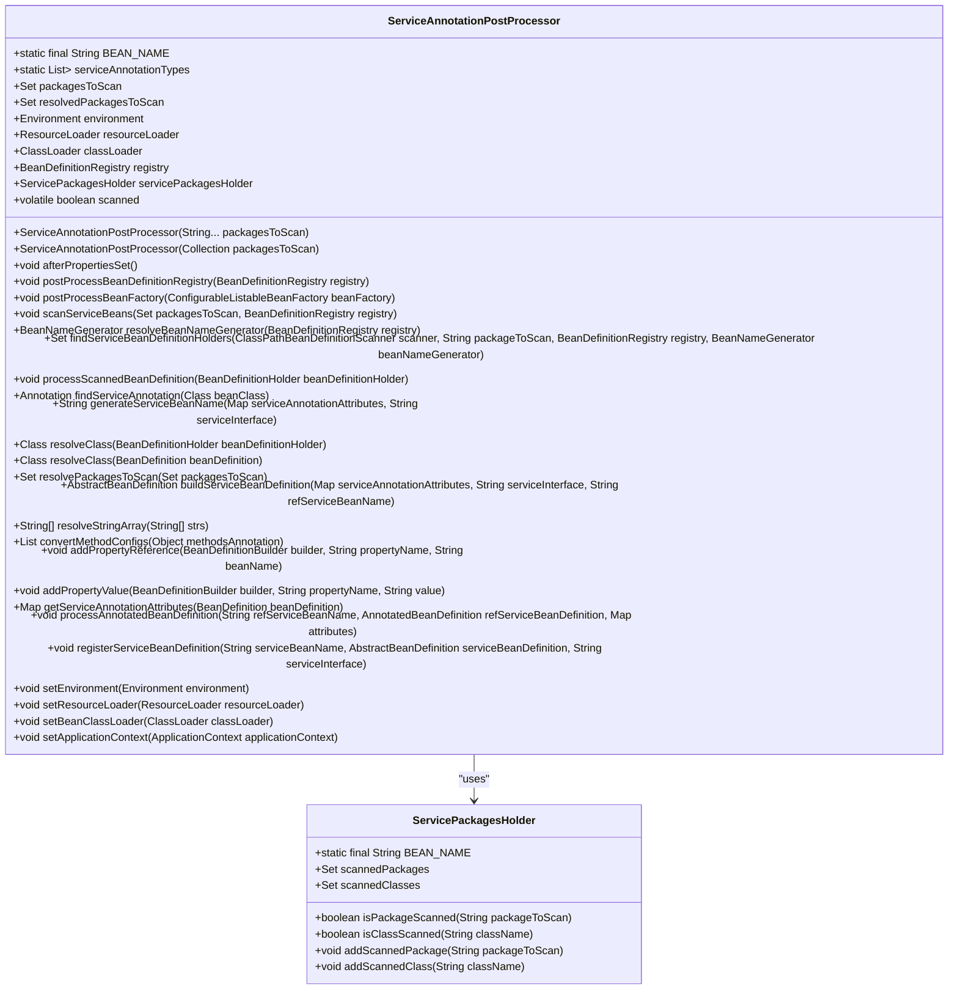
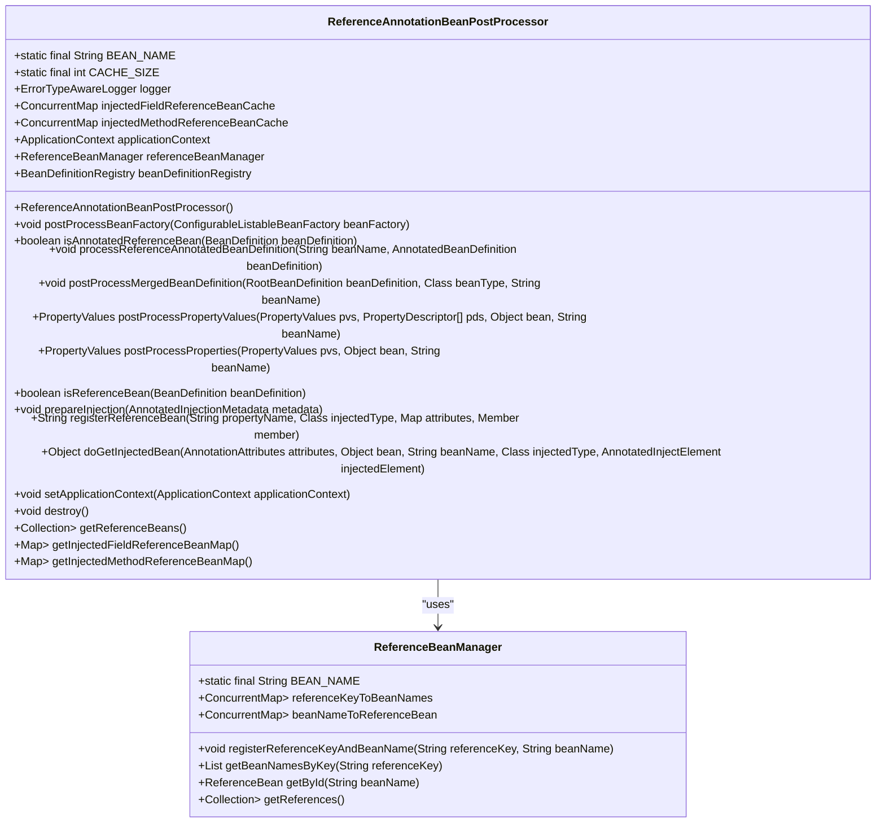
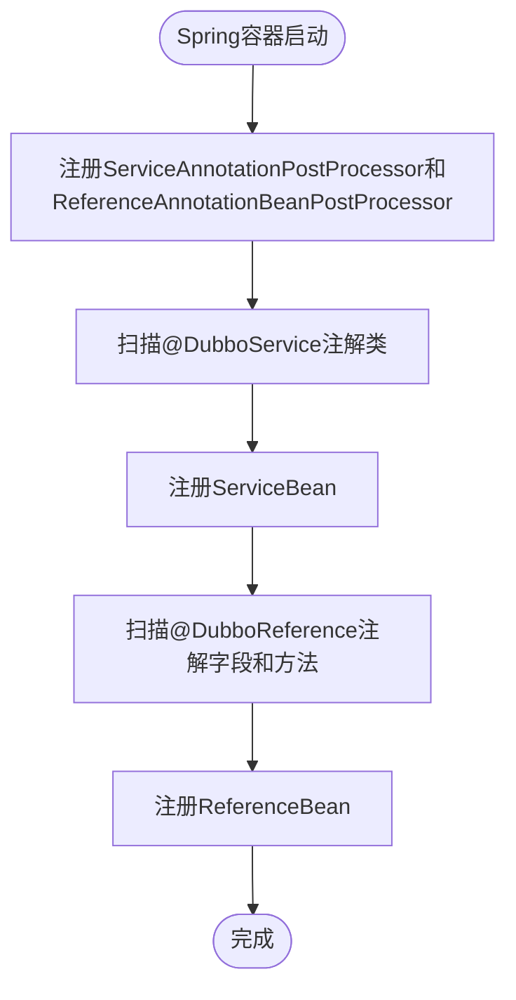
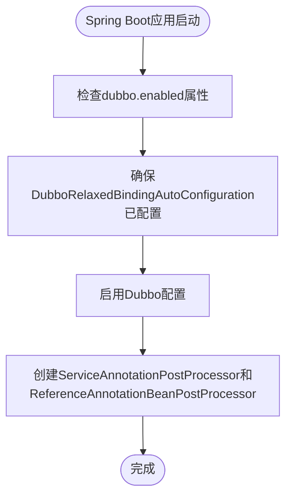

# 注解配置

<cite>
**本文档引用的文件**   
- [DubboService.java](file://dubbo-common\src\main\java\org\apache\dubbo\config\annotation\DubboService.java)
- [DubboReference.java](file://dubbo-common\src\main\java\org\apache\dubbo\config\annotation\DubboReference.java)
- [ServiceAnnotationPostProcessor.java](file://dubbo-config\dubbo-config-spring\src\main\java\org\apache\dubbo\config\spring\beans\factory\annotation\ServiceAnnotationPostProcessor.java)
- [ReferenceAnnotationBeanPostProcessor.java](file://dubbo-config\dubbo-config-spring\src\main\java\org\apache\dubbo\config\spring\beans\factory\annotation\ReferenceAnnotationBeanPostProcessor.java)
- [DubboComponentScan.java](file://dubbo-config\dubbo-config-spring\src\main\java\org\apache\dubbo\config\spring\context\annotation\DubboComponentScan.java)
- [EnableDubbo.java](file://dubbo-config\dubbo-config-spring\src\main\java\org\apache\dubbo\config\spring\context\annotation\EnableDubbo.java)
- [DubboSpringInitializer.java](file://dubbo-config\dubbo-config-spring\src\main\java\org\apache\dubbo\config\spring\context\DubboSpringInitializer.java)
- [DubboAutoConfiguration.java](file://dubbo-spring-boot-project\dubbo-spring-boot-autoconfigure\src\main\java\org\apache\dubbo\spring\boot\autoconfigure\DubboAutoConfiguration.java)
</cite>

## 目录
1. [引言](#引言)
2. [核心注解详解](#核心注解详解)
3. [注解处理机制](#注解处理机制)
4. [注解与XML配置的对应关系](#注解与xml配置的对应关系)
5. [Spring Boot中的注解配置示例](#spring-boot中的注解配置示例)
6. [注解扫描机制与自动装配流程](#注解扫描机制与自动装配流程)
7. [条件化配置与动态属性设置](#条件化配置与动态属性设置)
8. [配置方式的互操作性与优先级](#配置方式的互操作性与优先级)
9. [结论](#结论)

## 引言

Dubbo的注解驱动配置方式为开发者提供了简洁、直观的配置体验，通过在代码中使用特定的注解，可以轻松地定义服务提供者和消费者。这种配置方式不仅减少了XML配置文件的复杂性，还提高了代码的可读性和维护性。本文档将详细介绍Dubbo的注解配置机制，包括核心注解的属性和使用场景、注解处理机制、与XML配置的对应关系、在Spring Boot应用中的使用方法、扫描机制和自动装配流程，以及条件化配置和动态属性设置。

**本文档引用的文件**
- [DubboService.java](file://dubbo-common\src\main\java\org\apache\dubbo\config\annotation\DubboService.java)
- [DubboReference.java](file://dubbo-common\src\main\java\org\apache\dubbo\config\annotation\DubboReference.java)

## 核心注解详解

### @DubboService

`@DubboService` 注解用于声明一个Dubbo服务提供者。它可以应用于类或方法上，推荐在Java配置类的@Bean方法上使用，以提高灵活性和兼容性。

**属性说明：**
- `interfaceClass`: 接口类，默认值为`void.class`。
- `interfaceName`: 接口类名，默认值为空字符串。
- `version`: 服务版本，默认值为空字符串。
- `group`: 服务组，默认值为空字符串。
- `path`: 服务路径，默认值为空字符串。
- `export`: 是否导出服务，默认值为`true`。
- `token`: 服务令牌，默认值为空字符串。
- `deprecated`: 服务是否已废弃，默认值为`false`。
- `dynamic`: 服务是否动态，默认值为`true`。
- `accesslog`: 访问日志，默认值为空字符串。
- `executes`: 最大并发执行数，默认值为-1（无限制）。
- `register`: 是否注册到注册中心，默认值为`true`。
- `weight`: 服务权重，默认值为-1。
- `document`: 服务文档，默认值为空字符串。
- `delay`: 服务注册延迟时间，默认值为-1。
- `stub`: 服务存根名称，默认值为空字符串。
- `cluster`: 集群策略，合法值包括：`failover`、`failfast`、`failsafe`、`failback`、`forking`。
- `proxy`: 代理生成方式，合法值包括：`jdk`、`javassist`。
- `connections`: 服务提供者可接受的最大连接数，默认值为-1（共享连接）。
- `callbacks`: 每个连接的回调实例限制。
- `onconnect`: 连接时的回调方法名，默认值为空字符串。
- `ondisconnect`: 断开连接时的回调方法名，默认值为空字符串。
- `owner`: 服务所有者，默认值为空字符串。
- `layer`: 服务层，默认值为空字符串。
- `retries`: 服务调用重试次数。
- `loadbalance`: 负载均衡策略，合法值包括：`random`、`roundrobin`、`leastactive`。
- `async`: 是否启用异步调用，默认值为`false`。
- `actives`: 允许的最大活跃请求数，默认值为-1。
- `sent`: 异步请求是否已发送，默认值为`false`。
- `mock`: 服务模拟名称，默认值为空字符串。
- `validation`: 是否启用JSR303验证，合法值为：`true`、`false`。
- `timeout`: 服务调用超时值，默认值为-1。
- `cache`: 服务调用缓存实现，合法值包括：`lru`、`threadlocal`、`jcache`。
- `filter`: 服务调用过滤器。
- `listener`: 服务导出和取消导出的监听器。
- `parameters`: 自定义参数键值对。
- `application`: 应用程序Spring Bean名称（已废弃）。
- `module`: 模块Spring Bean名称。
- `provider`: 提供者Spring Bean名称。
- `protocol`: 协议Spring Bean名称。
- `monitor`: 监控Spring Bean名称。
- `registry`: 注册中心Spring Bean名称。
- `tag`: 服务标签名称。
- `methods`: 方法支持。
- `scope`: 服务引用/导出的范围，如果为`local`，则仅在当前JVM中搜索。
- `exportAsync`: 服务是否异步导出。
- `executor`: 服务执行器（线程池）的Bean名称，用于服务间的线程池隔离。
- `payload`: 有效负载最大长度。
- `serialization`: 序列化类型。
- `preferSerialization`: 优先使用的序列化类型。
- `mcpEnabled`: 是否启用MCP工具，默认值为`false`。

**使用场景：**
- **Java配置类中的@Bean方法**：推荐使用方式，更灵活且兼容Spring。
- **服务实现类**：直接在实现类上使用，但会导致实现类依赖Dubbo模块。

```java
@Configuration
class ProviderConfiguration {

    @Bean
    @DubboService(group="demo")
    public DemoService demoServiceImpl() {
        return new DemoServiceImpl();
    }
}

@DubboService(group="demo")
public class DemoServiceImpl implements DemoService {
    ...
}
```

### @DubboReference

`@DubboReference` 注解用于引用一个Dubbo服务。它可以在字段、方法或注解类型上使用。

**属性说明：**
- `interfaceClass`: 接口类，默认值为`void.class`。
- `interfaceName`: 接口类名，默认值为空字符串。
- `version`: 服务版本，默认值为空字符串。
- `group`: 服务组，默认值为空字符串。
- `url`: 服务目标URL，用于直接调用，如果指定了此属性，则注册中心无效。
- `client`: 客户端传输类型，默认值为`netty`。
- `generic`: 是否启用泛化调用，默认值为`false`（已废弃）。
- `injvm`: 是否优先调用本地服务，默认值为`true`（已废弃）。
- `check`: 启动时是否检查服务提供者，默认值为`true`。
- `init`: 是否在所有属性设置后立即初始化引用Bean，默认值为`true`。
- `lazy`: 创建客户端时是否建立连接，默认值为`false`。
- `stubevent`: 是否导出存根服务以进行事件分发，默认值为`false`。
- `reconnect`: 连接丢失时是否重连，默认值为`true`。
- `sticky`: 是否粘附到集群中的同一节点，默认值为`false`。
- `proxy`: 代理生成方式，合法值包括：`jdk`、`javassist`。
- `stub`: 服务存根名称，默认值为空字符串。
- `cluster`: 集群策略，合法值包括：`failover`、`failfast`、`failsafe`、`failback`、`forking`。
- `connections`: 服务提供者可接受的最大连接数，默认值为0（共享连接）。
- `callbacks`: 每个连接的回调实例限制。
- `onconnect`: 连接时的回调方法名，默认值为空字符串。
- `ondisconnect`: 断开连接时的回调方法名，默认值为空字符串。
- `owner`: 服务所有者，默认值为空字符串。
- `layer`: 服务层，默认值为空字符串。
- `retries`: 服务调用重试次数。
- `loadbalance`: 负载均衡策略，合法值包括：`random`、`roundrobin`、`leastactive`。
- `async`: 是否启用异步调用，默认值为`false`。
- `actives`: 允许的最大活跃请求数，默认值为0。
- `sent`: 异步请求是否已发送，默认值为`false`。
- `mock`: 服务模拟名称，默认值为空字符串。
- `validation`: 是否启用JSR303验证，合法值为：`true`、`false`。
- `timeout`: 服务调用超时值，默认值为0。
- `cache`: 服务调用缓存实现，合法值包括：`lru`、`threadlocal`、`jcache`。
- `filter`: 服务调用过滤器。
- `listener`: 服务导出和取消导出的监听器。
- `parameters`: 自定义参数键值对。
- `application`: 应用程序名称（已废弃）。
- `module`: 模块关联名称。
- `consumer`: 消费者关联名称。
- `monitor`: 监控关联名称。
- `registry`: 注册中心关联名称。
- `protocol`: Dubbo服务的通信协议。
- `tag`: 服务标签名称。
- `merger`: 服务合并器。
- `methods`: 方法支持。
- `id`: ID。
- `services`: 订阅的Dubbo接口服务名称（已废弃）。
- `providedBy`: 声明此接口属于哪个应用或服务。
- `providerPort`: 服务提供者的端口。
- `providerNamespace`: 分配提供者所属的命名空间。
- `scope`: 服务引用/导出的范围，如果为`local`，则仅在当前JVM中搜索。
- `referAsync`: 引用是否异步。
- `unloadClusterRelated`: 在网格模式下卸载集群相关。

**使用场景：**
- **Java配置类中的@Bean方法**：推荐使用方式，更灵活且兼容Spring。
- **字段或setter方法**：直接在字段或setter方法上使用，但不推荐。

```java
@Configuration
public class ReferenceConfiguration {
    @Bean
    @DubboReference(group = "demo")
    public ReferenceBean<HelloService> helloService() {
        return new ReferenceBean();
    }

    @Bean
    @DubboReference(group = "demo", interfaceClass = HelloService.class)
    public ReferenceBean<GenericService> genericHelloService() {
        return new ReferenceBean();
    }
}

public class FooController {
    @Autowired
    private HelloService helloService;

    @Autowired
    private GenericService genericHelloService;
}
```

### @DubboComponentScan

`@DubboComponentScan` 注解用于扫描类路径上的注解组件，并将其自动注册为Spring Bean。它主要用于扫描`@Service`和`@Reference`注解。

**属性说明：**
- `value`: 基础包的别名，允许更简洁的注解声明。
- `basePackages`: 要扫描的基础包，`value`是此属性的别名。
- `basePackageClasses`: 类型安全的替代方案，用于指定要扫描的包。

**使用场景：**
- **Spring Boot应用**：在主配置类上使用，自动扫描指定包下的服务和引用。

```java
@EnableDubbo
@ComponentScan(basePackages = "org.apache.dubbo.demo.provider")
public class ProviderApplication {
    public static void main(String[] args) {
        SpringApplication.run(ProviderApplication.class, args);
    }
}
```

**本文档引用的文件**
- [DubboService.java](file://dubbo-common\src\main\java\org\apache\dubbo\config\annotation\DubboService.java)
- [DubboReference.java](file://dubbo-common\src\main\java\org\apache\dubbo\config\annotation\DubboReference.java)
- [DubboComponentScan.java](file://dubbo-config\dubbo-config-spring\src\main\java\org\apache\dubbo\config\spring\context\annotation\DubboComponentScan.java)

## 注解处理机制

### ServiceAnnotationPostProcessor

`ServiceAnnotationPostProcessor` 是一个`BeanFactoryPostProcessor`，用于处理`@Service`注解的类和Java配置类中的注解Bean。它是XML `<dubbo:annotation />`的基础设施类。

**实现原理：**
- **扫描服务类**：通过`ClassPathBeanDefinitionScanner`扫描指定包下的`@Service`注解类。
- **注册ServiceBean**：为每个扫描到的服务类创建`ServiceBean`并注册到Spring容器中。
- **处理Java配置类**：处理Java配置类中`@Bean`方法上的`@DubboService`注解。



**Diagram sources**
- [ServiceAnnotationPostProcessor.java](file://dubbo-config\dubbo-config-spring\src\main\java\org\apache\dubbo\config\spring\beans\factory\annotation\ServiceAnnotationPostProcessor.java)
- [ServicePackagesHolder.java](file://dubbo-config\dubbo-config-spring\src\main\java\org\apache\dubbo\config\spring\beans\factory\annotation\ServicePackagesHolder.java)

### ReferenceAnnotationBeanPostProcessor

`ReferenceAnnotationBeanPostProcessor` 是一个`BeanPostProcessor`，用于处理`@DubboReference`注解的字段和方法。它实现了`ApplicationContextAware`和`BeanFactoryPostProcessor`接口。

**实现原理：**
- **扫描引用类**：通过`InjectionMetadata`扫描`@DubboReference`注解的字段和方法。
- **注册ReferenceBean**：为每个扫描到的引用创建`ReferenceBean`并注册到Spring容器中。
- **处理Java配置类**：处理Java配置类中`@Bean`方法上的`@DubboReference`注解。



**Diagram sources**
- [ReferenceAnnotationBeanPostProcessor.java](file://dubbo-config\dubbo-config-spring\src\main\java\org\apache\dubbo\config\spring\beans\factory\annotation\ReferenceAnnotationBeanPostProcessor.java)
- [ReferenceBeanManager.java](file://dubbo-config\dubbo-config-spring\src\main\java\org\apache\dubbo\config\spring\reference\ReferenceBeanManager.java)

## 注解与XML配置的对应关系

Dubbo的注解配置与XML配置之间存在一一对应的关系。以下是一些常见的对应关系：

| 注解属性 | XML属性 | 说明 |
| --- | --- | --- |
| `interfaceClass` | `interface` | 接口类 |
| `interfaceName` | `interface` | 接口类名 |
| `version` | `version` | 服务版本 |
| `group` | `group` | 服务组 |
| `path` | `path` | 服务路径 |
| `export` | `export` | 是否导出服务 |
| `token` | `token` | 服务令牌 |
| `deprecated` | `deprecated` | 服务是否已废弃 |
| `dynamic` | `dynamic` | 服务是否动态 |
| `accesslog` | `accesslog` | 访问日志 |
| `executes` | `executes` | 最大并发执行数 |
| `register` | `register` | 是否注册到注册中心 |
| `weight` | `weight` | 服务权重 |
| `document` | `document` | 服务文档 |
| `delay` | `delay` | 服务注册延迟时间 |
| `stub` | `stub` | 服务存根名称 |
| `cluster` | `cluster` | 集群策略 |
| `proxy` | `proxy` | 代理生成方式 |
| `connections` | `connections` | 服务提供者可接受的最大连接数 |
| `callbacks` | `callbacks` | 每个连接的回调实例限制 |
| `onconnect` | `onconnect` | 连接时的回调方法名 |
| `ondisconnect` | `ondisconnect` | 断开连接时的回调方法名 |
| `owner` | `owner` | 服务所有者 |
| `layer` | `layer` | 服务层 |
| `retries` | `retries` | 服务调用重试次数 |
| `loadbalance` | `loadbalance` | 负载均衡策略 |
| `async` | `async` | 是否启用异步调用 |
| `actives` | `actives` | 允许的最大活跃请求数 |
| `sent` | `sent` | 异步请求是否已发送 |
| `mock` | `mock` | 服务模拟名称 |
| `validation` | `validation` | 是否启用JSR303验证 |
| `timeout` | `timeout` | 服务调用超时值 |
| `cache` | `cache` | 服务调用缓存实现 |
| `filter` | `filter` | 服务调用过滤器 |
| `listener` | `listener` | 服务导出和取消导出的监听器 |
| `parameters` | `parameters` | 自定义参数键值对 |
| `application` | `application` | 应用程序Spring Bean名称（已废弃） |
| `module` | `module` | 模块Spring Bean名称 |
| `provider` | `provider` | 提供者Spring Bean名称 |
| `protocol` | `protocol` | 协议Spring Bean名称 |
| `monitor` | `monitor` | 监控Spring Bean名称 |
| `registry` | `registry` | 注册中心Spring Bean名称 |
| `tag` | `tag` | 服务标签名称 |
| `methods` | `methods` | 方法支持 |
| `scope` | `scope` | 服务引用/导出的范围 |
| `exportAsync` | `exportAsync` | 服务是否异步导出 |
| `executor` | `executor` | 服务执行器（线程池）的Bean名称 |
| `payload` | `payload` | 有效负载最大长度 |
| `serialization` | `serialization` | 序列化类型 |
| `preferSerialization` | `preferSerialization` | 优先使用的序列化类型 |
| `mcpEnabled` | `mcpEnabled` | 是否启用MCP工具 |

## Spring Boot中的注解配置示例

### 简单的注解配置示例

```java
@Configuration
@EnableDubbo
@ComponentScan(basePackages = "org.apache.dubbo.demo.provider")
public class ProviderConfiguration {
}

@Service
public class DemoServiceImpl implements DemoService {
    @Override
    public String sayHello(String name) {
        return "Hello, " + name;
    }
}
```

### 复杂的条件化配置和动态属性设置

```java
@Configuration
@EnableDubbo
@ComponentScan(basePackages = "org.apache.dubbo.demo.provider")
public class ProviderConfiguration {

    @Bean
    @DubboService(group = "${dubbo.service.group:demo}", version = "${dubbo.service.version:1.0.0}")
    public DemoService demoServiceImpl() {
        return new DemoServiceImpl();
    }
}

@Service
public class DemoServiceImpl implements DemoService {
    @Value("${dubbo.service.timeout:5000}")
    private int timeout;

    @Override
    public String sayHello(String name) {
        // 使用动态属性
        System.out.println("Timeout: " + timeout);
        return "Hello, " + name;
    }
}
```

**本文档引用的文件**
- [DubboService.java](file://dubbo-common\src\main\java\org\apache\dubbo\config\annotation\DubboService.java)
- [DubboReference.java](file://dubbo-common\src\main\java\org\apache\dubbo\config\annotation\DubboReference.java)
- [EnableDubbo.java](file://dubbo-config\dubbo-config-spring\src\main\java\org\apache\dubbo\config\spring\context\annotation\EnableDubbo.java)

## 注解扫描机制与自动装配流程

### 扫描机制

Dubbo的注解扫描机制通过`@DubboComponentScan`注解实现。当Spring容器启动时，`DubboComponentScanRegistrar`会注册`ServiceAnnotationPostProcessor`和`ReferenceAnnotationBeanPostProcessor`，这两个处理器负责扫描和处理`@DubboService`和`@DubboReference`注解。

**流程：**
1. **注册处理器**：`DubboComponentScanRegistrar`注册`ServiceAnnotationPostProcessor`和`ReferenceAnnotationBeanPostProcessor`。
2. **扫描服务类**：`ServiceAnnotationPostProcessor`扫描指定包下的`@DubboService`注解类。
3. **注册ServiceBean**：为每个扫描到的服务类创建`ServiceBean`并注册到Spring容器中。
4. **扫描引用类**：`ReferenceAnnotationBeanPostProcessor`扫描`@DubboReference`注解的字段和方法。
5. **注册ReferenceBean**：为每个扫描到的引用创建`ReferenceBean`并注册到Spring容器中。



**Diagram sources**
- [DubboComponentScanRegistrar.java](file://dubbo-config\dubbo-config-spring\src\main\java\org\apache\dubbo\config\spring\context\annotation\DubboComponentScanRegistrar.java)
- [ServiceAnnotationPostProcessor.java](file://dubbo-config\dubbo-config-spring\src\main\java\org\apache\dubbo\config\spring\beans\factory\annotation\ServiceAnnotationPostProcessor.java)
- [ReferenceAnnotationBeanPostProcessor.java](file://dubbo-config\dubbo-config-spring\src\main\java\org\apache\dubbo\config\spring\beans\factory\annotation\ReferenceAnnotationBeanPostProcessor.java)

### 自动装配流程

Dubbo的自动装配流程通过`DubboAutoConfiguration`类实现。当Spring Boot应用启动时，`DubboAutoConfiguration`会自动配置Dubbo的相关组件。

**流程：**
1. **条件检查**：检查`dubbo.enabled`属性是否为`true`。
2. **配置后置处理**：确保`DubboRelaxedBindingAutoConfiguration`已经配置。
3. **启用Dubbo配置**：使用`@EnableDubboConfig`注解启用Dubbo配置。
4. **创建处理器**：创建`ServiceAnnotationPostProcessor`和`ReferenceAnnotationBeanPostProcessor`。



**Diagram sources**
- [DubboAutoConfiguration.java](file://dubbo-spring-boot-project\dubbo-spring-boot-autoconfigure\src\main\java\org\apache\dubbo\spring\boot\autoconfigure\DubboAutoConfiguration.java)

## 条件化配置与动态属性设置

### 条件化配置

条件化配置允许根据不同的条件启用或禁用某些配置。例如，可以根据环境变量或配置文件中的属性来决定是否启用某个服务。

```java
@Configuration
@EnableDubbo
@ComponentScan(basePackages = "org.apache.dubbo.demo.provider")
@ConditionalOnProperty(name = "dubbo.service.enabled", havingValue = "true", matchIfMissing = true)
public class ProviderConfiguration {
}
```

### 动态属性设置

动态属性设置允许在运行时根据配置文件中的属性动态调整服务的行为。例如，可以根据配置文件中的超时值来调整服务调用的超时时间。

```java
@Service
public class DemoServiceImpl implements DemoService {
    @Value("${dubbo.service.timeout:5000}")
    private int timeout;

    @Override
    public String sayHello(String name) {
        // 使用动态属性
        System.out.println("Timeout: " + timeout);
        return "Hello, " + name;
    }
}
```

**本文档引用的文件**
- [DubboService.java](file://dubbo-common\src\main\java\org\apache\dubbo\config\annotation\DubboService.java)
- [DubboReference.java](file://dubbo-common\src\main\java\org\apache\dubbo\config\annotation\DubboReference.java)

## 配置方式的互操作性与优先级

### 互操作性

Dubbo支持多种配置方式，包括注解、XML、Java API和属性文件。这些配置方式可以混合使用，互不影响。

### 优先级

当多种配置方式同时存在时，它们的优先级如下：
1. **Java API**：最高优先级，直接在代码中设置的属性。
2. **注解**：次高优先级，通过注解设置的属性。
3. **XML**：中等优先级，通过XML文件设置的属性。
4. **属性文件**：最低优先级，通过属性文件设置的属性。

**示例：**
```java
// Java API
ServiceConfig<DemoService> service = new ServiceConfig<>();
service.setInterface(DemoService.class);
service.setRef(new DemoServiceImpl());
service.setVersion("1.0.0");
service.export();

// 注解
@DubboService(version = "2.0.0")
public class DemoServiceImpl implements DemoService {
    ...
}

// XML
<dubbo:service interface="org.apache.dubbo.demo.DemoService" ref="demoService" version="3.0.0" />

// 属性文件
dubbo.service.version=4.0.0
```

在这种情况下，最终的版本号将是`1.0.0`，因为Java API的优先级最高。

**本文档引用的文件**
- [DubboService.java](file://dubbo-common\src\main\java\org\apache\dubbo\config\annotation\DubboService.java)
- [DubboReference.java](file://dubbo-common\src\main\java\org\apache\dubbo\config\annotation\DubboReference.java)

## 结论

Dubbo的注解驱动配置方式为开发者提供了简洁、直观的配置体验。通过`@DubboService`、`@DubboReference`和`@DubboComponentScan`等核心注解，可以轻松地定义服务提供者和消费者。注解处理机制通过`ServiceAnnotationPostProcessor`和`ReferenceAnnotationBeanPostProcessor`实现，确保了注解的正确解析和处理。注解与XML配置之间存在一一对应的关系，可以灵活选择配置方式。在Spring Boot应用中，通过`@EnableDubbo`注解可以轻松启用Dubbo配置。条件化配置和动态属性设置进一步增强了配置的灵活性。多种配置方式的互操作性和优先级规则确保了配置的一致性和可靠性。

**本文档引用的文件**
- [DubboService.java](file://dubbo-common\src\main\java\org\apache\dubbo\config\annotation\DubboService.java)
- [DubboReference.java](file://dubbo-common\src\main\java\org\apache\dubbo\config\annotation\DubboReference.java)
- [ServiceAnnotationPostProcessor.java](file://dubbo-config\dubbo-config-spring\src\main\java\org\apache\dubbo\config\spring\beans\factory\annotation\ServiceAnnotationPostProcessor.java)
- [ReferenceAnnotationBeanPostProcessor.java](file://dubbo-config\dubbo-config-spring\src\main\java\org\apache\dubbo\config\spring\beans\factory\annotation\ReferenceAnnotationBeanPostProcessor.java)
- [DubboComponentScan.java](file://dubbo-config\dubbo-config-spring\src\main\java\org\apache\dubbo\config\spring\context\annotation\DubboComponentScan.java)
- [EnableDubbo.java](file://dubbo-config\dubbo-config-spring\src\main\java\org\apache\dubbo\config\spring\context\annotation\EnableDubbo.java)
- [DubboSpringInitializer.java](file://dubbo-config\dubbo-config-spring\src\main\java\org\apache\dubbo\config\spring\context\DubboSpringInitializer.java)
- [DubboAutoConfiguration.java](file://dubbo-spring-boot-project\dubbo-spring-boot-autoconfigure\src\main\java\org\apache\dubbo\spring\boot\autoconfigure\DubboAutoConfiguration.java)