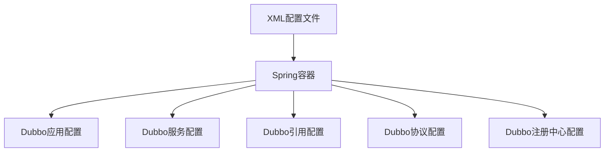
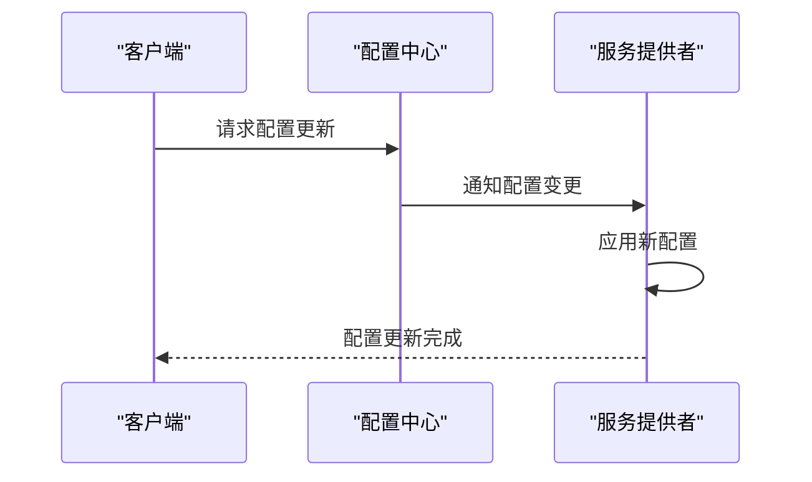
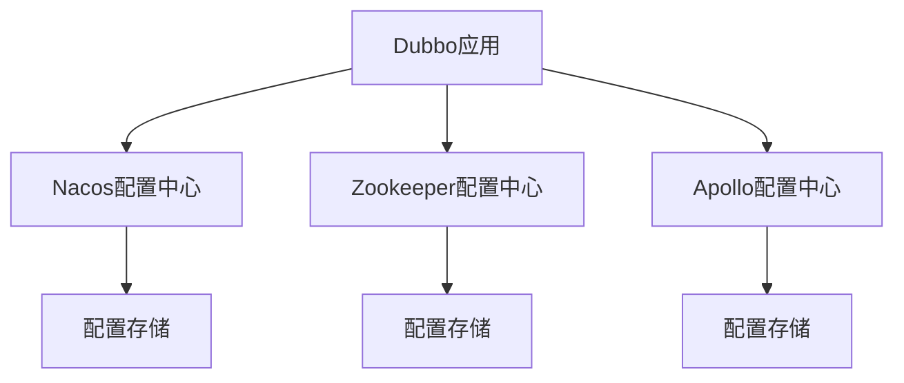

# 配置管理

<cite>
**本文档引用的文件**   
- [ApplicationConfig.java](file://dubbo-common\src\main\java\org\apache\dubbo\config\ApplicationConfig.java)
- [RegistryConfig.java](file://dubbo-common\src\main\java\org\apache\dubbo\config\RegistryConfig.java)
- [ConfigCenterConfig.java](file://dubbo-common\src\main\java\org\apache\dubbo\config\ConfigCenterConfig.java)
- [DynamicConfiguration.java](file://dubbo-common\src\main\java\org\apache\dubbo\common\config\configcenter\DynamicConfiguration.java)
- [AbstractDynamicConfiguration.java](file://dubbo-common\src\main\java\org\apache\dubbo\common\config\configcenter\AbstractDynamicConfiguration.java)
- [NacosDynamicConfiguration.java](file://dubbo-configcenter\dubbo-configcenter-nacos\src\main\java\org\apache\dubbo\configcenter\support\nacos\NacosDynamicConfiguration.java)
- [ZookeeperDynamicConfiguration.java](file://dubbo-configcenter\dubbo-configcenter-zookeeper\src\main\java\org\apache\dubbo\configcenter\support\zookeeper\ZookeeperDynamicConfiguration.java)
- [ApolloDynamicConfiguration.java](file://dubbo-configcenter\dubbo-configcenter-apollo\src\main\java\org\apache\dubbo\configcenter\support\apollo\ApolloDynamicConfiguration.java)
- [dubbo.xsd](file://dubbo-config\dubbo-config-spring\src\main\resources\META-INF\dubbo.xsd)
- [ConfigCenterBuilder.java](file://dubbo-config\dubbo-config-api\src\main\java\org\apache\dubbo\config\bootstrap\builders\ConfigCenterBuilder.java)
</cite>

## 目录
1. [引言](#引言)
2. [配置方式](#配置方式)
3. [配置优先级与合并策略](#配置优先级与合并策略)
4. [动态配置机制](#动态配置机制)
5. [配置中心集成](#配置中心集成)
6. [高级配置特性](#高级配置特性)
7. [配置示例](#配置示例)
8. [最佳实践](#最佳实践)

## 引言
Dubbo的配置系统是一个强大而灵活的框架，用于管理分布式服务架构中的各种配置。它支持多种配置方式，包括XML、注解、API编程和属性文件等，允许开发者根据具体需求选择最适合的配置方法。Dubbo的配置系统不仅处理本地配置，还支持与远程配置中心（如Nacos、Zookeeper、Apollo）的集成，实现配置的集中管理和动态更新。本文档将深入探讨Dubbo配置系统的各个方面，包括配置方式、优先级处理、动态配置机制、与不同配置中心的集成，以及高级特性如配置热更新、加密和版本管理。

**本文档引用的文件**   
- [ApplicationConfig.java](file://dubbo-common\src\main\java\org\apache\dubbo\config\ApplicationConfig.java)
- [RegistryConfig.java](file://dubbo-common\src\main\java\org\apache\dubbo\config\RegistryConfig.java)

## 配置方式
Dubbo支持多种配置方式，以满足不同场景下的需求。主要的配置方式包括XML配置、注解配置、API编程配置和属性文件配置。

### XML配置
XML配置是Dubbo最传统的配置方式，通过在Spring配置文件中定义Dubbo相关的Bean来完成配置。XML配置方式直观且易于理解，适合大型项目中复杂的配置需求。在XML配置中，可以定义应用、服务、引用、协议、注册中心等各个组件的配置。



**图源** 
- [dubbo.xsd](file://dubbo-config\dubbo-config-spring\src\main\resources\META-INF\dubbo.xsd)

### 注解配置
注解配置是Spring Boot环境下推荐的配置方式。通过在Java类上使用`@DubboService`、`@DubboReference`等注解，可以简化配置过程，使代码更加简洁。注解配置方式与Spring的自动配置机制紧密结合，能够快速搭建Dubbo服务。

### API编程配置
API编程配置方式提供了最高的灵活性，允许在代码中直接创建和配置Dubbo的各个组件。这种方式适合需要动态创建服务或引用的场景，例如在运行时根据条件决定服务的暴露方式。

### 属性文件配置
属性文件配置方式通过`dubbo.properties`文件来定义Dubbo的全局配置。这种方式简单直接，适合配置一些通用的参数，如超时时间、重试次数等。属性文件中的配置可以被其他配置方式覆盖，但通常作为默认值使用。

**本文档引用的文件**   
- [ApplicationConfig.java](file://dubbo-common\src\main\java\org\apache\dubbo\config\ApplicationConfig.java)
- [RegistryConfig.java](file://dubbo-common\src\main\java\org\apache\dubbo\config\RegistryConfig.java)
- [dubbo.xsd](file://dubbo-config\dubbo-config-spring\src\main\resources\META-INF\dubbo.xsd)

## 配置优先级与合并策略
Dubbo的配置系统设计了复杂的优先级和合并策略，以确保配置的正确性和一致性。配置的来源包括系统属性、环境变量、属性文件、XML配置、注解配置和API编程配置。这些配置来源按照一定的优先级顺序进行处理，高优先级的配置会覆盖低优先级的配置。

### 配置优先级
配置优先级从高到低依次为：系统属性 > 环境变量 > API编程配置 > 注解配置 > XML配置 > 属性文件配置。这意味着如果同一个配置项在多个地方定义，系统属性中的值将最终生效。

### 配置合并策略
当多个配置来源同时存在时，Dubbo会根据配置项的类型进行合并。对于简单的键值对配置，高优先级的值会直接覆盖低优先级的值。对于复杂的数据结构，如列表或映射，Dubbo会尝试合并这些数据结构，而不是简单地覆盖。

**本文档引用的文件**   
- [ApplicationConfig.java](file://dubbo-common\src\main\java\org\apache\dubbo\config\ApplicationConfig.java)
- [RegistryConfig.java](file://dubbo-common\src\main\java\org\apache\dubbo\config\RegistryConfig.java)

## 动态配置机制
Dubbo的动态配置机制允许在运行时修改配置，而无需重启服务。这一特性对于实现服务治理、流量控制等功能至关重要。动态配置的核心是`DynamicConfiguration`接口，它定义了配置的获取、监听和发布方法。

### 配置监听
通过`addListener`方法，可以注册一个配置监听器，当配置发生变化时，监听器会收到通知。这使得服务能够实时响应配置的变化，例如调整负载均衡策略或更新服务路由规则。

### 配置发布
`publishConfig`方法允许在运行时发布新的配置。这对于实现动态服务治理非常有用，例如在运行时添加新的服务路由规则或修改服务的权重。



**图源** 
- [DynamicConfiguration.java](file://dubbo-common\src\main\java\org\apache\dubbo\common\config\configcenter\DynamicConfiguration.java)
- [AbstractDynamicConfiguration.java](file://dubbo-common\src\main\java\org\apache\dubbo\common\config\configcenter\AbstractDynamicConfiguration.java)

**本文档引用的文件**   
- [DynamicConfiguration.java](file://dubbo-common\src\main\java\org\apache\dubbo\common\config\configcenter\DynamicConfiguration.java)
- [AbstractDynamicConfiguration.java](file://dubbo-common\src\main\java\org\apache\dubbo\common\config\configcenter\AbstractDynamicConfiguration.java)

## 配置中心集成
Dubbo支持与多种配置中心的集成，包括Nacos、Zookeeper和Apollo。这些配置中心提供了集中化的配置管理能力，使得配置的维护和更新变得更加方便。

### Nacos集成
Nacos是一个动态服务发现、配置和服务管理平台。Dubbo通过`NacosDynamicConfiguration`类与Nacos集成，实现了配置的动态获取和监听。Nacos的配置管理功能强大，支持配置的版本控制和灰度发布。

### Zookeeper集成
Zookeeper是一个分布式协调服务，常用于服务发现和配置管理。Dubbo通过`ZookeeperDynamicConfiguration`类与Zookeeper集成，利用Zookeeper的节点监听机制实现配置的动态更新。

### Apollo集成
Apollo是携程开源的分布式配置中心，提供了丰富的配置管理功能。Dubbo通过`ApolloDynamicConfiguration`类与Apollo集成，支持配置的实时推送和版本管理。



**图源** 
- [NacosDynamicConfiguration.java](file://dubbo-configcenter\dubbo-configcenter-nacos\src\main\java\org\apache\dubbo\configcenter\support\nacos\NacosDynamicConfiguration.java)
- [ZookeeperDynamicConfiguration.java](file://dubbo-configcenter\dubbo-configcenter-zookeeper\src\main\java\org\apache\dubbo\configcenter\support\zookeeper\ZookeeperDynamicConfiguration.java)
- [ApolloDynamicConfiguration.java](file://dubbo-configcenter\dubbo-configcenter-apollo\src\main\java\org\apache\dubbo\configcenter\support\apollo\ApolloDynamicConfiguration.java)

**本文档引用的文件**   
- [NacosDynamicConfiguration.java](file://dubbo-configcenter\dubbo-configcenter-nacos\src\main\java\org\apache\dubbo\configcenter\support\nacos\NacosDynamicConfiguration.java)
- [ZookeeperDynamicConfiguration.java](file://dubbo-configcenter\dubbo-configcenter-zookeeper\src\main\java\org\apache\dubbo\configcenter\support\zookeeper\ZookeeperDynamicConfiguration.java)
- [ApolloDynamicConfiguration.java](file://dubbo-configcenter\dubbo-configcenter-apollo\src\main\java\org\apache\dubbo\configcenter\support\apollo\ApolloDynamicConfiguration.java)

## 高级配置特性
Dubbo的配置系统不仅支持基本的配置管理，还提供了一系列高级特性，以满足复杂场景下的需求。

### 配置热更新
配置热更新是指在不重启服务的情况下，动态更新配置。这一特性通过配置监听机制实现，当配置发生变化时，服务能够立即感知并应用新的配置。

### 配置加密
为了保护敏感信息，Dubbo支持配置加密。通过配置加密插件，可以对配置中的敏感信息进行加密存储，确保数据的安全性。

### 配置版本管理
配置版本管理允许对配置进行版本控制，便于回滚和审计。通过配置中心的版本管理功能，可以轻松地管理和追踪配置的变化历史。

**本文档引用的文件**   
- [DynamicConfiguration.java](file://dubbo-common\src\main\java\org\apache\dubbo\common\config\configcenter\DynamicConfiguration.java)
- [AbstractDynamicConfiguration.java](file://dubbo-common\src\main\java\org\apache\dubbo\common\config\configcenter\AbstractDynamicConfiguration.java)

## 配置示例
以下是一些常见的配置示例，展示了如何在不同场景下使用Dubbo的配置系统。

### XML配置示例
```xml
<dubbo:application name="demo-provider"/>
<dubbo:registry address="zookeeper://127.0.0.1:2181"/>
<dubbo:protocol name="dubbo" port="20880"/>
<dubbo:service interface="org.apache.dubbo.demo.DemoService" ref="demoService"/>
```

### 注解配置示例
```java
@DubboService
public class DemoServiceImpl implements DemoService {
    // 服务实现
}
```

### API编程配置示例
```java
ApplicationConfig application = new ApplicationConfig();
application.setName("demo-provider");

RegistryConfig registry = new RegistryConfig();
registry.setAddress("zookeeper://127.0.0.1:2181");

ServiceConfig<DemoService> service = new ServiceConfig<>();
service.setApplication(application);
service.setRegistry(registry);
service.setInterface(DemoService.class);
service.setRef(new DemoServiceImpl());
service.export();
```

### 属性文件配置示例
```properties
dubbo.application.name=demo-provider
dubbo.registry.address=zookeeper://127.0.0.1:2181
dubbo.protocol.name=dubbo
dubbo.protocol.port=20880
```

**本文档引用的文件**   
- [ApplicationConfig.java](file://dubbo-common\src\main\java\org\apache\dubbo\config\ApplicationConfig.java)
- [RegistryConfig.java](file://dubbo-common\src\main\java\org\apache\dubbo\config\RegistryConfig.java)
- [ConfigCenterConfig.java](file://dubbo-common\src\main\java\org\apache\dubbo\config\ConfigCenterConfig.java)

## 最佳实践
在使用Dubbo的配置系统时，遵循一些最佳实践可以帮助提高系统的稳定性和可维护性。

### 使用配置中心
推荐使用配置中心来管理配置，特别是对于生产环境。配置中心可以提供配置的集中管理、版本控制和动态更新功能，减少配置错误的风险。

### 配置分离
将不同类型的配置分离到不同的文件或命名空间中，例如将应用配置、服务配置和治理规则分别管理。这有助于提高配置的可读性和可维护性。

### 配置验证
在应用启动时，对配置进行验证，确保所有必需的配置项都已正确设置。可以通过自定义的配置验证器来实现这一功能。

### 配置文档化
为配置项编写详细的文档，说明每个配置项的作用、默认值和可能的取值范围。这有助于团队成员理解和使用配置。

**本文档引用的文件**   
- [ApplicationConfig.java](file://dubbo-common\src\main\java\org\apache\dubbo\config\ApplicationConfig.java)
- [RegistryConfig.java](file://dubbo-common\src\main\java\org\apache\dubbo\config\RegistryConfig.java)
- [ConfigCenterConfig.java](file://dubbo-common\src\main\java\org\apache\dubbo\config\ConfigCenterConfig.java)