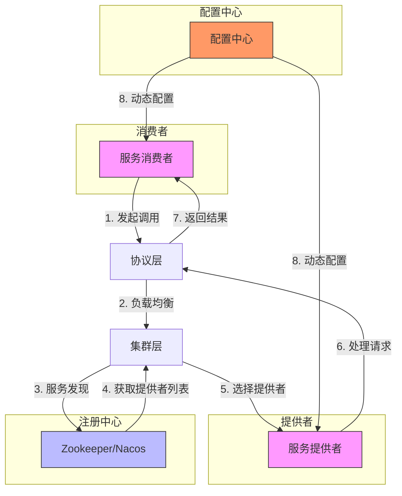
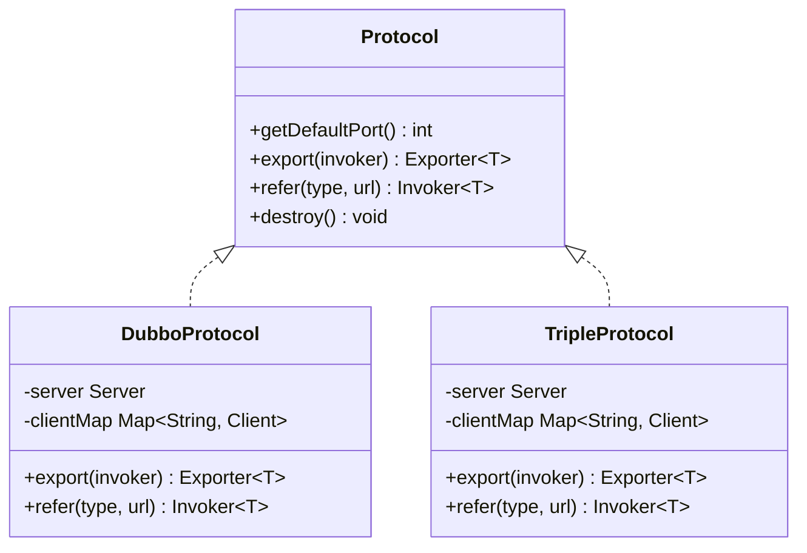
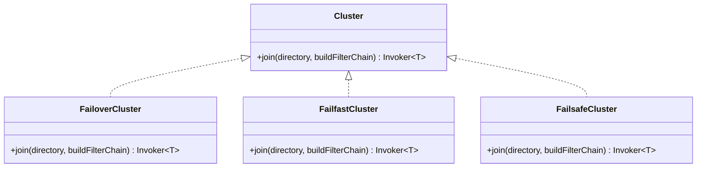
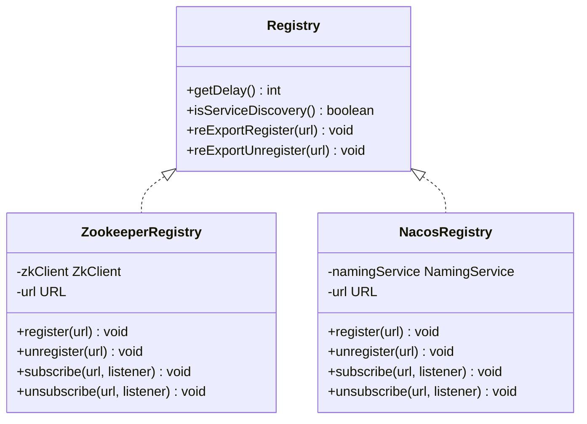
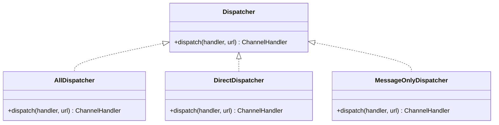
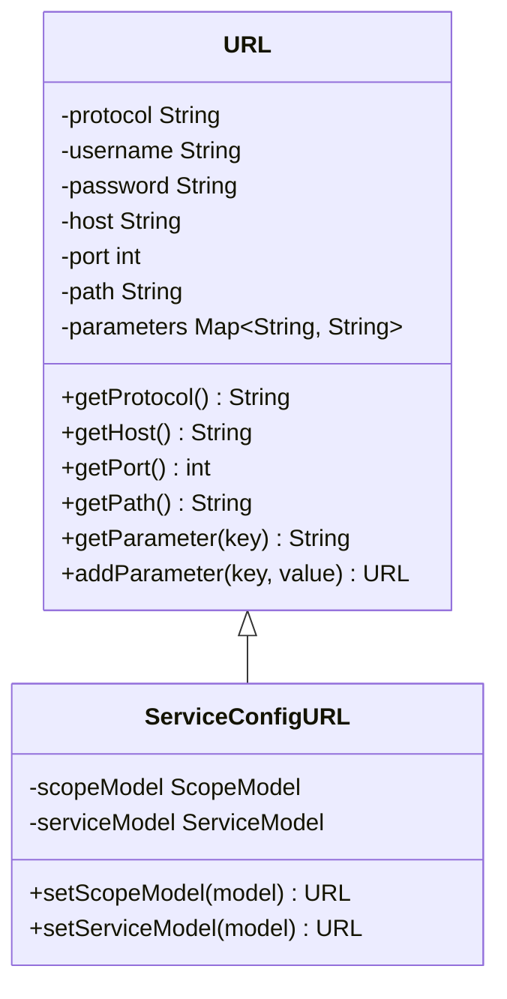
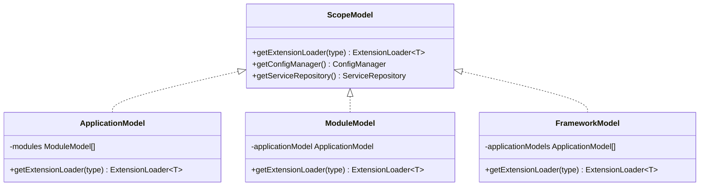
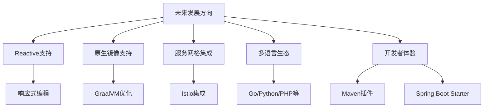

# 项目概述

<cite>
**本文档引用的文件**   
- [README.md](file://README.md)
- [pom.xml](file://pom.xml)
- [Protocol.java](file://dubbo-rpc/dubbo-rpc-api/src/main/java/org/apache/dubbo/rpc/Protocol.java)
- [Cluster.java](file://dubbo-cluster/src/main/java/org/apache/dubbo/rpc/cluster/Cluster.java)
- [Registry.java](file://dubbo-registry/dubbo-registry-api/src/main/java/org/apache/dubbo/registry/Registry.java)
- [Dispatcher.java](file://dubbo-remoting/dubbo-remoting-api/src/main/java/org/apache/dubbo/remoting/Dispatcher.java)
- [URL.java](file://dubbo-common/src/main/java/org/apache/dubbo/common/URL.java)
- [Constants.java](file://dubbo-common/src/main/java/org/apache/dubbo/config/Constants.java)
- [ServiceConfig.java](file://dubbo-config/dubbo-config-api/src/main/java/org/apache/dubbo/config/ServiceConfig.java)
- [ReferenceConfig.java](file://dubbo-config/dubbo-config-api/src/main/java/org/apache/dubbo/config/ReferenceConfig.java)
- [LoadBalance.java](file://dubbo-cluster/src/main/java/org/apache/dubbo/rpc/cluster/LoadBalance.java)
</cite>

## 目录
1. [引言](#引言)
2. [核心架构](#核心架构)
3. [主要功能特性](#主要功能特性)
4. [核心组件分析](#核心组件分析)
5. [SPI扩展机制与URL配置总线](#spi扩展机制与url配置总线)
6. [实际使用案例](#实际使用案例)
7. [发展历史与社区支持](#发展历史与社区支持)
8. [未来发展方向](#未来发展方向)
9. [与其他微服务框架对比](#与其他微服务框架对比)
10. [结论](#结论)

## 引言

Apache Dubbo是一个功能强大且用户友好的Web和RPC框架，旨在为构建企业级微服务提供完整的解决方案。它支持多种语言实现，包括Java、Go、Python、PHP、Erlang、Rust和Node.js/Web。Dubbo提供了通信、服务发现、流量管理、可观测性、安全、工具和最佳实践等全面的功能，使其成为现代分布式系统开发的理想选择。

对于初学者而言，Dubbo提供了5分钟快速入门指南，通过轻量级SDK即可快速构建RPC服务。对于经验丰富的开发者，Dubbo提供了丰富的SPI扩展机制和灵活的配置选项，可以深度定制框架行为。本概述将全面介绍Dubbo的核心架构、主要功能特性以及在不同场景下的应用。

**Section sources**
- [README.md](file://README.md)

## 核心架构

Apache Dubbo的核心架构基于分层设计，各层职责分明，通过SPI（Service Provider Interface）机制实现高度可扩展性。其架构主要包括通信层、RPC层、集群层、注册中心层和配置中心层。



**Diagram sources **
- [README.md](file://README.md)
- [pom.xml](file://pom.xml)

**Section sources**
- [README.md](file://README.md)
- [pom.xml](file://pom.xml)

## 主要功能特性

Dubbo提供了构建企业级微服务所需的完整功能集，主要包括以下几个方面：

### 通信
Dubbo支持多种通信协议，包括Triple（gRPC兼容）、Dubbo2（TCP）、REST和自定义协议。Triple协议基于HTTP/2，支持gRPC的IDL和工具链，同时兼容cURL等HTTP工具，提供了最佳的互操作性。

### 服务发现
Dubbo通过注册中心实现动态服务发现，支持Zookeeper、Nacos等多种注册中心实现。消费者能够动态发现提供者实例，并根据配置的策略管理流量。

### 流量管理
Dubbo提供了丰富的流量管理功能，包括负载均衡、路由规则、熔断降级等。通过配置不同的集群策略（如failover、failfast、failsafe等），可以实现不同的容错机制。

### 可观测性
Dubbo内置了对指标、追踪和日志的支持，可以与Prometheus、Zipkin等主流监控系统集成。通过dubbo-observability-spring-boot-starter，可以轻松实现服务的可观测性。

### 安全
Dubbo提供了多层次的安全机制，包括QoS（Quality of Service）控制台、访问控制、加密传输等。通过dubbo-security和dubbo-spring-security模块，可以实现细粒度的安全控制。

### 工具和最佳实践
Dubbo提供了丰富的工具支持，包括Maven插件、Spring Boot Starter、QoS控制台等。通过dubbo-maven-plugin，可以实现AOT（Ahead-of-Time）编译和依赖过滤，提升应用性能。

**Section sources**
- [README.md](file://README.md)

## 核心组件分析

### 协议层 (Protocol)
协议层是Dubbo的核心组件之一，负责封装远程调用的细节。`Protocol`接口定义了`export`和`refer`两个核心方法，分别用于导出服务和引用服务。



**Diagram sources **
- [dubbo-rpc/dubbo-rpc-api/src/main/java/org/apache/dubbo/rpc/Protocol.java](file://dubbo-rpc/dubbo-rpc-api/src/main/java/org/apache/dubbo/rpc/Protocol.java)

### 集群层 (Cluster)
集群层负责将多个服务提供者合并为一个虚拟的服务调用者，提供容错和负载均衡功能。`Cluster`接口定义了`join`方法，用于将目录调用者合并为一个虚拟调用者。



**Diagram sources **
- [dubbo-cluster/src/main/java/org/apache/dubbo/rpc/cluster/Cluster.java](file://dubbo-cluster/src/main/java/org/apache/dubbo/rpc/cluster/Cluster.java)

### 注册中心 (Registry)
注册中心负责服务的注册与发现，是Dubbo实现动态服务发现的核心组件。`Registry`接口继承自`Node`和`RegistryService`，提供了注册、取消注册、订阅和取消订阅等基本功能。



**Diagram sources **
- [dubbo-registry/dubbo-registry-api/src/main/java/org/apache/dubbo/registry/Registry.java](file://dubbo-registry/dubbo-registry-api/src/main/java/org/apache/dubbo/registry/Registry.java)

### 通信层 (Remoting)
通信层负责网络通信的细节，包括消息编解码、线程模型、连接管理等。`Dispatcher`接口定义了消息分发策略，可以将消息分发到不同的线程池进行处理。



**Diagram sources **
- [dubbo-remoting/dubbo-remoting-api/src/main/java/org/apache/dubbo/remoting/Dispatcher.java](file://dubbo-remoting/dubbo-remoting-api/src/main/java/org/apache/dubbo/remoting/Dispatcher.java)

**Section sources**
- [dubbo-rpc/dubbo-rpc-api/src/main/java/org/apache/dubbo/rpc/Protocol.java](file://dubbo-rpc/dubbo-rpc-api/src/main/java/org/apache/dubbo/rpc/Protocol.java)
- [dubbo-cluster/src/main/java/org/apache/dubbo/rpc/cluster/Cluster.java](file://dubbo-cluster/src/main/java/org/apache/dubbo/rpc/cluster/Cluster.java)
- [dubbo-registry/dubbo-registry-api/src/main/java/org/apache/dubbo/registry/Registry.java](file://dubbo-registry/dubbo-registry-api/src/main/java/org/apache/dubbo/registry/Registry.java)
- [dubbo-remoting/dubbo-remoting-api/src/main/java/org/apache/dubbo/remoting/Dispatcher.java](file://dubbo-remoting/dubbo-remoting-api/src/main/java/org/apache/dubbo/remoting/Dispatcher.java)

## SPI扩展机制与URL配置总线

### SPI扩展机制
Dubbo的SPI（Service Provider Interface）机制是其高度可扩展性的核心。与Java原生SPI不同，Dubbo的SPI支持：
- 按需加载：只有在需要时才实例化扩展实现
- 扩展名标识：通过扩展名来标识不同的实现
- 自适应扩展：通过@Adaptive注解生成自适应代码
- 扩展点自动包装：可以为扩展点添加AOP功能

例如，`Protocol`接口通过`@SPI("dubbo")`注解标记，默认使用"dubbo"协议，同时可以通过`@Adaptive`注解生成自适应代码，根据URL中的协议参数动态选择具体的协议实现。

### URL配置总线
Dubbo使用URL作为配置的总线，将所有的配置信息都编码在URL中。`URL`类是Dubbo中最重要的数据结构之一，包含了协议、主机、端口、路径和参数等信息。



**Diagram sources **
- [dubbo-common/src/main/java/org/apache/dubbo/common/URL.java](file://dubbo-common/src/main/java/org/apache/dubbo/common/URL.java)

### 作用域模型层次
Dubbo引入了作用域模型（ScopeModel）的概念，实现了应用级、模块级和框架级的隔离。`ScopeModel`接口定义了作用域模型的基本结构，包括应用模型（ApplicationModel）、模块模型（ModuleModel）和框架模型（FrameworkModel）。



**Diagram sources **
- [dubbo-common/src/main/java/org/apache/dubbo/common/URL.java](file://dubbo-common/src/main/java/org/apache/dubbo/common/URL.java)
- [dubbo-common/src/main/java/org/apache/dubbo/config/Constants.java](file://dubbo-common/src/main/java/org/apache/dubbo/config/Constants.java)

**Section sources**
- [dubbo-common/src/main/java/org/apache/dubbo/common/URL.java](file://dubbo-common/src/main/java/org/apache/dubbo/common/URL.java)
- [dubbo-common/src/main/java/org/apache/dubbo/config/Constants.java](file://dubbo-common/src/main/java/org/apache/dubbo/config/Constants.java)

## 实际使用案例

### Spring Boot集成
通过`dubbo-spring-boot-starter`，可以轻松将Dubbo集成到Spring Boot应用中。只需添加依赖和简单的YAML配置，即可解锁Dubbo的全部功能。

```yaml
dubbo:
  application:
    name: demo-provider
  protocol:
    name: dubbo
    port: 20880
  registry:
    address: nacos://127.0.0.1:8848
```

### 服务提供者
使用`@Service`注解将Java接口暴露为Dubbo服务：

```java
@Service
public class DemoServiceImpl implements DemoService {
    @Override
    public String sayHello(String name) {
        return "Hello " + name;
    }
}
```

### 服务消费者
使用`@DubboReference`注解注入远程服务：

```java
@RestController
public class DemoController {
    @DubboReference
    private DemoService demoService;
    
    @GetMapping("/hello")
    public String hello(@RequestParam String name) {
        return demoService.sayHello(name);
    }
}
```

### 流量管理
通过配置路由规则实现灰度发布：

```yaml
# 权重路由
dubbo:
  reference:
    demoService:
      loadbalance: random
      parameters:
        loadbalance.weight: 100
        
# 标签路由
dubbo:
  protocol:
    parameters:
      tag: blue
  reference:
    demoService:
      routing:
        tags:
          - blue
```

**Section sources**
- [dubbo-config/dubbo-config-api/src/main/java/org/apache/dubbo/config/ServiceConfig.java](file://dubbo-config/dubbo-config-api/src/main/java/org/apache/dubbo/config/ServiceConfig.java)
- [dubbo-config/dubbo-config-api/src/main/java/org/apache/dubbo/config/ReferenceConfig.java](file://dubbo-config/dubbo-config-api/src/main/java/org/apache/dubbo/config/ReferenceConfig.java)

## 发展历史与社区支持

Apache Dubbo最初由阿里巴巴开源，后捐赠给Apache软件基金会，成为顶级项目。Dubbo3是当前的主要版本系列，持续获得积极维护和功能更新。

社区支持方面，Dubbo拥有活跃的开发者社区，通过GitHub Issues、Discussions和Pull Requests进行协作。项目提供了详细的文档、示例代码和最佳实践指南，帮助开发者快速上手。


**Diagram sources **
- [README.md](file://README.md)

**Section sources**
- [README.md](file://README.md)

## 未来发展方向

Dubbo的未来发展方向主要包括：
- **Reactive支持**：通过`dubbo-mutiny`模块提供响应式编程支持
- **原生镜像支持**：优化对GraalVM原生镜像的支持，提升启动性能
- **服务网格集成**：加强与Istio等服务网格的集成，提供更好的云原生支持
- **多语言生态**：继续扩展多语言实现，完善跨语言微服务生态
- **开发者体验**：通过Maven插件和Spring Boot Starter提升开发者体验



**Diagram sources **
- [README.md](file://README.md)

**Section sources**
- [README.md](file://README.md)

## 与其他微服务框架对比

| 特性 | Dubbo | Spring Cloud | gRPC |
|------|-------|-------------|------|
| 通信协议 | Triple/Dubbo2/REST | HTTP/REST | gRPC |
| 服务发现 | Zookeeper/Nacos | Eureka/Consul | 手动/第三方 |
| 负载均衡 | 多种策略 | Ribbon | gRPC内置 |
| 流量管理 | 丰富 | 依赖第三方 | 有限 |
| 可观测性 | 内置支持 | 依赖Spring Cloud Sleuth | 依赖OpenTelemetry |
| 安全 | 多层次 | 依赖Spring Security | TLS |
| 多语言 | 支持 | 有限 | 良好 |
| 开发体验 | 良好 | 优秀 | 一般 |

**Section sources**
- [README.md](file://README.md)

## 结论

Apache Dubbo作为一个高性能、用户友好的Web和RPC框架，为构建企业级微服务提供了完整的解决方案。其核心优势在于：
1. **高性能**：基于Netty的异步非阻塞通信，支持多种高效序列化方式
2. **高可用**：丰富的集群策略和容错机制，确保服务的稳定性
3. **易用性**：与Spring Boot无缝集成，提供开箱即用的体验
4. **可扩展性**：基于SPI的扩展机制，支持深度定制
5. **生态完善**：支持多种注册中心、配置中心和监控系统

对于需要构建高性能、高可用微服务系统的团队，Dubbo是一个理想的选择。无论是从技术先进性还是从社区活跃度来看，Dubbo都展现出了强大的生命力和广阔的发展前景。

**Section sources**
- [README.md](file://README.md)