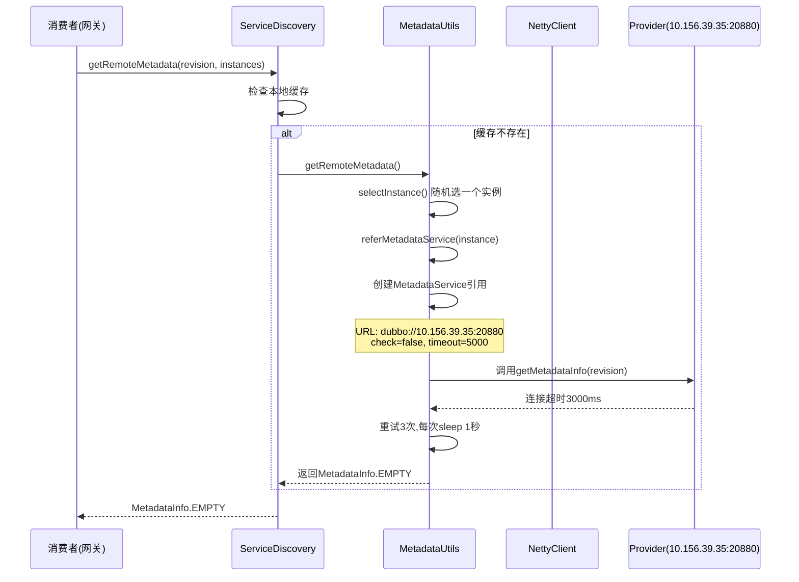
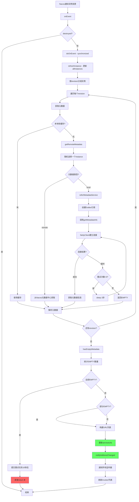
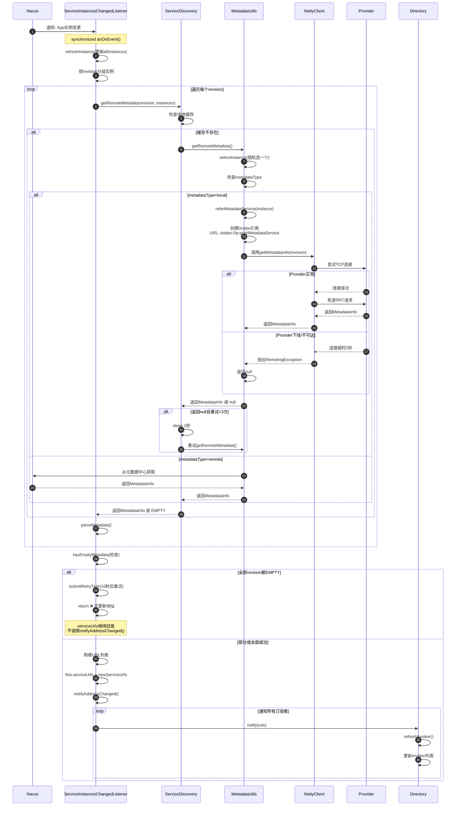
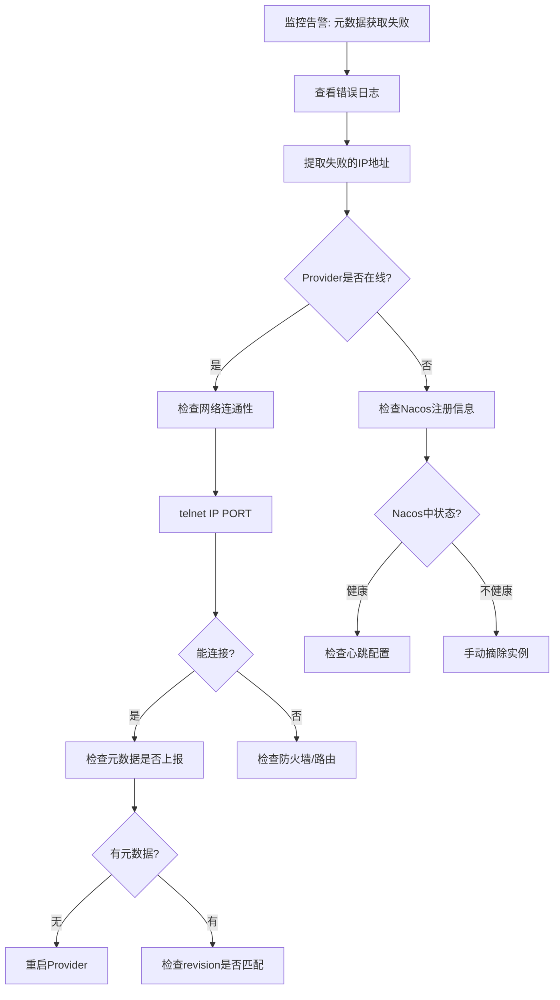

# Dubbo元数据获取超时导致地址列表无法更新问题深度分析

## 一、问题现象

### 1.1 错误日志

```
[DUBBO] Failed to get app metadata for revision 5647adf72fcf77a4a0b373cae1e55396 
for type local from instance 10.156.39.35:20880
org.apache.dubbo.rpc.RpcException: Failed to invoke remote method: getMetadataInfo
client-side timeout 3000ms (elapsed: 3000ms)
```

### 1.2 业务影响

1. **元数据获取失败**: 大量 `local` 模式的应用无法获取元数据
2. **地址列表不更新**: `remote` 模式的应用,新IP地址20分钟不在调用列表中
3. **Nacos已通知**: 日志显示Nacos已发送IP变更通知,但Dubbo未更新地址列表

### 1.3 环境信息

- **网关类型**: Dubbo泛化调用网关
- **监听规模**: 1000+ Dubbo IP实例
- **元数据模式**: 混合(local + remote)
- **Dubbo版本**: 3.3.4-mone-v6-tesla-SNAPSHOT

## 二、核心问题分析

### 2.1 问题根源

**关键发现**: `local` 模式元数据获取超时会阻塞整个地址刷新流程,导致所有应用(包括 `remote` 模式)的地址列表都无法更新!

### 2.2 代码层面的原因

从 `ServiceInstancesChangedListener.doOnEvent()` 方法可以看到核心逻辑:

```java
// 第1步: 更新实例列表(已完成,Nacos通知已收到)
refreshInstance(event); 
allInstances.put(appName, appInstances); ✓

// 第2步: 按revision分组实例
Map<String, List<ServiceInstance>> revisionToInstances = new HashMap<>();

// 第3步: 获取每个revision的元数据 ⚠️ 关键点!
for (Map.Entry<String, List<ServiceInstance>> entry : revisionToInstances.entrySet()) {
    String revision = entry.getKey();
    List<ServiceInstance> subInstances = entry.getValue();
    
    // ⚠️ 这里会阻塞!
    MetadataInfo metadata = subInstances.stream()
        .map(ServiceInstance::getServiceMetadata)
        .filter(Objects::nonNull)
        .filter(m -> revision.equals(m.getRevision()))
        .findFirst()
        .orElseGet(() -> serviceDiscovery.getRemoteMetadata(revision, subInstances));
    
    parseMetadata(revision, metadata, localServiceToRevisions);
}

// 第4步: 检查是否有失败的元数据
int emptyNum = hasEmptyMetadata(revisionToInstances);
if (emptyNum == revisionToInstances.size()) {
    // ❌ 如果全部失败,直接return,不更新地址!
    logger.error("Address refresh failed...");
    submitRetryTask(event);
    return; // ❌ 导致地址列表不更新!
}

// 第5步: 构建URL并通知 (前面return了,这里根本不会执行)
this.serviceUrls = newServiceUrls;
this.notifyAddressChanged(); // ❌ 不会执行!
```

### 2.3 问题链路

```
Nacos通知实例变更
    ↓
ServiceInstancesChangedListener.onEvent()
    ↓
doOnEvent() [synchronized方法]
    ↓
refreshInstance() ✓ (实例列表已更新到allInstances)
    ↓
按revision分组
    ↓
获取元数据 (遍历每个revision)
    ↓
    ├→ Revision A (local模式) → 超时3秒 → 返回EMPTY
    ├→ Revision B (local模式) → 超时3秒 → 返回EMPTY  
    ├→ Revision C (remote模式) → 成功获取
    └→ Revision D (remote模式) → 成功获取
    ↓
检查: emptyNum = 2, total = 4
    ↓
emptyNum != total, 继续执行
    ↓
构建URL列表 ✓
    ↓
notifyAddressChanged() ✓
```

**但是**: 如果 `emptyNum == total` (所有revision的元数据都获取失败),则直接return,不会更新地址!

## 三、为什么local模式会超时?

### 3.1 local模式的元数据获取流程



### 3.2 超时的原因

#### 原因1: Provider已下线但Nacos未及时摘除

```
10.156.39.35:20880 (Provider)
   ├─ 实际状态: 已下线
   ├─ Nacos状态: 仍注册(心跳超时未摘除)
   └─ Consumer尝试连接: 超时3秒
```

#### 原因2: 网络不可达

```
10.7.87.146 (Consumer/网关) → 10.156.39.35:20880 (Provider)
   └─ 跨网段/防火墙/网络故障 → 连接超时
```

#### 原因3: 连接超时配置

- **业务调用超时**: `timeout=5000ms` (5秒)
- **TCP连接超时**: `connect.timeout=3000ms` (3秒,默认值)
- **元数据服务**: 使用Dubbo协议调用 MetadataService.getMetadataInfo()
- **check=false**: 创建引用时不检查连接,真正调用时才连接

### 3.3 为什么会重试3次?

从 `AbstractServiceDiscovery.getRemoteMetadata()` 可以看到:

```java
synchronized (metaCacheManager) {
    int triedTimes = 0;
    while (triedTimes < 3) {
        metadata = MetadataUtils.getRemoteMetadata(revision, instances, metadataReport);
        
        if (metadata != MetadataInfo.EMPTY) {
            metadata.init();
            break; // 成功就跳出
        } else { 
            // 失败,sleep 1秒后重试
            triedTimes++;
            Thread.sleep(1000);
        }
    }
}
```

**总耗时**: 3秒(连接) + 1秒(sleep) + 3秒(连接) + 1秒(sleep) + 3秒(连接) = **11秒**

## 四、为什么remote模式的地址也不更新?

### 4.1 核心原因: 共享同一个监听器

```java
public class ServiceInstancesChangedListener {
    // 一个监听器管理多个应用
    protected final Set<String> serviceNames; 
    protected Map<String, List<ServiceInstance>> allInstances;
    
    // ⚠️ synchronized方法,同一时刻只能处理一个事件!
    private synchronized void doOnEvent(ServiceInstancesChangedEvent event) {
        // ...
    }
}
```

### 4.2 阻塞示例

假设网关监听了3个应用:

1. **App A** (local模式): revision=111
2. **App B** (remote模式): revision=222
3. **App C** (local模式,已下线): revision=333

**执行流程**:

```
Time  | Event                          | Status
------+--------------------------------+---------------------------
T0    | Nacos通知: App A 实例变更      | 进入doOnEvent()
T1    | 获取metadata for revision=111  | 尝试连接 10.156.39.35:20880
T4    | 连接超时(3秒)                  | 返回EMPTY,重试1
T5    | sleep 1秒                      | 等待...
T6    | 重试连接                       | 尝试连接 10.156.39.35:20880
T9    | 连接超时(3秒)                  | 返回EMPTY,重试2
T10   | sleep 1秒                      | 等待...
T11   | 重试连接                       | 尝试连接 10.156.39.35:20880
T14   | 连接超时(3秒)                  | 返回EMPTY,重试3
T14   | 最终返回EMPTY                  | emptyNum++ 
T14   | hasEmptyMetadata检查           | emptyNum=1, total=1
T14   | 判断:emptyNum==total          | ❌ 条件满足,直接return!
T14   | ❌ 不更新serviceUrls           | 地址列表保持旧的!
T14   | ❌ 不调用notifyAddressChanged()| 不通知各个服务!
------+--------------------------------+---------------------------
...   | Nacos通知: App B 实例变更      | ⏰ 等待doOnEvent()释放锁
```

### 4.3 为什么App B的新地址不在列表中?

因为 App A 获取元数据失败,导致 `doOnEvent()` 提前return,`serviceUrls` 没有更新,`notifyAddressChanged()` 没有调用。

**即使 App B 的元数据是 `remote` 模式,可以成功获取,但因为和 App A 共享同一个监听器,所以也无法更新!**

## 五、详细流程图

### 5.1 完整的地址刷新流程



### 5.2 元数据获取时序图



### 5.3 关键代码位置

```java
// ServiceInstancesChangedListener.java:132-231
private synchronized void doOnEvent(ServiceInstancesChangedEvent event) {
    // 第1步: 更新实例列表
    refreshInstance(event);  // line 137
    
    // 第2步: 按revision分组
    Map<String, List<ServiceInstance>> revisionToInstances = new HashMap<>(); // line 143
    for (ServiceInstance instance : instances) {
        String revision = getExportedServicesRevision(instance);
        // 分组逻辑...
    }
    
    // 第3步: 获取每个revision的元数据 ⚠️
    for (Map.Entry<String, List<ServiceInstance>> entry : revisionToInstances.entrySet()) {
        String revision = entry.getKey();
        List<ServiceInstance> subInstances = entry.getValue();
        
        // ⚠️ 这里会阻塞很久! line 168-173
        MetadataInfo metadata = subInstances.stream()
            .map(ServiceInstance::getServiceMetadata)
            .filter(Objects::nonNull)
            .filter(m -> revision.equals(m.getRevision()))
            .findFirst()
            .orElseGet(() -> serviceDiscovery.getRemoteMetadata(revision, subInstances));
        
        parseMetadata(revision, metadata, localServiceToRevisions);  // line 175
    }
    
    // 第4步: 检查失败数量 ⚠️
    int emptyNum = hasEmptyMetadata(revisionToInstances);  // line 185
    if (emptyNum != 0) {
        hasEmptyMetadata = true;
        
        if (emptyNum == revisionToInstances.size()) {  // line 190
            // ❌ 全部失败,直接return!
            logger.error("Address refresh failed...");
            submitRetryTask(event);  // line 198
            return;  // ❌ line 199
        }
    }
    
    // 第5步: 构建URL并通知
    this.serviceUrls = newServiceUrls;  // line 225
    this.notifyAddressChanged();  // line 226
}
```

## 六、问题示例

### 示例1: 单个应用获取元数据失败

```
应用: AppA
实例: 
  - 10.1.1.1:20880 (revision=abc123, metadataType=local)
  - 10.1.1.2:20880 (revision=abc123, metadataType=local)

执行流程:
1. Nacos通知: AppA有2个实例
2. 按revision分组: {abc123: [instance1, instance2]}
3. 获取metadata for abc123:
   - 随机选择 instance1 (10.1.1.1:20880)
   - 尝试连接: 超时3秒
   - 重试3次,总耗时11秒
   - 返回EMPTY
4. 检查: emptyNum=1, total=1
5. 判断: emptyNum == total ✓
6. ❌ 直接return,不更新地址
7. 10秒后重试

结果: AppA的地址列表一直是旧的,无法调用新实例!
```

### 示例2: 混合模式导致remote应用也无法更新

```
监听器管理3个应用:
  - AppA (local, revision=111)  
  - AppB (remote, revision=222)
  - AppC (local, revision=333, 已下线)

T0: Nacos通知AppA+AppB+AppC都有实例变更
T0: doOnEvent()开始执行

获取metadata:
  1. revision=111 (AppA, local):
     - 选择10.1.1.1:20880
     - 连接超时3秒
     - 重试3次,11秒
     - 返回EMPTY
  
  2. revision=222 (AppB, remote):
     - 从Nacos元数据中心获取
     - 成功,返回MetadataInfo
  
  3. revision=333 (AppC, local):
     - 选择10.2.2.2:20880 (已下线)
     - 连接超时3秒
     - 重试3次,11秒
     - 返回EMPTY

检查: emptyNum=2, total=3
判断: emptyNum != total ✓
继续执行:
  - 构建URL列表 (只包含AppB的)
  - 更新serviceUrls
  - notifyAddressChanged()

结果: AppB地址更新成功,但AppA和AppC失败
```

### 示例3: 全部失败的最坏情况

```
监听器管理2个应用,都是local模式:
  - AppA (local, revision=111, 实例已下线)
  - AppB (local, revision=222, 网络不可达)

获取metadata:
  1. revision=111: 超时11秒, 返回EMPTY
  2. revision=222: 超时11秒, 返回EMPTY

总耗时: 22秒

检查: emptyNum=2, total=2
判断: emptyNum == total ✓
❌ 直接return

结果: 两个应用的地址列表都不更新!
```

## 七、为什么网关会监听1000+实例?

网关采用Dubbo泛化调用,需要监听所有后端服务的实例:

```
网关订阅:
  ├─ ServiceA: 10个实例
  ├─ ServiceB: 20个实例
  ├─ ServiceC: 15个实例
  ├─ ... (100个服务)
  └─ Total: 1000+ 实例

每个ServiceInstancesChangedListener:
  ├─ serviceNames: Set<String> (可能包含多个应用)
  ├─ allInstances: Map<AppName, List<ServiceInstance>>
  └─ 共享synchronized的doOnEvent()方法
```

**问题**: 如果其中一个应用的元数据获取失败,可能影响整个监听器管理的所有应用!

## 八、解决方案

### 8.1 临时方案: 增加超时时间

```properties
# 增加TCP连接超时
dubbo.consumer.connect.timeout=10000

# 增加RPC调用超时
dubbo.consumer.timeout=10000
```

**缺点**: 治标不治本,如果Provider真的下线,还是会超时。

### 8.2 短期方案: 优化元数据获取逻辑

#### 方案A: 异步获取元数据

修改 `doOnEvent()`,将元数据获取改为异步:

```java
private synchronized void doOnEvent(ServiceInstancesChangedEvent event) {
    refreshInstance(event);
    
    Map<String, List<ServiceInstance>> revisionToInstances = new HashMap<>();
    // 分组逻辑...
    
    // ⚠️ 改为异步获取
    Map<String, CompletableFuture<MetadataInfo>> futureMap = new HashMap<>();
    for (Map.Entry<String, List<ServiceInstance>> entry : revisionToInstances.entrySet()) {
        String revision = entry.getKey();
        List<ServiceInstance> subInstances = entry.getValue();
        
        CompletableFuture<MetadataInfo> future = CompletableFuture.supplyAsync(() -> 
            serviceDiscovery.getRemoteMetadata(revision, subInstances)
        );
        futureMap.put(revision, future);
    }
    
    // 等待所有Future完成,但设置总超时时间
    CompletableFuture.allOf(futureMap.values().toArray(new CompletableFuture[0]))
        .orTimeout(15, TimeUnit.SECONDS)
        .join();
    
    // 收集结果...
}
```

**优点**: 并行获取,不会相互阻塞
**缺点**: 需要修改Dubbo源码

#### 方案B: 降级策略 - 部分成功即更新

修改判断逻辑,即使部分失败也更新成功的部分:

```java
int emptyNum = hasEmptyMetadata(revisionToInstances);
if (emptyNum != 0) {
    hasEmptyMetadata = true;
    
    // ❌ 原逻辑: 全部失败才return
    // if (emptyNum == revisionToInstances.size()) {
    //     submitRetryTask(event);
    //     return;
    // }
    
    // ✓ 新逻辑: 只在全部失败时return,否则用成功的部分更新
    if (emptyNum == revisionToInstances.size()) {
        logger.error("All revisions failed, retry in 10s");
        submitRetryTask(event);
        return;
    } else {
        logger.warn(emptyNum + " revisions failed, will use available metadata");
        // 继续执行,用成功的部分更新
    }
}
```

**优点**: 现有逻辑已支持,不需要大改
**缺点**: 失败的revision对应的实例不会加入地址列表

### 8.3 中期方案: 改用remote模式

将所有应用的元数据模式改为 `remote`:

```yaml
dubbo:
  application:
    metadata-type: remote
  metadata-report:
    address: nacos://127.0.0.1:8848
```

**原理**: 元数据存储在Nacos元数据中心,不需要通过Dubbo协议调用Provider

**优点**: 
- 不依赖Provider实例可用性
- 获取速度快
- 不会超时

**缺点**:
- 需要配置元数据中心
- 所有Provider都要上报元数据

### 8.4 长期方案: 架构优化

#### 方案A: 拆分监听器

不要让一个监听器管理所有应用,按业务域拆分:

```java
// 原来: 一个监听器管理100个应用
ServiceInstancesChangedListener listener = new ServiceInstancesChangedListener(
    Set.of("appA", "appB", ..., "appZ"), serviceDiscovery
);

// 优化: 拆分为多个监听器
ServiceInstancesChangedListener listener1 = new ServiceInstancesChangedListener(
    Set.of("appA", "appB", "appC"), serviceDiscovery
);
ServiceInstancesChangedListener listener2 = new ServiceInstancesChangedListener(
    Set.of("appD", "appE", "appF"), serviceDiscovery
);
```

**优点**: 一个应用失败不影响其他监听器管理的应用

#### 方案B: 改造网关架构

使用Dubbo Mesh或Service Mesh架构,元数据管理交给控制面:

```
网关 → Sidecar(Envoy/Mosn) → Provider
         ↑
    控制面(Pilot/Istiod)
         ↑
      Nacos/K8s
```

## 九、最佳实践建议

### 9.1 生产环境配置

```yaml
dubbo:
  application:
    # 强烈建议使用remote模式
    metadata-type: remote
    
  consumer:
    # 增加连接超时
    connect.timeout: 10000
    timeout: 10000
    # 启用check,提前发现问题
    check: true
    
  metadata-report:
    # 配置元数据中心
    address: nacos://${nacos.address}
    
  registry:
    # 启用空保护
    empty-protection: true
```

### 9.2 监控告警

添加监控指标:

1. **元数据获取失败率**
   ```
   dubbo_metadata_get_failure_rate > 0.1 (10%)
   ```

2. **地址刷新耗时**
   ```
   dubbo_address_refresh_duration > 30s
   ```

3. **重试任务数量**
   ```
   dubbo_metadata_retry_task_count > 10
   ```

### 9.3 故障处理流程



## 十、总结

### 10.1 核心问题

1. **阻塞问题**: `local` 模式元数据获取会通过Dubbo协议调用Provider,如果Provider下线会超时阻塞
2. **连锁反应**: 一个应用获取元数据失败,可能导致整个监听器管理的所有应用地址都无法更新
3. **synchronized**: `doOnEvent()` 是synchronized方法,同一时刻只能处理一个事件

### 10.2 根本原因

- **设计缺陷**: Dubbo 3的应用级服务发现,将元数据获取和地址刷新强耦合在一起
- **容错不足**: 元数据获取失败时,没有降级策略,直接放弃整个刷新流程
- **模式问题**: `local` 模式依赖Provider可用性,而网关场景需要监听大量实例,风险很高

### 10.3 推荐方案

**短期** (立即实施):
1. 将元数据模式改为 `remote`
2. 增加连接超时时间
3. 添加监控告警

**中期** (1-2周):
1. 拆分监听器,降低影响范围
2. 优化Dubbo源码,改为异步获取元数据
3. 添加降级策略

**长期** (1-3月):
1. 考虑Service Mesh架构
2. 升级Dubbo版本,等待官方修复
3. 建立完善的故障处理流程

---

**关键结论**: `local` 模式的元数据获取超时会阻塞整个地址刷新流程,即使其他应用是 `remote` 模式也无法更新,因为它们共享同一个 `synchronized` 的 `doOnEvent()` 方法!
