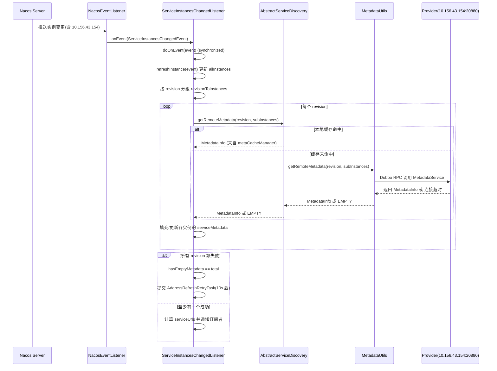
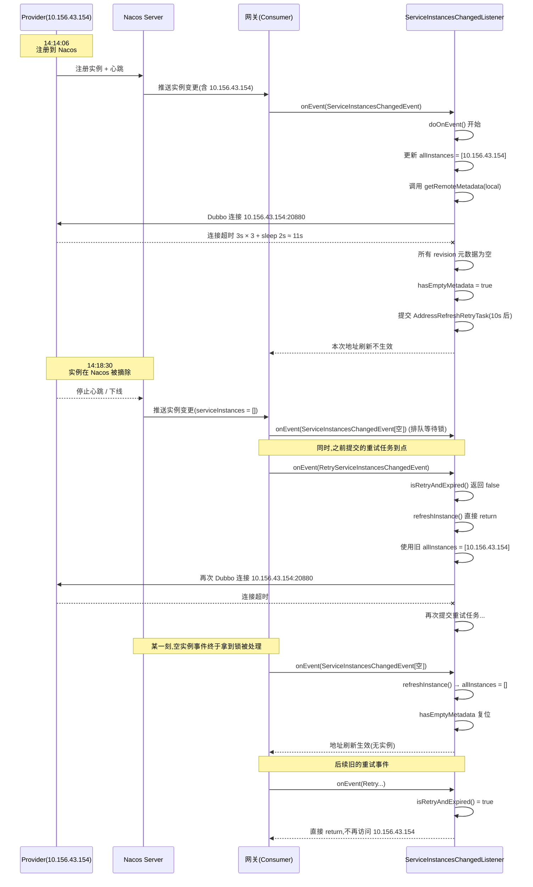

## Dubbo 实例下线后仍然获取元数据的原因解析

### 1. 场景回顾(基于你的真实日志)

先把你提供的关键信息串在一起:

- **Nacos naming_instance 表记录**
  - ip: `10.156.43.154`
  - port: `20880`
  - serviceName: `auto-pc-backend-consumer`
  - `dubbo.metadata.storage-type = local`
  - `dubbo.metadata.revision = c6c5ff06a9e5bb0f2960cd4d094be521`
  - `last_beat_time = 2026-01-16 14:14:06`
  - 后续 `gmt_modified = 2026-01-16 14:18:30` (实例被下线/摘除)

- **网关首次报错时间**
  - 时间: `2026-01-16 14:15:14.129`
  - 报错: `Failed to get app metadata for revision c6c5ff06... from instance 10.156.43.154:20880`
  - 具体异常: `NettyClient ... failed to connect to server /10.156.43.154:20880 client-side timeout 3000ms`

- **你后面看到的报错时间**
  - 时间: `2026-01-16 14:22:34.xxx`
  - 此时 Nacos naming_instance 中已经**没有**这台机器
  - 但网关仍然在输出 **同样的元数据获取失败日志**

你最核心的问题是:

> **为什么 Nacos 表里已经没有这台机器了, 网关还在尝试去 10.156.43.154:20880 拉取元数据?**

下面我们从两个视角来拆开看:

- **Nacos 视角: 实例何时被摘除**
- **Dubbo Consumer 视角: 本地缓存 + 元数据重试机制**

最后再把两条线用时序图和源码逻辑拼在一起。

---

### 2. Nacos 视角: naming_instance 只是“真相”,不是客户端视图

在 Nacos 里, 服务实例的生命周期大致如下:

- Provider 启动后注册实例
  - 写一条记录到 `naming_instance` 表
  - 同时开始定时心跳(`last_beat_time` 会更新)
- 如果 Provider 正常下线(或宕机/心跳超时)
  - Nacos 会在心跳超时后, 将该实例标记为不可用
  - 再经过一小段时间, 彻底从 `naming_instance` 表中删除

**关键点**: `naming_instance` 表上的删行, 只是 **Nacos 自己的真相来源**。Dubbo 客户端不会每次发请求都去查这张表, 而是:

- 依赖 **Nacos 的推送事件**
- 将推送结果保存在 **Dubbo 本地缓存(allInstances)**
- 后续所有地址和元数据逻辑,都基于这个本地缓存

所以会出现这样的时间差:

1. `naming_instance` 表已经删除了实例
2. **但某些 Consumer 还没来得及处理“删除事件”**, 本地缓存里仍然认为这个实例是存在的

再叠加 Dubbo 的 **异步重试机制**, 就会出现你看到的“残留元数据请求”。

---

### 3. Dubbo 视角: 服务实例变更 + 元数据获取全链路

以网关(Consumer)为例,关键参与角色有:

- **NacosServiceDiscovery.NacosEventListener**: 接收 Nacos 推送事件
- **ServiceInstancesChangedListener**: Dubbo 侧监听器,维护 `allInstances` 和 `serviceUrls`
- **AbstractServiceDiscovery.getRemoteMetadata(...)**: 负责按 revision 拉取元数据
- **MetadataUtils.getRemoteMetadata(...)**: 在 local 模式下,会通过 Dubbo RPC 调用 Provider 的 `MetadataService`
- **AddressRefreshRetryTask + RetryServiceInstancesChangedEvent**: 失败后的重试任务

用一个时序图先整体看一下:



有两个**非常关键的点**:

- `doOnEvent()` 是 **synchronized** 的 → 同一时刻只能处理一个事件(包括 Nacos 推送事件和重试事件)
- 如果元数据获取走的是 **local 模式**, 每次失败都会:
  - Dubbo 连接超时 3 秒
  - 重试 3 次,中间 sleep 1 秒
  - 单次最坏耗时约 11 秒

这为后面“实例已经从 Nacos 删除, 但网关还在访问”的现象埋下了伏笔。

---

### 4. 关键代码逻辑(小白版解释)

#### 4.1 ServiceInstancesChangedListener.doOnEvent()

只看和本问题相关的核心片段(伪代码化描述):

```java
private synchronized void doOnEvent(ServiceInstancesChangedEvent event) {
    if (destroyed.get() || !accept(event) || isRetryAndExpired(event)) {
        return;
    }

    // 1) 如果是正常事件,刷新 allInstances
    refreshInstance(event);  // Retry 事件不会更新 allInstances

    // 2) 把 allInstances 中所有实例,按 metadata revision 分组
    Map<String, List<ServiceInstance>> revisionToInstances = groupByRevision(allInstances);

    // 3) 针对每个 revision 拉取元数据
    for (entry in revisionToInstances) {
        String revision = entry.key;
        List<ServiceInstance> subInstances = entry.value;

        MetadataInfo metadata = subInstances.stream()
            .map(ServiceInstance::getServiceMetadata) // 先看实例里有没有现成的元数据
            .filter(非空且revision匹配)
            .findFirst()
            .orElseGet(() -> serviceDiscovery.getRemoteMetadata(revision, subInstances));
            // 如果没有,就远程拉

        // ... 把 metadata 塞回每个实例的 serviceMetadata 属性
    }

    int emptyNum = hasEmptyMetadata(revisionToInstances);
    if (emptyNum == revisionToInstances.size()) {
        // 所有 revision 都没拿到元数据
        submitRetryTask(event);     // 10s 后重试
        return;                    // 本次地址刷新不生效
    }

    // ... 正常计算 serviceUrls 并通知订阅者
}
```

记住两件事:

- `revisionToInstances` 是从 **allInstances** 算出来的
- 如果当前所有 revision 的元数据都获取失败,会调 `submitRetryTask(event)` 提交一个 **10 秒后的重试任务**

#### 4.2 AddressRefreshRetryTask + RetryServiceInstancesChangedEvent

重试任务的定义:

```java
protected class AddressRefreshRetryTask implements Runnable {
    private final RetryServiceInstancesChangedEvent retryEvent;
    private final Semaphore retryPermission;

    public AddressRefreshRetryTask(Semaphore semaphore, String serviceName) {
        this.retryEvent = new RetryServiceInstancesChangedEvent(serviceName);
        this.retryPermission = semaphore;
    }

    @Override
    public void run() {
        retryPermission.release();
        ServiceInstancesChangedListener.this.onEvent(retryEvent);
    }
}
```

`RetryServiceInstancesChangedEvent` 的构造:

```java
public RetryServiceInstancesChangedEvent(String serviceName) {
    super(serviceName, Collections.emptyList());
    // instance list has been stored by ServiceInstancesChangedListener
}
```

也就是说:

- 重试事件里自带的 `getServiceInstances()` 是一个 **空列表**
- 注释写得很清楚:实例列表是存在 `ServiceInstancesChangedListener` 里的(allInstances)
- 所以重试时**不会从事件里拿实例列表**,而是用 **之前缓存的 allInstances**

此外,在 `refreshInstance(event)` 中对重试事件有特殊判断:

```java
private void refreshInstance(ServiceInstancesChangedEvent event) {
    if (event instanceof RetryServiceInstancesChangedEvent) {
        return; // 重试事件不会刷新 allInstances
    }
    String appName = event.getServiceName();
    List<ServiceInstance> appInstances = event.getServiceInstances();
    allInstances.put(appName, appInstances);
    lastRefreshTime = System.currentTimeMillis();
}
```

**非常关键**:

- 正常的 Nacos 推送事件会更新 `allInstances`
- 但 **重试事件不会更新 `allInstances`**, 只会使用当时缓存的实例列表

#### 4.3 AbstractServiceDiscovery.getRemoteMetadata()

简化后的逻辑:

```java
public MetadataInfo getRemoteMetadata(String revision, List<ServiceInstance> instances) {
    // 1) 先查二级缓存 metaCacheManager
    MetadataInfo metadata = metaCacheManager.get(revision);
    if (metadata 命中且非 EMPTY) {
        return metadata;
    }

    synchronized (metaCacheManager) {
        int triedTimes = 0;
        while (triedTimes < 3) {
            metadata = MetadataUtils.getRemoteMetadata(revision, instances, metadataReport);
            if (metadata != MetadataInfo.EMPTY) {
                break;  // 成功
            }
            triedTimes++;
            Thread.sleep(1000);     // 失败后 sleep 1 秒
        }

        if (metadata == MetadataInfo.EMPTY) {
            // 记录错误日志
        } else {
            metaCacheManager.put(revision, metadata); // 成功才写缓存
        }
    }
    return metadata;
}
```

注意几点:

- 如果三次都失败,返回的是 `MetadataInfo.EMPTY`, **不会写入缓存**
- 下次再来,`metaCacheManager.get(revision)` 还是拿不到,又会走远程调用
- 远程调用时用到的 `instances` 就是上面传进来的 `subInstances`

#### 4.4 MetadataUtils.getRemoteMetadata() 在 local 模式下的行为

关键逻辑:

```java
public static MetadataInfo getRemoteMetadata(String revision, List<ServiceInstance> instances, MetadataReport metadataReport) {
    ServiceInstance instance = selectInstance(instances);   // 随机选一个实例
    String metadataType = ServiceInstanceMetadataUtils.getMetadataStorageType(instance);

    if (REMOTE_METADATA_STORAGE_TYPE.equals(metadataType)) {
        // remote 模式: 从远程元数据中心拿
        metadataInfo = MetadataUtils.getMetadata(revision, instance, metadataReport);
    } else {
        // local 模式: 通过 Dubbo 调用 Provider 自身的 MetadataService
        RemoteMetadataService remoteMetadataService = null;
        try {
            remoteMetadataService = MetadataUtils.referMetadataService(instance);
            metadataInfo = remoteMetadataService.getRemoteMetadata(revisionFromInstance);
        } finally {
            MetadataUtils.destroyProxy(remoteMetadataService);
        }
    }
}
```

在你这次的场景里:

- `dubbo.metadata.storage-type = local`
- 所以会通过 Dubbo 协议去连 `10.156.43.154:20880` 的 `MetadataService`
- 如果端口没监听/实例已经下线,就会抛出你看到的 `client-side timeout 3000ms`

---

### 5. 为什么 Nacos 已删除实例,网关还在连 10.156.43.154?

现在可以精确回答你的问题了,我们按时间线一步一步来。

#### 5.1 第一次失败(14:15:14): Provider 未就绪/已挂掉

- 14:14:06: Provider 向 Nacos 注册,`last_beat_time` 记为 14:14:06
- 很可能此时应用还在启动中,或者刚启动完马上就挂了:
  - 对 Nacos 来说,实例是“存在”的
  - 对 Dubbo 来说,端口 20880 还没真正对外提供服务
- Nacos 推送包含该实例的变更给网关
- 网关在处理 `doOnEvent()` 时,需要拉取元数据
- MetadataUtils 走 local 模式,通过 Dubbo 去连:
  - `dubbo://10.156.43.154:20880/org.apache.dubbo.metadata.MetadataService?...`
- 结果:
  - 连接 3 秒超时
  - 重试 3 次,中间两次 sleep 1 秒
  - 共耗时约 11 秒

这是你第一次看到的错误日志(**在实例仍存在于 Nacos 时,是“正常”的失败**)。

#### 5.2 提交重试任务(重试使用的是旧实例缓存)

这次尝试的结果是:

- 所有 revision 的元数据都没拿到
- `hasEmptyMetadata(revisionToInstances)` 返回的 `emptyNum == 总 revision 数`
- `doOnEvent()` 会:
  - 打一条错误日志(元数据服务失败)
  - 调用 `submitRetryTask(event)`, 提交一个 **10 秒后执行的重试任务**
  - **提前 return**, 本次地址刷新不生效

此时 `allInstances` 里仍然缓存着:

```text
appName = auto-pc-backend-consumer
instances = [10.156.43.154:20880]
```

#### 5.3 Provider 在 Nacos 被摘除(14:18:30),但消费者未必立刻同步

- Nacos 根据心跳/下线事件,在 `14:18:30` 把该实例从 `naming_instance` 表里摘掉
- 但 **Dubbo Consumer 完全不知道这件事,直到 Nacos 推送一个“实例为空”的事件过来,并且这个事件被 `doOnEvent()` 成功处理为止**
- 如果此时 `doOnEvent()` 正在被前一次的元数据超时(11 秒)阻塞,或者正在处理其他应用的事件,新的事件会排队等待锁

换句话说:

> Nacos 的“真相”→ Dubbo 客户端的“视图”,中间有一条异步、可能被阻塞的通道。

#### 5.4 重试任务触发,但 allInstances 仍是旧数据

重试流程是这样的:

1. 失败时,按失败时间 `failureRecordTime` 记录一个 `RetryServiceInstancesChangedEvent`
2. 10 秒后,`AddressRefreshRetryTask.run()` 被调度执行:
   - 调用 `ServiceInstancesChangedListener.onEvent(retryEvent)`
   - 继而进入 `doOnEvent(retryEvent)`
3. `doOnEvent()` 里第一件事是:

```java
if (destroyed.get() || !accept(event) || isRetryAndExpired(event)) {
    return;
}
```

其中 `isRetryAndExpired(event)` 的逻辑是:

```java
if (event instanceof RetryServiceInstancesChangedEvent) {
    if (retryEvent.getFailureRecordTime() < lastRefreshTime && !hasEmptyMetadata) {
        // 如果在失败之后,已经有一次成功刷新且有有效元数据
        // 就认为这个重试事件已经过期,可以忽略
        return true;
    }
    // 否则打印日志,继续重试
}
```

在你的场景里,由于一直都没有成功拿到元数据(`hasEmptyMetadata` 一直是 true 或者未复位),同时 `lastRefreshTime` 也不会被新的成功事件更新,所以:

- `retryEvent.getFailureRecordTime() < lastRefreshTime` 条件很难成立
- 绝大多数情况下,**重试事件不会被判定为过期**,会继续执行

4. 接下来是 `refreshInstance(event)`:

```java
if (event instanceof RetryServiceInstancesChangedEvent) {
    return; // 注意:不会更新 allInstances
}
```

因此,在重试的这条执行路径上:

- `allInstances` 保持着**失败那一刻的旧快照**
- 对你这个 app 来说,里面仍然是 `[10.156.43.154:20880]`

5. 然后重新构建 `revisionToInstances` 并调用 `getRemoteMetadata(revision, subInstances)`
   - `subInstances` 正是从 `allInstances` 分组得来的
   - MetadataUtils 又会拿着这批旧实例,去尝试再次建立 Dubbo 连接
   - 而此时 Nacos 已经把实例从表里删掉了,Provider 端口也关了

所以你会在 **14:22:34** 仍然看到这条错误日志:

> `[DUBBO] Failed to get app metadata ... from instance 10.156.43.154:20880`

#### 5.5 直到“实例为空”的推送成功被处理为止

一旦某个时刻:

1. Nacos 推送了 `serviceInstances = []` 的事件给网关
2. 这个事件被 `ServiceInstancesChangedListener.doOnEvent()` 处理完成
   - `refreshInstance(event)` 会把 `allInstances.put(appName, [])`
   - `revisionToInstances` 对于这个 app 会变成空
   - `hasEmptyMetadata(revisionToInstances)` 也会把 `hasEmptyMetadata` 复位
3. 后续再有历史遗留的重试事件过来时:
   - 要么 `isRetryAndExpired` 判它已过期而直接忽略
   - 要么就算进入循环,`revisionToInstances` 里也找不到这个 app 的实例,不会再去连 10.156.43.154

这样,你看到的“残留元数据请求”才会真正消失。

---

### 6. 用一张总时序图串起来

下面这张图把整个过程按时间轴拉开:



---

### 7. 给“小白”的心智模型总结

可以把整个过程类比成:

- **Nacos = 工商局**
  - 负责登记“公司”(服务实例)的存在与否
- **Dubbo Consumer = 你手上的电话簿**
  - 平时打电话只看自己的电话簿(allInstances),不会每次都跑去工商局查
- 当某个公司(实例)刚注册,但电话(端口)还没装好/已经被拆了:
  - 电话打不通(连接超时)是正常的
  - 你会设置一个“过 10 秒再打一次”的闹钟(重试任务)
- 即使工商局后来把这家公司从系统里删除了:
  - 只要你手上的电话簿还没更新,闹钟响起时,你还是会按着旧号码拨出去
- 直到有一天你收到“这家公司已经注销”的正式通知(Nacos 推送实例为空事件),并把电话簿里的号码划掉:
  - 之后再有旧闹钟响起,你会发现“反正已经划掉了”,就不再拨号

**所以: Nacos 中已经没有这台机器,但在一段时间内,网关仍然会因为“本地缓存 + 重试任务”去尝试获取它的元数据,这是 Dubbo 现有设计 + 超时重试机制的必然结果,不是“幻觉”也不是“日志乱写”。**

---

### 8. 结论与建议

- **这是预期内的行为**,但在你这个场景里被多次重试 + 超时放大,显得很“顽固”
- 这种“残留访问”通常会持续到:
  - 空实例事件被成功处理
  - `allInstances` 清理掉该实例
  - `hasEmptyMetadata` 被复位
  - 历史重试事件被 `isRetryAndExpired` 判定为过期

**可选的优化方向(思路)**:

- 将 `metadata.storage-type` 统一调整为 `remote`, 避免在 Consumer 发起 Dubbo RPC 到 Provider 拉元数据
- 缩短连接超时时间(比如从 3000ms 调低),减小单次失败的阻塞时间
- 对 `AddressRefreshRetryTask` 增加上限或快速过期机制,避免长时间重试已下线实例

如果你愿意,我们可以在这份文档的基础上,进一步**结合你真实的完整日志**,再画一张“你公司环境专属”的时间线图,帮助你做生产事故复盘。

### 9. 10.156.43.154 机器问题与记录汇总

#### 9.1 基本信息

- **IP / 端口**: `10.156.43.154:20880`
- **应用级实例**:
  - application: `auto-pc-backend-consumer`
  - registerMode: `instance`
  - `dubbo.metadata.storage-type = local`
  - `dubbo.metadata.revision = c6c5ff06a9e5bb0f2960cd4d094be521`
- **服务级实例(本地 dev Provider)**:
  - serviceName: `providers:com.xiaomi.china.auto.provider.api.MultidimensionalTableProvider:dev`
  - group: `dev`
  - register-mode: `interface`
  - application: `auto-pc-backend-consumer`
  - methods: `refreshTable, cityList, getTableUrl`

#### 9.2 时间线梳理

- **2026-01-16 14:14:06**:
  - 应用级实例(元数据 local)注册到 Nacos,`last_beat_time = 14:14:06`。
  - 服务级 dev 实例(`MultidimensionalTableProvider:dev`)同样在这一刻完成注册。
- **2026-01-16 14:14:21**:
  - naming_instance 记录的 `last_modified` 更新,说明 Nacos 在这一时刻对该实例做过一次状态变更(可能是注册信息补充/健康状态变更)。
- **2026-01-16 14:15:14.129**:
  - 网关首次输出:
    - `Failed to get app metadata for revision c6c5ff06... from instance 10.156.43.154:20880`
    - 底层异常为: Netty 客户端连接 `/10.156.43.154:20880` 超时 3000ms。
  - 这说明:
    - 从 Consumer 视角看,实例已经在本地缓存 `allInstances` 中;
    - 但从 Provider 真实状态看,端口 20880 尚未就绪或实例已经挂掉。
- **2026-01-16 14:18:24 ~ 14:18:30**:
  - naming_instance 中 `gmt_modified` 被更新为 `14:18:24/30`,意味着:
    - Nacos 在心跳长时间缺失后,通过过期检查将该实例标记为删除/下线;
    - 对 Nacos 来说,这台 dev 机器已经“不在注册列表”中。
- **2026-01-16 14:22:34.xxx**:
  - 网关仍然在输出同一 revision、同一 IP/端口的元数据获取失败日志。
  - 结合 ServiceInstancesChangedListener 的实现可以确认:
    - 这是 **AddressRefreshRetryTask** 触发的重试;
    - 重试事件不会刷新 allInstances,仍然使用失败当时缓存的实例列表;
    - 因此即便 Nacos 表已经删掉实例,Consumer 仍会继续尝试连接 10.156.43.154:20880。

#### 9.3 该机器的主要问题归纳

- **问题1: dev 实例非优雅下线**
  - group=dev 且 `last_beat_time` 卡在注册时间点附近,之后再无更新,高度符合“本地开发实例启动后很快被 kill/崩溃”的行为;
  - 没有走 Dubbo/Nacos 的正常注销流程,仅依靠 Nacos 的心跳超时 + 定时清理被动摘除。
- **问题2: Consumer 侧服务发现/元数据缓存存在滞后窗口**
  - Nacos 从 naming_instance 删除实例只是服务端真相,Consumer 必须等到:
    - 收到“实例为空/减少”的推送事件;
    - 对应的 ServiceInstancesChangedListener.doOnEvent() 成功拿到锁并处理;
    - 才会把 allInstances 中的旧实例清理掉。
  - 在这之前,所有元数据获取、地址刷新都仍然会把 10.156.43.154:20880 当作一个“存在”的实例。
- **问题3: local 元数据模式 + 重试机制放大了影响时长**
  - `dubbo.metadata.storage-type = local` 导致 Consumer 必须通过 Dubbo RPC 拉取元数据:
    - 每次重试链路是: 连接 3 秒超时 × 3 次 + 中间 2 次 sleep 1 秒 ≈ 11 秒;
    - 所有 revision 都失败时,会提交至少一个 10 秒后的 AddressRefreshRetryTask;
    - 重试事件不会刷新 allInstances,继续使用已经失效的实例列表。
  - 因此,在 Provider 被动下线后的若干个重试周期内,你会持续看到“连接 10.156.43.154:20880 超时”的日志,即所谓“残留访问”。
- **问题4: dev 实例注册到共享 Nacos 的潜在风险**
  - 由于 dev 分组实例注册在与正式网关相同的 Nacos 集群中,即便网关只订阅部分 group,也有可能因为配置疏漏/测试使用,导致正式流量感知到这些短命的 dev 实例;
  - 一旦 dev 实例异常下线,就会引入本次类似的元数据超时与重试日志,增加排查复杂度。

#### 9.4 针对该机器的结论与建议

- **结论**:
  - 10.156.43.154 这台机器上的 dev Provider 实例并非优雅下线,而是心跳中断后被 Nacos 被动摘除;
  - 在其注册到被摘除这一段时间内,以及之后的一段重试窗口内,网关都基于缓存的旧实例列表,持续向 10.156.43.154:20880 拉取应用级元数据,从而产生了多次 `Failed to get app metadata ...` 和 `client-side timeout 3000ms` 日志;
  - 此现象属于 Dubbo 现有“local 元数据 + 重试任务 + synchronized 监听器”的综合结果,而非 Dubbo/Nacos 日志错误。
- **建议**:
  - 本地/开发环境尽量避免将 dev 实例直接注册到生产共用的 Nacos 集群,可以通过:
    - 使用独立 namespace/集群隔离 dev;
    - 或在生产网关侧通过 group/namespace 精确控制订阅范围;
  - 对重要应用优先考虑切换到 `metadata.storage-type=remote`,降低 Consumer 对单个 Provider 存活状态的强依赖;
  - 在排查类似问题时,优先对齐三类信息:
    - naming_instance 中的 last_beat_time / gmt_modified;
    - 网关侧元数据失败/重试日志的时间点;
    - ServiceInstancesChangedListener 是否存在长时间阻塞(例如通过线程栈、metrics)。