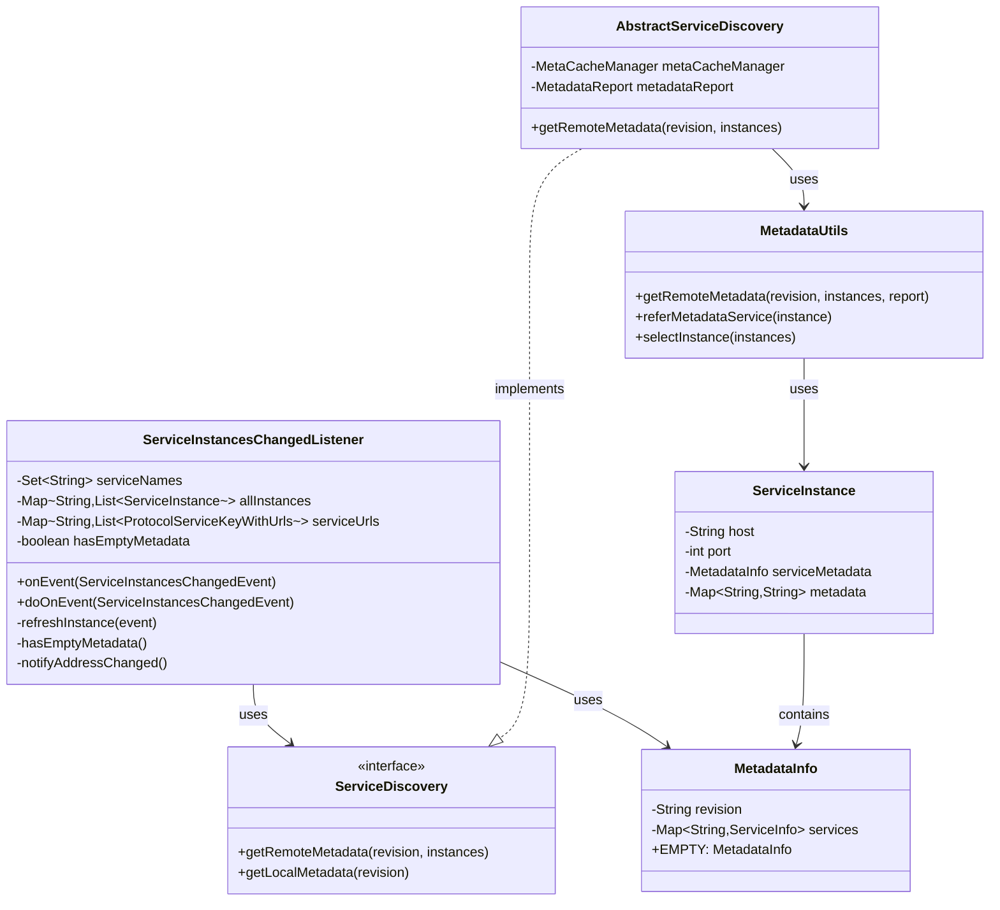
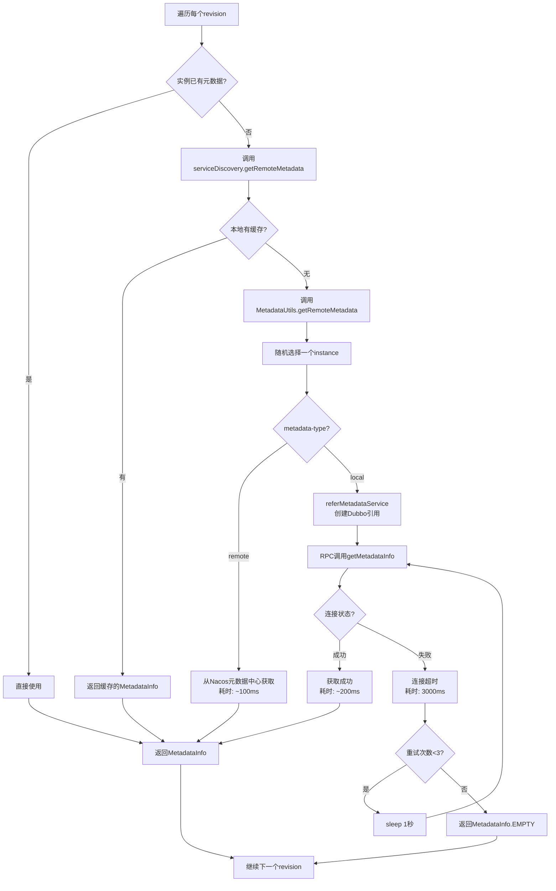

# Dubbo地址刷新源码深度剖析

## 一、核心类关系图



## 二、doOnEvent() 方法详细分析

### 2.1 方法签名和并发控制

```java
/**
 * 处理服务实例变更事件
 * ⚠️ synchronized关键字: 同一时刻只有一个线程可以执行
 * 
 * 调用链:
 * onEvent(event) 
 *   → doOnEvent(event) [synchronized]
 *     → 更新实例列表
 *     → 获取元数据 (可能阻塞)
 *     → 构建URL列表
 *     → 通知监听器
 */
private synchronized void doOnEvent(ServiceInstancesChangedEvent event) {
    // 1. 预检查
    if (destroyed.get() || !accept(event) || isRetryAndExpired(event)) {
        return;
    }
    
    // 2. 更新实例列表 (第1阶段)
    refreshInstance(event);
    
    // 3. 按revision分组 (第2阶段)
    Map<String, List<ServiceInstance>> revisionToInstances = new HashMap<>();
    Map<ServiceInfo, Set<String>> localServiceToRevisions = new HashMap<>();
    
    // ... 后续处理
}
```

### 2.2 第1阶段: 更新实例列表

```java
// ServiceInstancesChangedListener.java:344-357
private void refreshInstance(ServiceInstancesChangedEvent event) {
    // 如果是重试事件,不更新实例列表
    if (event instanceof RetryServiceInstancesChangedEvent) {
        return;
    }
    
    String appName = event.getServiceName();
    List<ServiceInstance> appInstances = event.getServiceInstances();
    
    logger.info("Received instance notification, serviceName: " 
        + appName + ", instances: " + appInstances.size());
    
    // 自定义处理逻辑
    for (ServiceInstanceNotificationCustomizer customizer : 
            serviceInstanceNotificationCustomizers) {
        customizer.customize(appInstances);
    }
    
    // ✓ 更新到allInstances
    allInstances.put(appName, appInstances);
    lastRefreshTime = System.currentTimeMillis();
}
```

**关键点**:
- ✓ Nacos通知的实例已经保存到 `allInstances`
- ✓ 更新了 `lastRefreshTime`
- ⚠️ 但此时 `serviceUrls` 还是旧的,还没有通知监听器!

### 2.3 第2阶段: 按revision分组实例

```java
// ServiceInstancesChangedListener.java:143-161
Map<String, List<ServiceInstance>> revisionToInstances = new HashMap<>();
Map<ServiceInfo, Set<String>> localServiceToRevisions = new HashMap<>();

// grouping all instances of this app(service name) by revision
for (Map.Entry<String, List<ServiceInstance>> entry : allInstances.entrySet()) {
    List<ServiceInstance> instances = entry.getValue();
    for (ServiceInstance instance : instances) {
        // 获取实例的revision
        String revision = getExportedServicesRevision(instance);
        
        // revision为空或EMPTY,跳过
        if (revision == null || EMPTY_REVISION.equals(revision)) {
            if (logger.isDebugEnabled()) {
                logger.debug("Find instance without valid service metadata: " 
                    + instance.getAddress());
            }
            continue;
        }
        
        // 按revision分组
        List<ServiceInstance> subInstances = 
            revisionToInstances.computeIfAbsent(revision, r -> new LinkedList<>());
        subInstances.add(instance);
    }
}
```

**示例**:
```
allInstances = {
    "AppA": [
        {host: "10.1.1.1", port: 20880, revision: "abc123"},
        {host: "10.1.1.2", port: 20880, revision: "abc123"},
        {host: "10.1.1.3", port: 20880, revision: "def456"}
    ],
    "AppB": [
        {host: "10.2.2.1", port: 20880, revision: "xyz789"}
    ]
}

↓ 分组后

revisionToInstances = {
    "abc123": [
        {host: "10.1.1.1", port: 20880},
        {host: "10.1.1.2", port: 20880}
    ],
    "def456": [
        {host: "10.1.1.3", port: 20880}
    ],
    "xyz789": [
        {host: "10.2.2.1", port: 20880}
    ]
}
```

### 2.4 第3阶段: 获取每个revision的元数据 ⚠️

```java
// ServiceInstancesChangedListener.java:164-183
for (Map.Entry<String, List<ServiceInstance>> entry : revisionToInstances.entrySet()) {
    String revision = entry.getKey();
    List<ServiceInstance> subInstances = entry.getValue();
    
    // ⚠️ 关键代码! 这里会阻塞!
    MetadataInfo metadata = subInstances.stream()
        .map(ServiceInstance::getServiceMetadata)  // 尝试从实例对象获取
        .filter(Objects::nonNull)
        .filter(m -> revision.equals(m.getRevision()))
        .findFirst()
        .orElseGet(() -> serviceDiscovery.getRemoteMetadata(revision, subInstances));
        //              ↑ 如果实例没有,就远程获取(会阻塞)
    
    // 解析元数据,提取ServiceInfo
    parseMetadata(revision, metadata, localServiceToRevisions);
    
    // 更新到实例对象中
    for (ServiceInstance tmpInstance : subInstances) {
        MetadataInfo originMetadata = tmpInstance.getServiceMetadata();
        if (originMetadata == null || 
            !Objects.equals(originMetadata.getRevision(), metadata.getRevision())) {
            tmpInstance.setServiceMetadata(metadata);
        }
    }
}
```

**执行流程**:



### 2.5 getRemoteMetadata() 详细实现

#### 层次1: ServiceDiscovery.getRemoteMetadata()

```java
// AbstractServiceDiscovery.java:243-293
@Override
public MetadataInfo getRemoteMetadata(String revision, List<ServiceInstance> instances) {
    // 1. 先查本地缓存
    MetadataInfo metadata = metaCacheManager.get(revision);
    
    if (metadata != null && metadata != MetadataInfo.EMPTY) {
        metadata.init();
        if (logger.isDebugEnabled()) {
            logger.debug("MetadataInfo for revision=" + revision + ", " + metadata);
        }
        return metadata;  // ✓ 缓存命中,直接返回
    }
    
    // 2. 缓存未命中,远程获取
    synchronized (metaCacheManager) {  // ⚠️ 加锁,防止重复获取
        int triedTimes = 0;
        while (triedTimes < 3) {  // ⚠️ 最多重试3次
            
            metadata = MetricsEventBus.post(
                MetadataEvent.toSubscribeEvent(applicationModel),
                () -> MetadataUtils.getRemoteMetadata(revision, instances, metadataReport),
                //    ↑ 实际获取逻辑
                result -> result != MetadataInfo.EMPTY
            );
            
            if (metadata != MetadataInfo.EMPTY) {  // 成功
                metadata.init();
                break;
            } else {  // 失败,重试
                if (triedTimes > 0) {
                    logger.debug("Retry the " + triedTimes 
                        + " times to get metadata for revision=" + revision);
                }
                triedTimes++;
                try {
                    Thread.sleep(1000);  // ⚠️ sleep 1秒
                } catch (InterruptedException e) {
                }
            }
        }
        
        if (metadata == MetadataInfo.EMPTY) {
            logger.error("Failed to get metadata for revision after 3 retries, revision=" 
                + revision);
        } else {
            metaCacheManager.put(revision, metadata);  // 缓存起来
        }
    }
    return metadata;
}
```

**重试机制耗时计算**:

```
第1次尝试: 
  - 连接超时: 3秒
  - 返回EMPTY
  - sleep: 1秒
  
第2次尝试:
  - 连接超时: 3秒
  - 返回EMPTY
  - sleep: 1秒
  
第3次尝试:
  - 连接超时: 3秒
  - 返回EMPTY

总耗时: 3 + 1 + 3 + 1 + 3 = 11秒
```

#### 层次2: MetadataUtils.getRemoteMetadata()

```java
// MetadataUtils.java:237-279
public static MetadataInfo getRemoteMetadata(
        String revision, 
        List<ServiceInstance> instances, 
        MetadataReport metadataReport) {
    
    // 1. 随机选择一个实例
    ServiceInstance instance = selectInstance(instances);
    
    // 2. 获取元数据存储类型
    String metadataType = ServiceInstanceMetadataUtils.getMetadataStorageType(instance);
    
    MetadataInfo metadataInfo;
    try {
        if (logger.isDebugEnabled()) {
            logger.debug("Instance " + instance.getAddress() 
                + " is using metadata type " + metadataType);
        }
        
        // 3. 根据类型选择获取方式
        if (REMOTE_METADATA_STORAGE_TYPE.equals(metadataType)) {
            // remote模式: 从元数据中心获取
            metadataInfo = MetadataUtils.getMetadata(revision, instance, metadataReport);
        } else {
            // local模式: 通过Dubbo协议调用Provider ⚠️
            RemoteMetadataService remoteMetadataService = null;
            try {
                // 创建元数据服务引用
                remoteMetadataService = MetadataUtils.referMetadataService(instance);
                // 调用getMetadataInfo方法 ⚠️ 这里会阻塞
                metadataInfo = remoteMetadataService.getRemoteMetadata(
                    ServiceInstanceMetadataUtils.getExportedServicesRevision(instance)
                );
            } finally {
                MetadataUtils.destroyProxy(remoteMetadataService);
            }
        }
    } catch (Exception e) {
        logger.error(
            REGISTRY_FAILED_LOAD_METADATA, "", "",
            "Failed to get app metadata for revision " + revision 
                + " for type " + metadataType 
                + " from instance " + instance.getAddress(),
            e
        );
        metadataInfo = null;
    }
    
    if (metadataInfo == null) {
        metadataInfo = MetadataInfo.EMPTY;
    }
    return metadataInfo;
}
```

**selectInstance() 实现**:

```java
// MetadataUtils.java:305-315
private static ServiceInstance selectInstance(List<ServiceInstance> instances) {
    if (instances.size() == 1) {
        return instances.get(0);
    }
    // ⚠️ 随机选择一个实例
    return instances.get(ThreadLocalRandom.current().nextInt(0, instances.size()));
}
```

**问题**: 如果随机选中的实例已下线,会连接超时!

#### 层次3: referMetadataService() - 创建元数据服务引用

```java
// MetadataUtils.java:129-212
public static RemoteMetadataService referMetadataService(ServiceInstance instance) {
    URL url = buildMetadataUrl(instance);
    
    ApplicationModel applicationModel = instance.getApplicationModel();
    ModuleModel internalModel = applicationModel.getInternalModule();
    
    ConsumerModel consumerModel;
    
    // ... 判断使用MetadataService还是MetadataServiceV2 ...
    
    consumerModel = applicationModel.getInternalModule()
        .registerInternalConsumer(MetadataService.class, url);
    
    // 获取Protocol扩展
    Protocol protocol = applicationModel.getExtensionLoader(Protocol.class)
        .getExtension(url.getProtocol(), false);
    
    url = url.setServiceModel(consumerModel);
    if (url.getParameter(AUTH_KEY, false)) {
        url = url.addParameter(FILTER_KEY, "-default,consumersign");
    }
    
    // 创建Invoker
    Invoker<MetadataService> invoker = protocol.refer(MetadataService.class, url);
    
    // 创建代理对象
    ProxyFactory proxyFactory = applicationModel.getExtensionLoader(ProxyFactory.class)
        .getAdaptiveExtension();
    
    remoteMetadataService = new RemoteMetadataService(
        consumerModel, 
        proxyFactory.getProxy(invoker), 
        internalModel
    );
    
    // ... 初始化 ...
    
    return remoteMetadataService;
}
```

**buildMetadataUrl() - 构建元数据服务URL**:

```java
// MetadataUtils.java:209-240
private static URL buildMetadataUrl(ServiceInstance instance) {
    // ... 构建逻辑 ...
    
    URL url = urls.get(0);
    
    // ⚠️ 强制设置check=false
    url = url.addParameter(CHECK_KEY, false);
    
    return url;
}
```

**URL示例**:
```
dubbo://10.156.39.35:20880/org.apache.dubbo.metadata.MetadataService
  ?check=false           // 创建引用时不检查连接
  &connections=1         // 连接数
  &timeout=5000          // RPC调用超时5秒
  &retries=0             // 不重试
  &protocol=dubbo
  &version=1.0.0
  &group=auto-pc-backend-consumer
```

**关键配置**:
- `check=false`: 创建引用时不检查连接是否可用
- `timeout=5000`: 业务调用超时5秒
- **BUT**: 连接超时使用的是 `connect.timeout`,默认3秒!

#### 层次4: RemoteMetadataService.getRemoteMetadata()

```java
// MetadataUtils.RemoteMetadataService:359-374
public MetadataInfo getRemoteMetadata(String revision) {
    Object existProxy = getInternalProxy();
    if (existProxy instanceof MetadataService) {
        // ⚠️ 调用Dubbo代理对象的方法
        return ((MetadataService) existProxy).getMetadataInfo(revision);
        //      ↑ 这里会触发RPC调用
    } else {
        return MetadataServiceVersionUtils.toV1(
            ((MetadataServiceV2) existProxy)
                .getMetadataInfo(MetadataRequest.newBuilder()
                    .setRevision(revision)
                    .build())
        );
    }
}
```

#### 层次5: DubboInvoker.doInvoke() - 发起RPC调用

```java
// DubboInvoker.java:137
protected Result doInvoke(final Invocation invocation) throws Throwable {
    RpcInvocation inv = (RpcInvocation) invocation;
    // ...
    
    // ⚠️ 获取ExchangeClient,这里会触发连接
    ExchangeClient currentClient = clients[0];
    
    try {
        // ...
        // ⚠️ 发送请求,如果连接不存在会先建立连接
        ResponseFuture responseFuture = currentClient.request(inv, timeout, executor);
        //                                                           ↑
        //                                                    业务超时5000ms
        return new AsyncRpcResult(responseFuture, inv);
    } catch (RemotingException e) {
        throw new RpcException(...);
    }
}
```

#### 层次6: NettyClient.send() - 发送请求

```java
// AbstractClient.java:237
@Override
public void send(Object message, boolean sent) throws RemotingException {
    if (needReconnect && !isConnected()) {
        // ⚠️ 如果未连接,先建立连接
        connect();
    }
    
    Channel channel = getChannel();
    if (channel == null) {
        throw new RemotingException(...);
    }
    channel.send(message, sent);
}
```

#### 层次7: NettyClient.doConnect() - 建立TCP连接

```java
// NettyClient.java:184-270
private void doConnect(InetSocketAddress serverAddress) throws RemotingException {
    long start = System.currentTimeMillis();
    
    // 发起连接
    ChannelFuture future = bootstrap.connect(serverAddress);
    
    try {
        // ⚠️ 等待连接建立,使用connect.timeout(默认3000ms)
        boolean ret = future.awaitUninterruptibly(getConnectTimeout(), MILLISECONDS);
        
        if (ret && future.isSuccess()) {
            // 连接成功
            Channel newChannel = future.channel();
            // ...
        } else if (future.cause() != null) {
            // 连接失败,抛出异常
            throw new RemotingException(...);
        } else {
            // ⚠️ 超时!
            throw new RemotingException(
                this,
                "client(url: " + getUrl() + ") failed to connect to server " 
                    + serverAddress + " client-side timeout " 
                    + getConnectTimeout() + "ms (elapsed: " 
                    + (System.currentTimeMillis() - start) + "ms) from netty client " 
                    + NetUtils.getLocalHost() + " using dubbo version " 
                    + Version.getVersion()
            );
        }
    } finally {
        // ...
    }
}
```

**getConnectTimeout() 实现**:

```java
// AbstractEndpoint.java:46
this.connectTimeout = url.getPositiveParameter(
    Constants.CONNECT_TIMEOUT_KEY,  // "connect.timeout"
    Constants.DEFAULT_CONNECT_TIMEOUT  // 3000
);
```

### 2.6 第4阶段: 检查元数据获取结果 ⚠️

```java
// ServiceInstancesChangedListener.java:185-203
int emptyNum = hasEmptyMetadata(revisionToInstances);
if (emptyNum != 0) {
    hasEmptyMetadata = true;
    
    // ⚠️ 关键判断!
    if (emptyNum == revisionToInstances.size()) {
        // 所有revision的元数据都获取失败!
        logger.error(
            REGISTRY_FAILED_REFRESH_ADDRESS,
            "metadata Server failure",
            "",
            "Address refresh failed because of Metadata Server failure, "
                + "wait for retry or new address refresh event."
        );
        
        // 提交10秒后的重试任务
        submitRetryTask(event);
        
        // ❌ 直接return,不更新serviceUrls,不通知监听器!
        return;
    }
}
```

**hasEmptyMetadata() 实现**:

```java
// ServiceInstancesChangedListener.java:365-394
protected int hasEmptyMetadata(Map<String, List<ServiceInstance>> revisionToInstances) {
    if (revisionToInstances == null) {
        return 0;
    }
    
    StringBuilder builder = new StringBuilder();
    int emptyMetadataNum = 0;
    
    for (Map.Entry<String, List<ServiceInstance>> entry : revisionToInstances.entrySet()) {
        DefaultServiceInstance serviceInstance = 
            (DefaultServiceInstance) entry.getValue().get(0);
        
        // 检查ServiceMetadata是否为EMPTY
        if (serviceInstance == null || 
            serviceInstance.getServiceMetadata() == MetadataInfo.EMPTY) {
            emptyMetadataNum++;
        }
        
        builder.append(entry.getKey());
        builder.append(' ');
    }
    
    if (emptyMetadataNum > 0) {
        builder.insert(0, emptyMetadataNum + "/" + revisionToInstances.size() 
            + " revisions failed to get metadata from remote: ");
        logger.error(INTERNAL_ERROR, "unknown error in registry module", "", 
            builder.toString());
    } else {
        builder.insert(0, revisionToInstances.size() + " unique working revisions: ");
        logger.info(builder.toString());
    }
    
    return emptyMetadataNum;
}
```

**判断逻辑**:

```
revisionToInstances = {
    "abc123": [instance1, instance2],  // metadata = EMPTY
    "def456": [instance3],             // metadata = MetadataInfo(...)
    "xyz789": [instance4, instance5]   // metadata = EMPTY
}

hasEmptyMetadata() 返回:
  emptyNum = 2 (abc123 和 xyz789)
  total = 3

判断:
  emptyNum == total ?
  2 == 3 ? 否
  
  → 继续执行,但只有def456的实例会加入serviceUrls
```

**最坏情况**:

```
revisionToInstances = {
    "abc123": [instance1, instance2],  // metadata = EMPTY
    "def456": [instance3]              // metadata = EMPTY
}

hasEmptyMetadata() 返回:
  emptyNum = 2
  total = 2

判断:
  emptyNum == total ?
  2 == 2 ? 是!
  
  → ❌ 直接return,不更新serviceUrls!
```

### 2.7 第5阶段: 构建URL列表并通知

```java
// ServiceInstancesChangedListener.java:205-231
// 如果有部分成功,继续构建URL
Map<String, Map<Integer, Map<Set<String>, Object>>> protocolRevisionsToUrls = new HashMap<>();
Map<String, List<ProtocolServiceKeyWithUrls>> newServiceUrls = new HashMap<>();

for (Map.Entry<ServiceInfo, Set<String>> entry : localServiceToRevisions.entrySet()) {
    ServiceInfo serviceInfo = entry.getKey();
    Set<String> revisions = entry.getValue();
    
    // 获取这些revision对应的所有实例URL
    Object urls = getServiceUrlsCache(
        revisionToInstances, revisions, 
        serviceInfo.getProtocol(), serviceInfo.getPort()
    );
    
    List<ProtocolServiceKeyWithUrls> list = 
        newServiceUrls.computeIfAbsent(serviceInfo.getPath(), k -> new LinkedList<>());
    list.add(new ProtocolServiceKeyWithUrls(
        serviceInfo.getProtocolServiceKey(), (List<URL>) urls
    ));
}

// ✓ 更新serviceUrls
this.serviceUrls = newServiceUrls;

// ✓ 通知所有监听器
this.notifyAddressChanged();

if (hasEmptyMetadata) {
    // 提交重试任务
    submitRetryTask(event);
}
```

**notifyAddressChanged() 实现**:

```java
// ServiceInstancesChangedListener.java:460-480
protected void notifyAddressChanged() {
    MetricsEventBus.post(RegistryEvent.toNotifyEvent(applicationModel), () -> {
        Map<String, Integer> lastNumMap = new HashMap<>();
        
        // 遍历所有订阅者
        listeners.forEach((serviceKey, listenerSet) -> {
            for (NotifyListenerWithKey listenerWithKey : listenerSet) {
                NotifyListener notifyListener = listenerWithKey.getNotifyListener();
                
                // 获取该服务对应的URL列表
                List<URL> urls = toUrlsWithEmpty(
                    getAddresses(
                        listenerWithKey.getProtocolServiceKey(), 
                        notifyListener.getConsumerUrl()
                    )
                );
                
                logger.info("Notify service " + listenerWithKey.getProtocolServiceKey() 
                    + " with urls " + urls.size());
                
                // ✓ 通知监听器
                notifyListener.notify(urls);
                
                lastNumMap.put(serviceKey, urls.size());
            }
        });
        return lastNumMap;
    });
}
```

## 三、关键变量状态变化追踪

### 3.1 正常流程

```
初始状态:
  allInstances = {
    "AppA": [old-instance1, old-instance2]
  }
  serviceUrls = {
    "com.example.ServiceA": [url1, url2]
  }

↓ Nacos通知实例变更

Step 1 - refreshInstance():
  allInstances = {
    "AppA": [new-instance1, new-instance2, new-instance3]
  }
  ✓ 实例列表已更新

Step 2 - 按revision分组:
  revisionToInstances = {
    "revision-new": [new-instance1, new-instance2, new-instance3]
  }

Step 3 - 获取元数据:
  获取 revision-new 的元数据
  → 成功,返回MetadataInfo
  → 解析出 ServiceInfo

Step 4 - 检查:
  emptyNum = 0
  total = 1
  emptyNum != total ✓

Step 5 - 构建URL:
  newServiceUrls = {
    "com.example.ServiceA": [new-url1, new-url2, new-url3]
  }

Step 6 - 更新并通知:
  serviceUrls = newServiceUrls
  notifyAddressChanged()
  → 通知所有监听器
  → refreshInvoker()
  → ✓ 地址列表已更新
```

### 3.2 异常流程 - local模式超时

```
初始状态:
  allInstances = {
    "AppA": [old-instance1]
  }
  serviceUrls = {
    "com.example.ServiceA": [old-url1]
  }

↓ Nacos通知实例变更

Step 1 - refreshInstance():
  allInstances = {
    "AppA": [new-instance1, new-instance2]  // ✓ 新实例已加入
  }

Step 2 - 按revision分组:
  revisionToInstances = {
    "revision-new": [new-instance1, new-instance2]
  }

Step 3 - 获取元数据:
  获取 revision-new 的元数据
  → metadataType = local
  → selectInstance() → 随机选中 new-instance1 (10.156.39.35:20880)
  → referMetadataService()
  → 调用 getMetadataInfo(revision-new)
  → NettyClient.doConnect()
  → ❌ 连接超时 3秒
  → 重试1: sleep 1秒 → ❌ 连接超时 3秒
  → 重试2: sleep 1秒 → ❌ 连接超时 3秒
  → 返回 MetadataInfo.EMPTY
  → ⏱️ 总耗时: 11秒

Step 4 - 检查:
  emptyNum = 1
  total = 1
  emptyNum == total ✓ → ❌ 触发提前return

Step 5 - ❌ 不执行:
  ❌ 没有构建newServiceUrls
  ❌ 没有更新serviceUrls (还是旧值)
  ❌ 没有调用notifyAddressChanged()
  ❌ 没有通知监听器

Step 6 - submitRetryTask:
  10秒后重新执行doOnEvent()

结果:
  allInstances = {
    "AppA": [new-instance1, new-instance2]  // ✓ 实例列表是新的
  }
  serviceUrls = {
    "com.example.ServiceA": [old-url1]  // ❌ URL列表还是旧的!
  }
  → Consumer调用时只能选择old-url1
  → 无法调用new-instance1和new-instance2!
```

### 3.3 混合场景 - 多应用共享监听器

```
初始状态:
  allInstances = {
    "AppA": [a1, a2],
    "AppB": [b1],
    "AppC": [c1]
  }
  serviceUrls = {
    "ServiceA": [url-a1, url-a2],
    "ServiceB": [url-b1],
    "ServiceC": [url-c1]
  }

↓ Nacos通知: AppA、AppB、AppC都有实例变更

Step 1 - refreshInstance():
  allInstances = {
    "AppA": [a3, a4],     // ✓ 已更新
    "AppB": [b2, b3],     // ✓ 已更新
    "AppC": [c2]          // ✓ 已更新
  }

Step 2 - 按revision分组:
  revisionToInstances = {
    "revision-A": [a3, a4],
    "revision-B": [b2, b3],
    "revision-C": [c2]
  }

Step 3 - 获取元数据:
  3.1) 获取 revision-A (AppA, local模式):
       → 选中 a3 (已下线)
       → ❌ 连接超时 11秒
       → 返回 EMPTY
  
  3.2) 获取 revision-B (AppB, remote模式):
       → 从Nacos元数据中心获取
       → ✓ 成功,返回MetadataInfo-B
  
  3.3) 获取 revision-C (AppC, local模式):
       → 选中 c2 (网络不可达)
       → ❌ 连接超时 11秒
       → 返回 EMPTY
  
  ⏱️ 总耗时: 11 + 0.1 + 11 = 22.1 秒

Step 4 - 检查:
  emptyNum = 2 (revision-A 和 revision-C)
  total = 3
  emptyNum != total ✓ → 继续执行

Step 5 - 构建URL:
  newServiceUrls = {
    "ServiceB": [url-b2, url-b3]  // 只包含AppB!
  }

Step 6 - 更新并通知:
  serviceUrls = {
    "ServiceB": [url-b2, url-b3]  // ✓ AppB更新成功
    // ❌ ServiceA 和 ServiceC 从map中移除了!
  }
  notifyAddressChanged()
  → 通知ServiceA: urls = [] (空列表或empty protocol)
  → 通知ServiceB: urls = [url-b2, url-b3] ✓
  → 通知ServiceC: urls = [] (空列表或empty protocol)

结果:
  - AppA: ❌ 无可用地址
  - AppB: ✓ 地址已更新
  - AppC: ❌ 无可用地址
```

## 四、为什么会有这个设计?

### 4.1 Dubbo 3 应用级服务发现的背景

Dubbo 2.x:
```
一个服务接口 = 一个注册单元
  → 注册中心存储: 接口级URL
  → 每个接口单独订阅
```

Dubbo 3.x:
```
一个应用 = 一个注册单元
  → 注册中心存储: 应用实例
  → 元数据单独存储
```

### 4.2 元数据的作用

**元数据(MetadataInfo)包含**:
- 该应用暴露了哪些服务接口
- 每个接口的详细配置(group, version, protocol, port等)

**为什么需要元数据?**

Dubbo 3 中,Nacos只存储应用实例:
```json
{
  "serviceName": "AppA",
  "ip": "10.1.1.1",
  "port": 20880,
  "metadata": {
    "dubbo.metadata.revision": "abc123"
  }
}
```

Consumer需要知道:
- 这个实例提供哪些接口?
- 接口的配置是什么?

所以需要通过 `revision` 获取元数据:
```json
{
  "revision": "abc123",
  "services": {
    "com.example.ServiceA": {
      "protocol": "dubbo",
      "port": 20880,
      "group": "default",
      "version": "1.0.0"
    },
    "com.example.ServiceB": {
      "protocol": "tri",
      "port": 50051
    }
  }
}
```

### 4.3 为什么是 synchronized?

```java
private synchronized void doOnEvent(ServiceInstancesChangedEvent event) {
    // ...
}
```

**原因**: 防止并发修改 `serviceUrls` 和 `allInstances`

**场景**:
```
Thread1: 处理 AppA 实例变更
Thread2: 处理 AppB 实例变更

如果不加锁:
  Thread1: 读取 allInstances
  Thread2: 修改 allInstances
  Thread1: 修改 serviceUrls (基于过期的allInstances)
  → 数据不一致!
```

**问题**: `synchronized` 导致串行执行,一个应用获取元数据慢,其他应用也要等!

## 五、可能的优化方案

### 方案1: 细粒度锁

```java
private void doOnEvent(ServiceInstancesChangedEvent event) {
    // 不加synchronized
    
    // 只在修改共享变量时加锁
    synchronized (allInstances) {
        refreshInstance(event);
    }
    
    // 获取元数据不加锁 (可以并发)
    for (...) {
        MetadataInfo metadata = serviceDiscovery.getRemoteMetadata(...);
        // ...
    }
    
    synchronized (serviceUrls) {
        this.serviceUrls = newServiceUrls;
    }
    
    notifyAddressChanged();
}
```

### 方案2: 异步获取元数据

```java
// 为每个revision异步获取元数据
Map<String, CompletableFuture<MetadataInfo>> futures = new HashMap<>();
for (Map.Entry<String, List<ServiceInstance>> entry : revisionToInstances.entrySet()) {
    String revision = entry.getKey();
    List<ServiceInstance> subInstances = entry.getValue();
    
    CompletableFuture<MetadataInfo> future = CompletableFuture.supplyAsync(() -> 
        serviceDiscovery.getRemoteMetadata(revision, subInstances),
        metadataExecutor
    );
    futures.put(revision, future);
}

// 等待所有完成,但设置总超时
CompletableFuture.allOf(futures.values().toArray(new CompletableFuture[0]))
    .orTimeout(15, TimeUnit.SECONDS)
    .join();
```

### 方案3: 分离local和remote的处理

```java
// 先处理remote模式的(快)
Map<String, MetadataInfo> remoteMetadatas = new HashMap<>();
for (...) {
    if (isRemoteMode(instance)) {
        MetadataInfo metadata = getFromNacos(revision);
        remoteMetadatas.put(revision, metadata);
    }
}

// 再处理local模式的(慢)
Map<String, MetadataInfo> localMetadatas = new HashMap<>();
for (...) {
    if (isLocalMode(instance)) {
        try {
            MetadataInfo metadata = getFromProvider(revision, instance);
            localMetadatas.put(revision, metadata);
        } catch (TimeoutException e) {
            // 记录失败,但不影响其他
        }
    }
}

// 合并结果,有数据就用,没有就等重试
Map<String, MetadataInfo> allMetadatas = new HashMap<>();
allMetadatas.putAll(remoteMetadatas);
allMetadatas.putAll(localMetadatas);
```

### 方案4: 降级策略 - 使用旧元数据

```java
MetadataInfo metadata = getRemoteMetadata(revision, instances);
if (metadata == MetadataInfo.EMPTY) {
    // 尝试使用上一次的元数据
    MetadataInfo oldMetadata = metadataCache.get(revision);
    if (oldMetadata != null) {
        logger.warn("Use old metadata for revision: " + revision);
        metadata = oldMetadata;
    }
}
```

## 六、总结

### 核心问题链

```
1. local模式需要通过Dubbo协议调用Provider获取元数据
   ↓
2. 如果Provider下线/不可达,连接会超时(3秒 × 3次 = 9秒)
   ↓
3. 获取元数据失败,返回MetadataInfo.EMPTY
   ↓
4. 如果所有revision都失败,直接return,不更新serviceUrls
   ↓
5. notifyAddressChanged()不会被调用
   ↓
6. Dubbo Invoker列表不会更新
   ↓
7. Consumer无法调用新实例,只能调用旧实例(如果旧实例还存在)
```

### 影响范围

```
单应用场景:
  ✗ 该应用地址列表无法更新
  ✓ 不影响其他应用

多应用共享监听器场景:
  ✗ 所有应用的doOnEvent()串行执行
  ✗ 一个应用慢,其他应用也要等
  ✗ 如果使用emptyNum==total逻辑,可能所有应用都无法更新
```

### 关键代码位置

1. **ServiceInstancesChangedListener.doOnEvent()** - line 132
   - 主流程入口,synchronized方法

2. **AbstractServiceDiscovery.getRemoteMetadata()** - line 243
   - 元数据获取,3次重试逻辑

3. **MetadataUtils.getRemoteMetadata()** - line 237
   - 判断local/remote模式

4. **MetadataUtils.referMetadataService()** - line 129
   - 创建Dubbo元数据服务引用

5. **NettyClient.doConnect()** - line 184
   - TCP连接建立,连接超时判断

6. **ServiceInstancesChangedListener.hasEmptyMetadata()** - line 365
   - 检查失败数量

7. **ServiceInstancesChangedListener line 190** - ⚠️ 最关键
   ```java
   if (emptyNum == revisionToInstances.size()) {
       submitRetryTask(event);
       return;  // ❌ 导致地址无法更新!
   }
   ```
