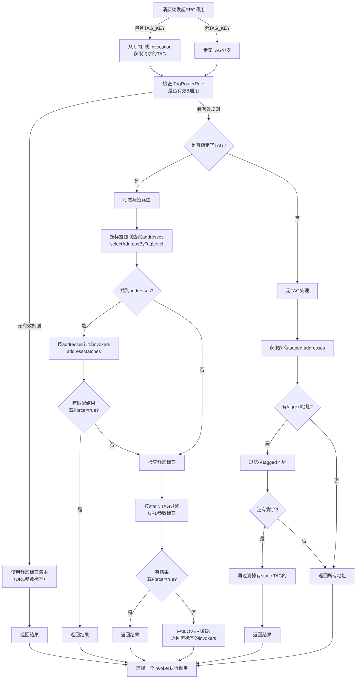

# Dubbo Tag Router 标签路由模块详细分析

## 一、模块概述

Tag Router（标签路由）是 Dubbo 集群中的一个重要路由组件，位于 `dubbo-cluster/src/main/java/org/apache/dubbo/rpc/cluster/router/tag` 目录下。该模块主要功能是**根据标签（Tag）将请求路由到指定的服务提供者**。

### 核心功能
- 支持动态标签路由规则（通过配置中心下发）
- 支持静态标签路由（URL参数）
- 支持标签级联查询（多级标签匹配）
- 支持参数匹配规则（v3.0 新增）
- 提供强制路由和降级容错机制

---

## 二、核心类详解

### 1. **TagStateRouter<T>** - 核心路由执行器

**文件**: `TagStateRouter.java` (373 行)

**核心职责**: 实现具体的标签路由逻辑

#### 类结构
```
TagStateRouter<T>
├── AbstractStateRouter<T>
├── ConfigurationListener (配置监听器)
└── <T> 泛型，表示服务接口类型
```

#### 关键属性
```java
private volatile TagRouterRule tagRouterRule;  // 当前生效的标签规则
private String application;                     // 提供者应用名称
private volatile BitList<Invoker<T>> invokers; // 所有可用的调用器列表
```

#### 主要方法解析

**方法1: `process(ConfigChangedEvent event)` - 配置变更处理**
```
触发条件: 配置中心标签规则发生变更
处理流程:
  1. 检查变更类型（DELETED/ADD/MODIFY）
  2. 若删除，设置 tagRouterRule = null
  3. 否则，解析新规则 → 初始化规则 → 缓存规则
  4. 异常情况记录错误日志，规则不生效
```

**方法2: `doRoute()` - 路由核心逻辑**
```
输入: 
  - invokers: 所有可用的调用器
  - url: 消费端URL
  - invocation: 调用信息（包含TAG_KEY）

输出: 过滤后的调用器列表

执行流程:
┌─────────────────────────────────────────┐
│ 检查 invokers 是否为空                    │
└──────────────┬──────────────────────────┘
               │
        ┌──────▼──────┐
        │   为空?      │
        └──────┬──────┘
           是  │  否
              │  └──────────────┐
        ┌─────▼─┐      ┌───────▼──────────────┐
        │ 返回空 │      │ 检查tagRouterRule    │
        └───────┘      │ 是否有效&启用        │
                       └──┬──────────────┬────┘
                        否│              │是
                      ┌────▼──┐    ┌────▼────────────┐
                      │使用静态│    │ 获取请求的TAG   │
                      │标签路由│    └────┬────────────┘
                      └────────┘         │
                                    ┌────▼──────────┐
                                    │ TAG非空?       │
                                    └────┬────────┬─┘
                                      是 │ 否    │ 
                                ┌────────▼─┐    │ 
                      ┌─────────┤动态标签路由│    │ 
                      │         └──────────┘    │ 
                  ┌───▼─────────────────┐       │ 
                  │ 按标签查询addresses  │       │ 
                  └───┬─────────────────┘       │ 
                      │                         │ 
                 ┌────▼────────┐               │ 
                 │ 地址匹配？   │       ┌───────▼─────┐
                 └┬──────┬──────┘       │ 无TAG处理    │
              是 │      │ 否           │ 返回无标签   │
         ┌──────┤      │              │ 的invokers  │
         │      │      │              └─────────────┘
    ┌────▼──┐  │   ┌──▼────────┐
    │返回结果│ 强制│检查静态TAG │
    │或Force│  │   └──┬───────┘
    └───────┘  │      │
               │  ┌───▼────┐
               │  │存在?    │
               │  └┬──┬────┘
               │  │  │否+非Force
               └──┘  │
                 ┌───▼──────────┐
                 │ FAILOVER降级  │
                 │ 返回无标签    │
                 │ invokers     │
                 └──────────────┘
```

#### 关键算法详解

**算法1: 标签级联查询 - `selectAddressByTagLevel()`**
```
问题: 支持多级标签如 "beta|team1|partner1"
解决方案: 从最具体逐步降级到最通用

示例:
  标签映射:
    "beta|team1|partner1" → [ip1:port1, ip2:port1]
    "beta|team1" → [ip3:port1]
    "beta" → [ip4:port1]

  查询 "beta|team1|partner1":
    step1: 查 "beta|team1|partner1" → 命中 → 返回 [ip1, ip2]
    
  查询 "beta|team2" (不存在team2):
    step1: 查 "beta|team2" → 不命中
    step2: 查 "beta" → 命中 → 返回 [ip4]
    
  原理: 遍历分割符 '|'，从右到左逐个移除元素
```

**算法2: 地址匹配 - `checkAddressMatch()`**
```
支持:
  1. IP通配符表达式: NetUtils.matchIpExpression(address, host, port)
     例: 192.168.1.*, 192.168.1.1-10
  2. 精确IP:PORT 匹配
  3. ANYHOST:PORT (*:port) 匹配
```

#### 缓存关键字
```
配置中心的规则KEY: "{providerApplication}.tag-router"
示例: "demo-provider.tag-router"
```

---

### 2. **TagRouterRule** - 标签路由规则模型

**文件**: `TagRouterRule.java` (145 行)

**核心职责**: 存储和管理标签路由规则的数据结构

#### 类结构
```
TagRouterRule
├── extends AbstractRouterRule
├── List<Tag> tags                          // 所有标签定义
├── Map<String, Set<String>> addressToTagnames     // 反向映射
└── Map<String, Set<String>> tagnameToAddresses    // 标签→地址映射 [重要]
```

#### 内部数据结构详解

**关键数据结构1: `tagnameToAddresses` (标签→地址映射)**
```
Map<String, Set<String>> tagnameToAddresses
│
├─ Key: 标签名称
│  ├─ "tag1" → {"192.168.1.10:20880", "192.168.1.11:20880"}
│  ├─ "tag2" → {"192.168.1.20:20880"}
│  ├─ "beta" → {"10.0.0.1:20880"}
│  ├─ "beta|team1" → {"10.0.0.2:20880", "10.0.0.3:20880"}
│  └─ "beta|team1|partner1" → {"10.0.0.4:20880"}
│
└─ Value: 该标签对应的所有提供者地址

作用: 支持 TagStateRouter.selectAddressByTagLevel() 进行级联查询
```

**关键数据结构2: `addressToTagnames` (地址→标签反向映射)**
```
Map<String, Set<String>> addressToTagnames
│
├─ Key: 提供者地址 (IP:PORT)
│  ├─ "192.168.1.10:20880" → {"tag1", "tag2", "beta"}
│  ├─ "192.168.1.20:20880" → {"tag2"}
│  └─ "10.0.0.1:20880" → {"beta", "beta|team1"}
│
└─ Value: 该地址属于哪些标签

作用: 快速查询某个地址属于哪些标签（目前代码未充分使用）
```

#### 初始化过程 - `init(TagStateRouter<?> router)`

```
初始化步骤:

step1: 处理带 addresses 字段的标签（所有版本）
  for each Tag in tags:
    if tag.getAddresses() is not empty:
      tagnameToAddresses.put(tag.name, tag.addresses)
      for each addr in tag.addresses:
        addressToTagnames[addr].add(tag.name)

step2: 处理带 match 字段的标签（仅v3.0+）
  if version startswith "v3.0":
    for each Tag in tags:
      if tag.getMatch() is not empty and tag.getAddresses() is empty:
        for each Invoker in router.getInvokers():
          if tag.match 所有条件都匹配 invoker.url 参数:
            addresses.add(invoker.address)
        tagnameToAddresses.put(tag.name, addresses)

说明: 
  - step1 是静态配置，rule下发时直接指定地址
  - step2 是动态计算，根据 Invoker URL 的参数动态匹配
```

#### YAML 规则格式示例

**v2.x 格式 (address-based)**
```yaml
---
force: true
runtime: false
enabled: true
priority: 1
key: demo-provider
tags:
  - name: tag1
    addresses:
      - "192.168.1.10:20880"
      - "192.168.1.11:20880"
  - name: tag2
    addresses:
      - "192.168.1.20:20880"
```

**v3.0 格式 (match-based，推荐)**
```yaml
---
configVersion: v3.0
force: false
runtime: true
enabled: true
priority: 1
key: demo-provider
tags:
  - name: gray
    match:
      - key: env
        value:
          exact: "gray"
      - key: region
        value:
          exact: "cn-bj"
  - name: prod
    match:
      - key: env
        value:
          exact: "prod"
```

#### 方法详解

**方法: `getAddresses()`**
```
功能: 获取所有参与标签路由的提供者地址集合
返回: Set<String> 
      包含所有 tagnameToAddresses 中的地址（去重）

用途: 当消费端无tag时，需要过滤掉带标签的地址
```

---

### 3. **Tag** - 单个标签定义

**文件**: `Tag.java` (102 行)

**核心职责**: 表示一个标签的定义和配置

#### 属性详解
```java
private String name;              // 标签名称，如 "tag1", "beta"
private List<ParamMatch> match;   // 参数匹配规则（v3.0）
private List<String> addresses;   // 绑定的地址列表（v2.x）
```

#### 解析逻辑 - `parseFromMap()`

```
输入: Map<String, Object> (YAML解析后的Map)

v2.x 处理:
  1. tag.name = map.get("name")
  2. tag.addresses = map.get("addresses") (List<String>)

v3.0+ 处理 (增量):
  1. 以上所有步骤
  2. 如果存在 "match" 字段:
     tag.match = map.get("match").stream()
       .map(obj → PojoUtils.mapToPojo(obj, ParamMatch.class))
       .collect()
  3. 若无 match 则警告日志，推荐使用 match
  
输出: Tag 对象
```

---

### 4. **ParamMatch** - 参数匹配规则（v3.0新增）

**文件**: `ParamMatch.java` (48 行)

**核心职责**: 定义单个参数的匹配规则（支持精确匹配、通配符等）

#### 属性
```java
private String key;                // 要匹配的参数名，如 "env", "region"
private StringMatch value;         // 匹配规则，可以是 exact、wildcard、prefix 等
```

#### 匹配方式支持

```
通过 StringMatch 支持的匹配类型:

1. exact: 精确匹配
   示例: key="env", value.exact="gray"
   匹配: invoker.url.getOriginalParameter("env") == "gray"

2. wildcard: 通配符匹配
   示例: value.wildcard="test*"
   
3. prefix: 前缀匹配
   示例: value.prefix="gray_"
   
4. regex: 正则表达式匹配
   示例: value.regex="gray_[0-9]+"
```

#### 工作原理

```
ParamMatch.isMatch(String input) 的执行:
  1. 获取 StringMatch value
  2. 调用 value.isMatch(input)
  3. 根据匹配类型（exact/wildcard/regex）进行判断
  4. 返回匹配结果 (boolean)

示例代码:
  ParamMatch matcher = new ParamMatch()
  matcher.setKey("env")
  matcher.setValue(new StringMatch().setExact("gray"))
  
  matcher.isMatch("gray")   // true
  matcher.isMatch("prod")   // false
```

---

### 5. **TagRuleParser** - 规则解析器

**文件**: `TagRuleParser.java` (44 行)

**核心职责**: 将 YAML 字符串解析为 TagRouterRule 对象

#### 解析流程

```
输入: String rawRule (YAML 格式的原始规则文本)

parse() 方法:
  1. 初始化 Yaml 解析器 (SafeConstructor 防止代码注入)
  2. yaml.load(rawRule) → Map<String, Object>
  3. TagRouterRule.parseFromMap(map) → TagRouterRule
  4. rule.setRawRule(rawRule) → 保存原始文本
  5. 检查 tags 是否为空 → 若空则标记无效
  6. 返回 rule

输出: TagRouterRule 对象 (可能无效)

异常处理:
  - YAML 格式错误 → 抛出异常（由 TagStateRouter.process() 捕获）
  - 规则字段缺失 → 标记 valid=false
```

#### 示例
```java
String yaml = "---\n" +
    "force: false\n" +
    "runtime: true\n" +
    "enabled: true\n" +
    "key: demo-provider\n" +
    "tags:\n" +
    "  - name: tag1\n" +
    "    addresses: [\"192.168.1.10:20880\"]\n";

TagRouterRule rule = TagRuleParser.parse(yaml);
// rule.getTagNames() → ["tag1"]
// rule.getTagnameToAddresses() → {"tag1" → {"192.168.1.10:20880"}}
```

---

### 6. **TagStateRouterFactory** - 路由工厂

**文件**: `TagStateRouterFactory.java` (36 行)

**核心职责**: 创建 TagStateRouter 实例

```java
@Activate(order = 100)  // 自动激活，顺序为100
public class TagStateRouterFactory extends CacheableStateRouterFactory {
    
    protected <T> StateRouter<T> createRouter(Class<T> interfaceClass, URL url) {
        return new TagStateRouter<>(url);  // 创建路由器
    }
}
```

#### 激活顺序说明
```
order = 100 表示加载顺序
- 值越小越先加载
- TagRouter 在大多数内置路由中加载顺序较靠后
- 允许其他路由（如 ConditionRouter）先执行
```

---

## 三、整体工作流程图



---

## 四、数据流向和转换

### 流程1: 配置下发 → 规则生效

```
配置中心
    ↓
ConfigChangedEvent
    ↓
TagStateRouter.process()
    ↓
TagRuleParser.parse(rawRule)
    ↓
TagRouterRule.parseFromMap(Map)
    ↓
TagRouterRule.init(router)  ← 初始化数据结构
    ↓
tagRouterRule (volatile 变量)
    ↓
doRoute() 方法使用规则
```

### 流程2: 标签查询 → 地址匹配 → Invoker过滤

```
消费端请求 (tag="beta|team1|partner1", forceUseTag=false)
    ↓
selectAddressByTagLevel(tagnameToAddresses, tag, isForce)
    ├─ 查询 "beta|team1|partner1" → 命中
    ├─ 查询 "beta|team1" → (跳过)
    └─ 返回 Set<String> addresses
    ↓
filterInvoker(invokers, invoker → addressMatches(invoker.url, addresses))
    ├─ 逐个检查 invoker.host:port 是否在 addresses 中
    ├─ 支持通配符匹配和精确匹配
    └─ 返回 BitList<Invoker<T>>
```

### 流程3: v3.0 参数匹配 → 动态地址绑定

```
TagRouterRule.init() 执行时:
    ↓
for each Tag with match != null and addresses == null:
    ↓
    for each Invoker in invokers:
        ├─ 提取 invoker.url 的参数
        ├─ 逐个检查 ParamMatch 是否匹配
        │   ├─ key="env", value.exact="gray"
        │   ├─ invoker.url.getOriginalParameter("env") == "gray"?
        │   └─ 所有 match 都满足则匹配
        └─ 匹配则添加 invoker.address 到 addresses
    ↓
tagnameToAddresses.put(tag.name, addresses)
```

---

## 五、关键算法深度分析

### 算法1: 标签级联降级 (Multi-level Tag Fallback)

**问题背景**:
- 支持多层次的标签，如 "gray|beijing|cluster1"
- 若精确标签无可用提供者，应自动降级到父级标签
- 降级顺序: 最具体 → 较通用 → 最通用

**算法实现** (`selectAddressByTagLevel`)

```java
public static Set<String> selectAddressByTagLevel(
    Map<String, Set<String>> tagAddresses, 
    String tagSelector, 
    boolean isForce) {
    
    // 情况1: 强制使用指定标签 或 标签内无 '|'
    if (isForce || StringUtils.isNotContains(tagSelector, TAG_SEPERATOR)) {
        return tagAddresses.get(tagSelector);
    }
    
    // 情况2: 级联降级查询
    String[] selectors = StringUtils.split(tagSelector, TAG_SEPERATOR);
    
    // 从最长到最短逐个尝试
    for (int i = selectors.length; i > 0; i--) {
        // 拼接前 i 个元素
        String selectorTmp = StringUtils.join(selectors, TAG_SEPERATOR, 0, i);
        Set<String> addresses = tagAddresses.get(selectorTmp);
        
        if (CollectionUtils.isNotEmpty(addresses)) {
            return addresses;  // 找到即返回
        }
    }
    
    return null;  // 全部失败返回 null
}
```

**时间复杂度**: O(n)，其中 n 是标签分段数
**空间复杂度**: O(n)，用于拼接字符串

**示例执行**:

```
tagAddresses 内容:
  "gray|bj|zone1" → {"192.168.1.1:20880", "192.168.1.2:20880"}
  "gray|bj" → {"192.168.1.3:20880"}
  "gray" → {"192.168.1.4:20880"}

查询 "gray|bj|zone2" (zone2不存在，实际标签只有zone1):
  step1: 查 "gray|bj|zone2" → null, 继续
  step2: 查 "gray|bj" → 命中 → 返回 {"192.168.1.3:20880"}
  
原理: 移除最右侧元素 "zone2"，得到 "gray|bj"，然后找到了

查询 "gray|sh" (sh不存在):
  step1: 查 "gray|sh" → null, 继续
  step2: 查 "gray" → 命中 → 返回 {"192.168.1.4:20880"}
  
原理: 继续移除最右侧，最后只剩 "gray"
```

### 算法2: IP地址匹配 (Address Matching)

**支持的匹配方式**:

```
1. 精确匹配
   address: "192.168.1.10:20880"
   invoker: "192.168.1.10:20880"
   结果: ✓

2. 通配符匹配 (由 NetUtils.matchIpExpression 支持)
   address: "192.168.1.*:20880"  或 "192.168.*:20880"
   invoker: "192.168.1.10:20880"
   结果: ✓

3. 范围匹配
   address: "192.168.1.1-10:20880"
   invoker: "192.168.1.5:20880"
   结果: ✓

4. ANYHOST 匹配
   address: "*:20880"
   invoker: "任意:20880"
   结果: ✓
```

**实现** (`checkAddressMatch`):

```java
private boolean checkAddressMatch(Set<String> addresses, String host, int port) {
    for (String address : addresses) {
        try {
            // 尝试 IP 通配符匹配
            if (NetUtils.matchIpExpression(address, host, port)) {
                return true;
            }
            
            // 尝试 ANYHOST:port 匹配
            if ((ANYHOST_VALUE + ":" + port).equals(address)) {
                return true;
            }
        } catch (Exception e) {
            logger.error(..., "The format of ip address is invalid in tag route...");
        }
    }
    return false;
}
```

**时间复杂度**: O(m*k)
- m: addresses 集合大小
- k: IP 表达式匹配的复杂度（一般为 O(1) 到 O(n)）

---

## 六、关键特性详解

### 特性1: 动态规则下发

**工作机制**:

```
前置条件:
  - 配置中心（Nacos/Zookeeper）已上线规则
  - 规则KEY: "{providerApplication}.tag-router"

流程:
  1. invoke() 方法 → notify(invokers) 触发
  2. 获取 providerApplication（从第一个invoker的URL）
  3. 如果 application 变更:
     - 注销旧规则监听器
     - 注册新规则监听器到配置中心
     - 立即拉取最新规则
  4. 配置中心发送 ConfigChangedEvent
  5. 调用 process() 方法解析规则

特点:
  - 自动检测应用变更
  - 动态订阅和取消订阅
  - 规则变更立即生效
```

### 特性2: 强制路由和容错 (Force & Failover)

**四个配置项**:

```
1. rule.force: 规则级别的强制标志
   - true: 严格按规则路由，无可用提供者则返回空
   - false: 规则失效时进行容错降级

2. invocation.FORCE_USE_TAG: 调用级别的强制标志
   - true: 只使用标签匹配的提供者，失败不降级
   - false: 标签失效时可降级到其他提供者

3. 容错规则 (当 force=false 时):
   step1: 按 tag 查询动态地址 → 有结果则返回
   step2: 查询静态标签 → 有结果则返回
   step3: FAILOVER 降级 → 返回无任何标签的 invokers

4. 示例场景:

   force=true:
     - tag="gray" → 有结果 → 返回 ✓
     - tag="gray" → 无结果 → 返回空 ✗
   
   force=false:
     - tag="gray" → 有结果 → 返回 ✓
     - tag="gray" → 无结果 → 检查静态tag → 无 → 返回无标签的 ✓
```

### 特性3: 静态标签和动态标签并存

**v2.x (静态标签)**:
```
规则中直接指定地址列表:
tags:
  - name: "gray"
    addresses: ["10.0.0.1:20880", "10.0.0.2:20880"]

URL参数中也可指定:
dubbo://10.0.0.1:20880/service?tag=gray
```

**v3.0 (动态标签 + 参数匹配)**:
```
根据参数动态绑定:
tags:
  - name: "gray"
    match:
      - key: "env"
        value:
          exact: "gray"

匹配过程:
  遍历所有 invoker → 检查参数 env=gray → 符合则自动添加到该标签
```

**优先级顺序** (在 `doRoute()` 中):
```
1. 首先尝试动态标签匹配 (v3.0 match)
2. 若动态失败，尝试静态标签匹配 (URL参数)
3. 都失败则根据 force 参数决定是否容错
```

---

## 七、核心业务场景

### 场景1: 灰度发布

```yaml
---
configVersion: v3.0
force: false
runtime: true
enabled: true
key: user-service

tags:
  - name: gray  # 灰度环境
    match:
      - key: region
        value:
          exact: "bj"  # 仅北京地区用户
  
  - name: gray  # 灰度环境 - 特定用户群
    match:
      - key: user_type
        value:
          exact: "vip"
```

**路由行为**:
```
消费端请求 (region=bj, env=prod):
  → 匹配 gray 标签的地址
  → 路由到灰度版本的提供者
  
消费端请求 (region=sz, env=prod):
  → gray 标签无匹配
  → 降级到正式版本提供者
```

### 场景2: 多地域容灾

```yaml
---
force: false
runtime: true
key: user-service

tags:
  - name: "region|bj|zone1"
    addresses: ["192.168.1.1:20880", "192.168.1.2:20880"]
  
  - name: "region|bj"
    addresses: ["192.168.1.3:20880"]
  
  - name: "region"
    addresses: ["192.168.2.1:20880"]  # 全国备份
```

**路由行为**:
```
消费端请求 (tag="region|bj|zone1"):
  step1: 查 "region|bj|zone1" → 返回 [192.168.1.1:2, 192.168.1.2:2]
  
消费端请求 (tag="region|bj|zone2", 实际zone2不存在):
  step1: 查 "region|bj|zone2" → null
  step2: 查 "region|bj" → 返回 [192.168.1.3:2]
  
消费端请求 (tag="region|sh", 上海无专线):
  step1: 查 "region|sh" → null
  step2: 查 "region" → 返回 [192.168.2.1:2] (全国备份)
```

### 场景3: 金融等级路由

```yaml
---
configVersion: v3.0
force: true
runtime: true
key: payment-service

tags:
  - name: vip_level  # VIP用户
    match:
      - key: user_level
        value:
          exact: "vip"

  - name: normal_level  # 普通用户
    match:
      - key: user_level
        value:
          exact: "normal"
```

**路由行为**:
```
VIP 用户请求:
  → 自动匹配 vip_level 标签
  → 路由到高性能提供者集群
  
普通用户请求:
  → 自动匹配 normal_level 标签
  → 路由到标准提供者集群
  
无标签信息请求:
  → force=true 严格模式
  → 返回空 (拒绝服务)
```

---

## 八、性能分析

### 内存占用

```
per TagRouterRule:
  - List<Tag>: O(m)，m为标签数
  - tagnameToAddresses: O(n*a)
    n: 标签数
    a: 平均每个标签的地址数
  - addressToTagnames: O(a*m)
    a: 总地址数
    m: 平均每个地址绑定的标签数

典型场景:
  标签数: 10-50
  地址数: 100-1000
  平均地址/标签: 10-100
  
  总内存: ~10MB (中等规模集群)
```

### CPU 成本

```
per 路由调用 (doRoute):
  1. rule 有效性检查: O(1)
  2. selectAddressByTagLevel(): O(k) 
     k = 标签分段数 (通常 1-5)
  3. filterInvoker(): O(n)
     n = invoker 数量
  4. addressMatches(): O(n*m)
     n = addresses 集合大小
     m = invoker 数量
  
总计: O(n*m)，通常在毫秒级

优化: 地址匹配时使用 HashSet 查找 O(1)
```

### 缓存机制

```
CacheableStateRouterFactory 缓存:
  - Key: serviceKey
  - Value: TagStateRouter 实例
  - 结果: 同一服务仅创建一个 router 实例
  
BitList 优化:
  - 避免频繁创建新的 List
  - 支持高效的 clone() 和 removeIf()
```

---

## 九、常见问题 FAQ

### Q1: Tag 路由和 Condition 路由的区别？

```
Tag Router (标签路由):
  - 维度: 基于标签字符串维度
  - 用途: 灰度、多地域、金融等级
  - 性能: 高效，支持大规模标签
  - 规则: 简单，标签→地址映射

Condition Router (条件路由):
  - 维度: 基于请求条件（参数、方法等）
  - 用途: 细粒度的调用链路控制
  - 性能: 较慢，复杂正则表达式判断
  - 规则: 复杂，支持 AND/OR 组合

优先级: TagRouter 优先加载 (order=100)
```

### Q2: v3.0 的 match 和 v2.x 的 addresses 如何选择？

```
v2.x addresses (静态指定):
  优点:
    - 规则直接配置，无额外计算
    - 清晰明了，便于人工审计
  缺点:
    - 需要手动更新地址列表
    - 不适合动态扩缩容

v3.0 match (动态匹配):
  优点:
    - 自动匹配新加入的提供者
    - 提供者下线自动移除
    - 规则简洁，参数驱动
  缺点:
    - 依赖于参数配置正确
    - 首次初始化计算成本高

建议:
  - 生产环境优先使用 v3.0 match
  - 小规模集群可用 v2.x addresses
  - 混合使用时 match 优先级高
```

### Q3: 标签无可用提供者时如何处理？

```
三层防护:

layer1: 动态标签失败
  条件: tagnameToAddresses.get(tag) == null || 空集合
  处理:
    - 若 force=true → 返回空，调用失败
    - 若 force=false → 进入 layer2

layer2: 静态标签检查
  条件: 检查 url.getParameter(TAG_KEY) 是否匹配
  处理:
    - 若有匹配 → 返回
    - 若无匹配 → 进入 layer3

layer3: FAILOVER 降级
  条件: force=false
  处理:
    - 返回所有无标签的 invokers
    - 或返回所有非 tagged 地址的 invokers
```

### Q4: 如何调试标签路由规则？

```
方法1: 日志打印
  - 启用 DEBUG 级别日志
  - 观察 TagStateRouter 的路由过程信息
  - 查看 messageHolder 的路由决策信息

方法2: 规则验证
  String rawRule = "...";  // YAML 内容
  TagRouterRule rule = TagRuleParser.parse(rawRule);
  System.out.println(rule.getTagnameToAddresses());
  System.out.println(rule.getAddresses());

方法3: 单元测试
  参考 TagStateRouterTest 类
  验证规则解析和路由结果

方法4: QoS 控制台
  通过 Dubbo QoS 查看路由器信息
  访问 http://localhost:22222/
```

---

## 十、总结

### 核心特点

```
1. 功能完整
   ✓ 静态标签 (v2.x)
   ✓ 动态标签 (v3.0 match)
   ✓ 标签级联降级
   ✓ 多级地址匹配
   ✓ 容错机制

2. 性能优良
   ✓ O(n*m) 时间复杂度可控
   ✓ 缓存机制减少重复计算
   ✓ BitList 优化避免频繁内存分配

3. 易用性强
   ✓ YAML 格式配置清晰
   ✓ 自动化规则下发
   ✓ 友好的容错降级

4. 扩展性好
   ✓ SPI 扩展点充分
   ✓ 支持自定义 ParamMatch 实现
   ✓ 支持自定义 StringMatch 策略
```

### 适用场景

```
推荐使用:
  • 灰度发布/金丝雀发布
  • 多地域容灾
  • 用户等级路由
  • A/B 测试
  • 蓝绿部署

不推荐:
  • 复杂条件组合 → 用 ConditionRouter
  • 实时特征计算 → 需要 AI/ML 框架
  • 跨服务链路优化 → 需要分布式追踪系统
```

### 后续改进方向

```
1. 性能优化
   - 标签预索引 (Prefix Tree)
   - 地址匹配缓存
   - 规则增量更新

2. 功能增强
   - 权重分配 (weighted tag)
   - 流量镜像 (mirroring)
   - 动态权重调整

3. 可观测性
   - 路由命中率指标
   - 标签匹配详细日志
   - 规则效果评估
```

