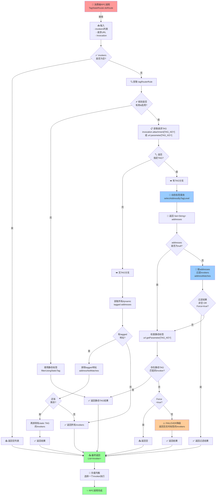
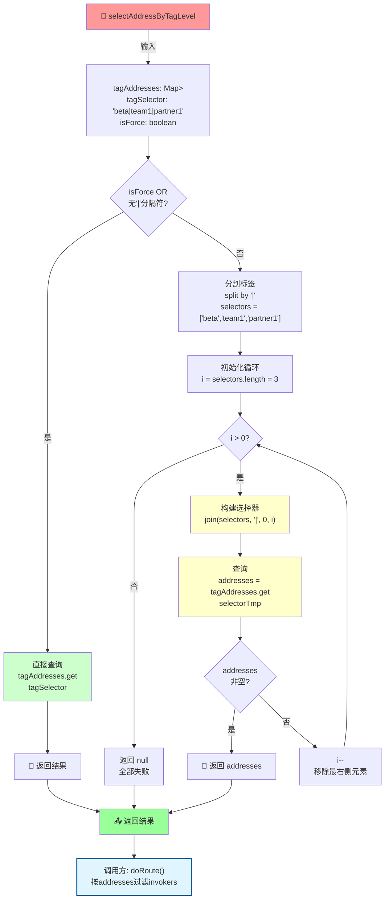
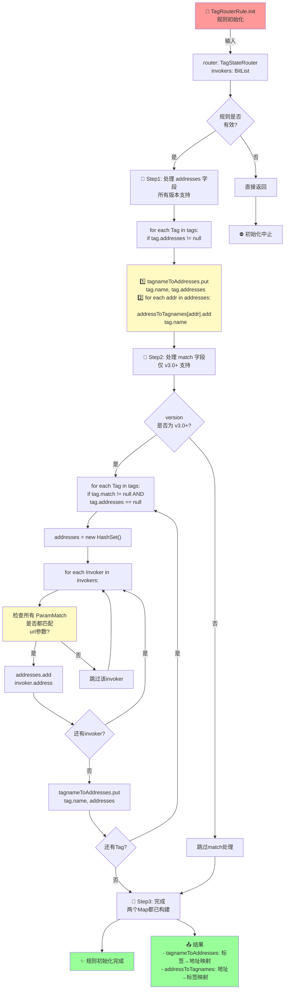
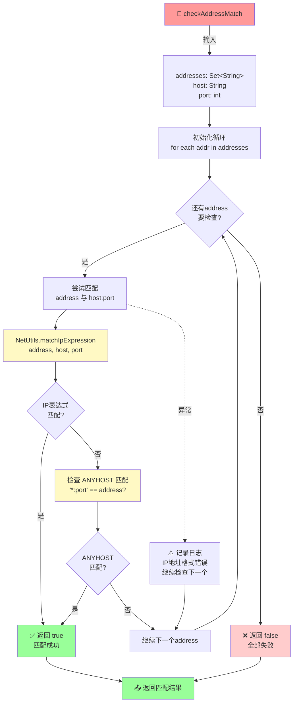
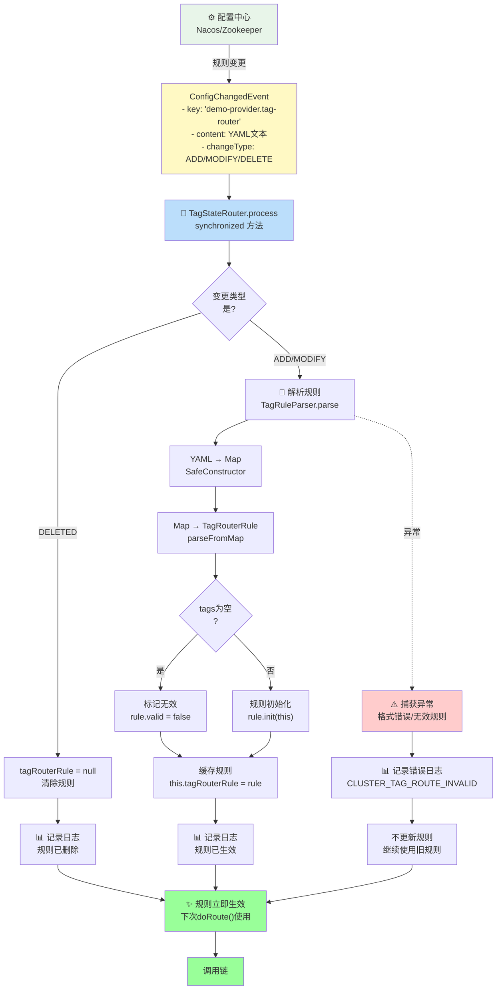
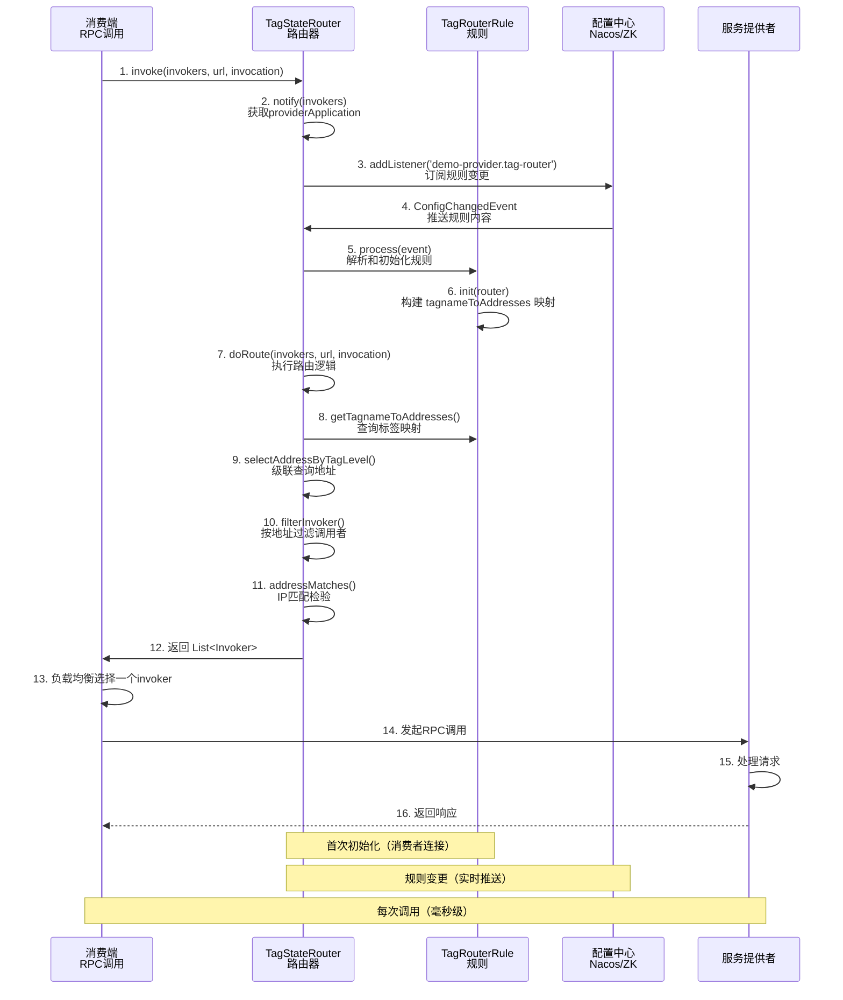
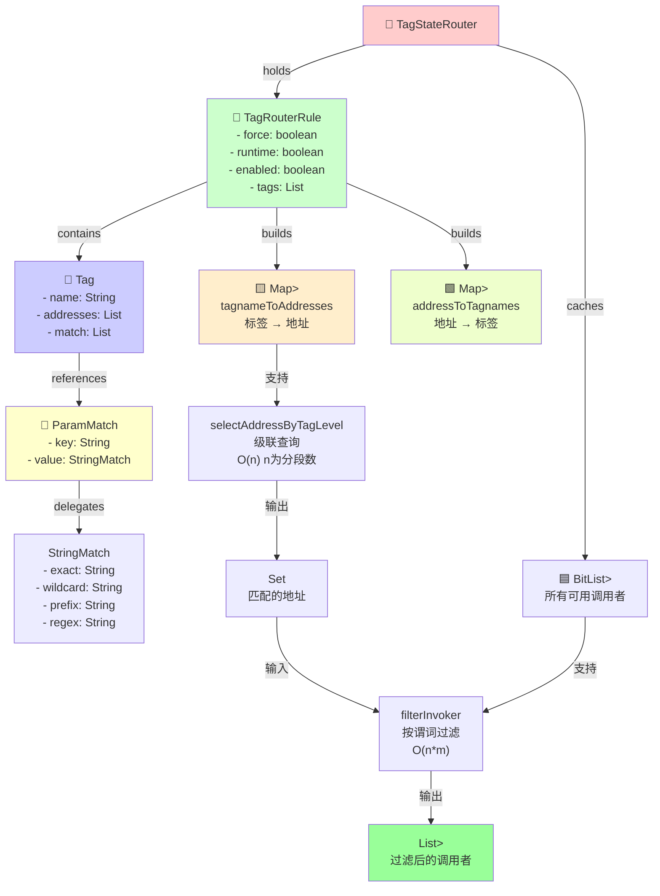
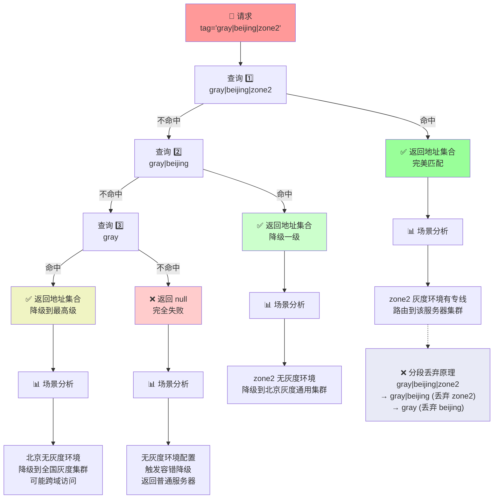

# Tag Router 流程图集合

## 1. 核心路由决策流程图



---

## 2. 标签级联查询算法流程



**执行示例**:
```
输入: tagSelector="beta|team1|partner1", tagAddresses={
  "beta|team1|partner1": {"10.0.0.1", "10.0.0.2"},
  "beta|team1": {"10.0.0.3"},
  "beta": {"10.0.0.4"}
}

循环过程:
  i=3: 查 "beta|team1|partner1" → 命中 ✓ → 返回 {"10.0.0.1", "10.0.0.2"}
```

---

## 3. 规则初始化流程 (init方法)



---

## 4. 地址匹配检查流程



**支持的地址格式**:
```
1. 精确: 192.168.1.10:20880
2. 通配符: 192.168.1.*:20880
3. 范围: 192.168.1.1-10:20880  
4. ANYHOST: *:20880
```

---

## 5. 配置变更监听和规则刷新流程



---

## 6. 消费端调用完整时序图



---

## 7. 数据结构之间的关系图



---

## 8. 容错和降级策略流程

```mermaid
flowchart TD
    Start["🚀 处理无可用地址"] -->|场景| Scenario{"动态标签匹配<br/>返回空?"}
    
    Scenario -->|是| CheckForce1{"rule.force<br/>=true?"}
    
    CheckForce1 -->|是| ReturnEmpty1["❌ 返回空列表<br/>调用失败"]
    CheckForce1 -->|否| Layer2["📌 Layer2: 检查静态标签<br/>url.getParameter[TAG_KEY]"]
    
    Layer2 --> StaticMatch{"找到匹配<br/>的invoker?"}
    StaticMatch -->|是| ReturnStatic["✅ 返回静态标签结果"]
    StaticMatch -->|否| Layer3["📌 Layer3: FAILOVER 降级"]
    
    Layer3 --> Strategy{"降级策略<br/>">
    Strategy -->|Strategy A| FilterNoTag["A) 返回所有无任何标签的invokers<br/>StringUtils.isEmpty<br/>invoker.url.parameter[TAG_KEY]"]
    Strategy -->|Strategy B| FilterOutTagged["B) 返回排除tagged地址的invokers<br/>addressNotMatches<br/>rule.getAddresses"]
    
    FilterNoTag --> VerifyResult{"检查结果<br/>是否非空?"}
    FilterOutTagged --> VerifyResult
    
    VerifyResult -->|是| ReturnFallback["✅ 返回降级结果<br/>可用的提供者"]
    VerifyResult -->|否| ReturnEmpty2["❌ 返回空列表<br/>真正无可用提供者"]
    
    ReturnEmpty1 --> Output["📤 最终响应"]
    ReturnStatic --> Output
    ReturnFallback --> Output
    ReturnEmpty2 --> Output
    
    Output --> ClientCode{"消费端<br/>处理结果"}
    ClientCode -->|非空| Invoke["✨ 调用提供者"]
    ClientCode -->|为空| Error["💥 抛异常<br/>或使用Mock"]
    
    style Start fill:#ff9999
    style ReturnEmpty1 fill:#ffcccc
    style ReturnEmpty2 fill:#ffcccc
    style ReturnFallback fill:#ccffcc
    style ReturnStatic fill:#ccffcc
    style Error fill:#ffcccc
    style Invoke fill:#ccffcc
    
    classDef forcePath fill:#ffe0b2
    classDef fallbackPath fill:#f0f4c3
    class CheckForce1 forcePath
    class Layer2,Layer3 fallbackPath
```

---

## 9. 多级标签降级示例



---

## 10. 数据流总结图

```mermaid
graph LR
    YamlRule["📋 YAML<br/>配置文件"]
    
    YamlRule -->|TagRuleParser| Map["🗺️ Map<br/>标签定义"]
    Map -->|parseFromMap| TagRule["TagRouterRule<br/>规则对象"]
    TagRule -->|init| Build["构建映射<br/>关系"]
    
    Build -->|生成| TMark["tagnameToAddresses<br/>标签→地址"]
    Build -->|生成| ATMark["addressToTagnames<br/>地址→标签"]
    
    TMark -->|支持| SelectAddr["selectAddressByTagLevel<br/>级联查询"]
    ATMark -->|备用| ReverseQuery["反向查询<br/>某地址的标签"]
    
    SelectAddr -->|查询结果| Addresses["Set<String><br/>目标地址"]
    
    Addresses -->|输入| MatchFilter["addressMatches<br/>地址匹配检查"]
    MatchFilter -->|过滤| FilterInvokers["BitList<Invoker><br/>过滤调用者"]
    
    FilterInvokers -->|输出| RouteResult["最终路由结果"]
    
    RpcRequest["🔴 RPC请求<br/>包含TAG_KEY"]
    RpcRequest -->|提供| Tag["tag 值"]
    Tag -->|输入| SelectAddr
    
    RouteResult -->|选择| LB["🎲 负载均衡<br/>选择一个invoker"]
    LB -->|返回| Invoker["单个Invoker"]
    Invoker -->|执行调用| RpcResult["✨ RPC结果"]
    
    style YamlRule fill:#c8e6c9
    style Map fill:#fff9c4
    style TagRule fill:#bbdefb
    style TMark fill:#ffccbc
    style ATMark fill:#ffccbc
    style RouteResult fill:#99ff99
    style RpcRequest fill:#ff9999
    style RpcResult fill:#99ff99
```



